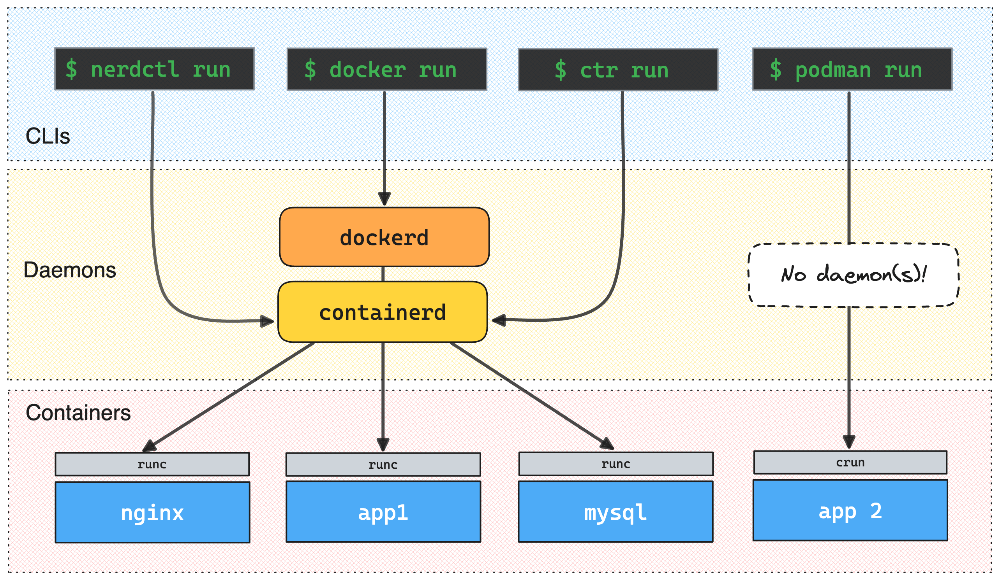
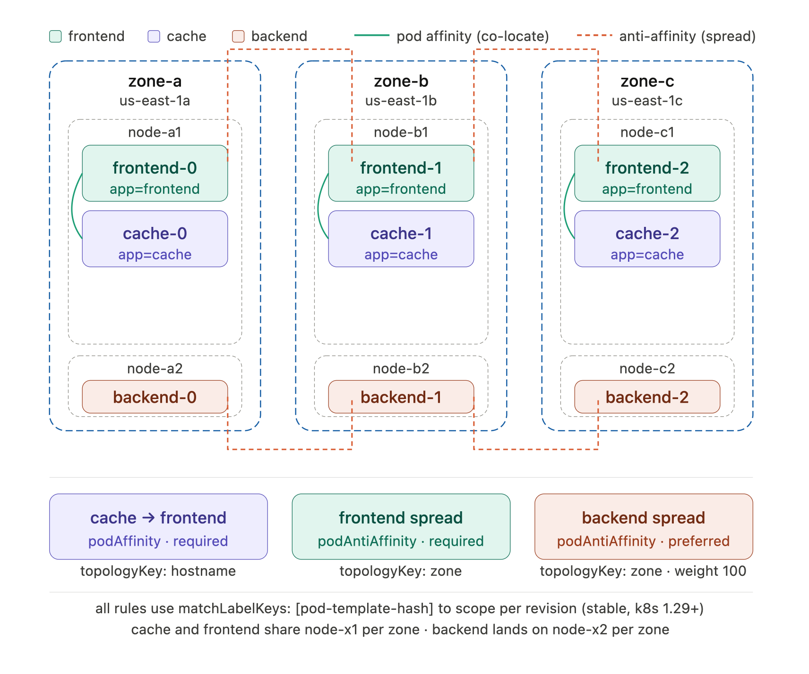
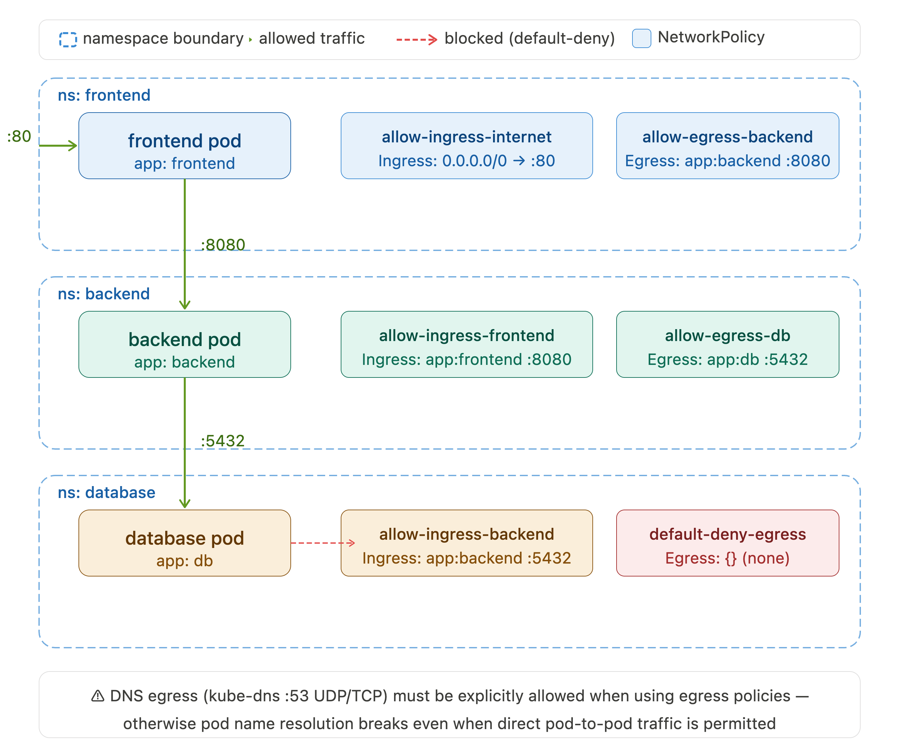
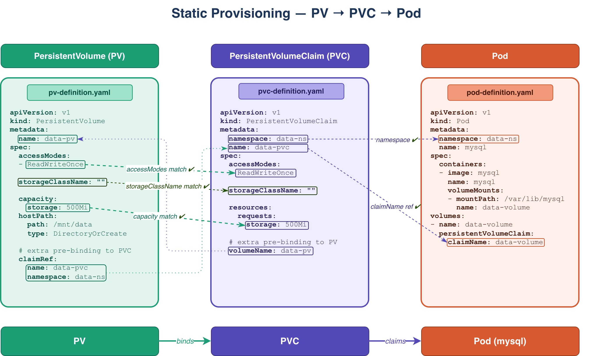
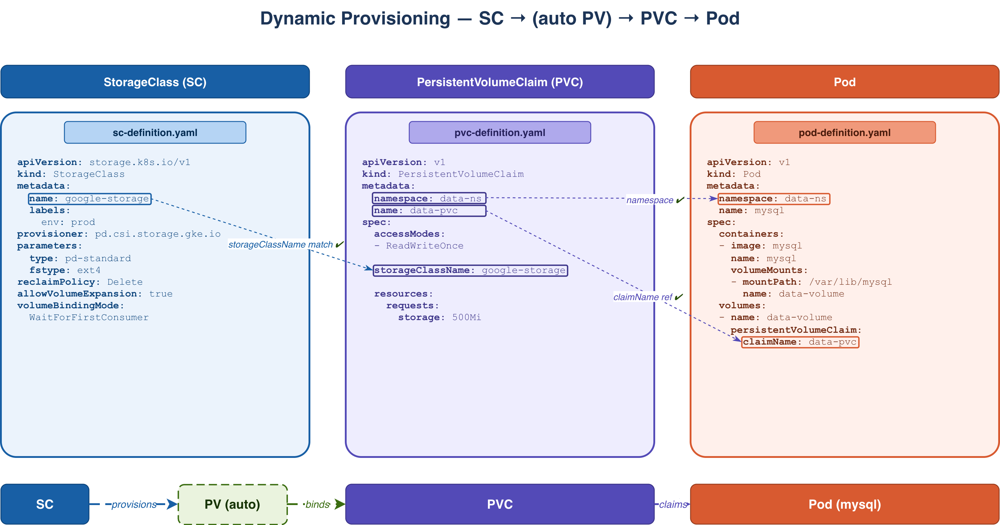
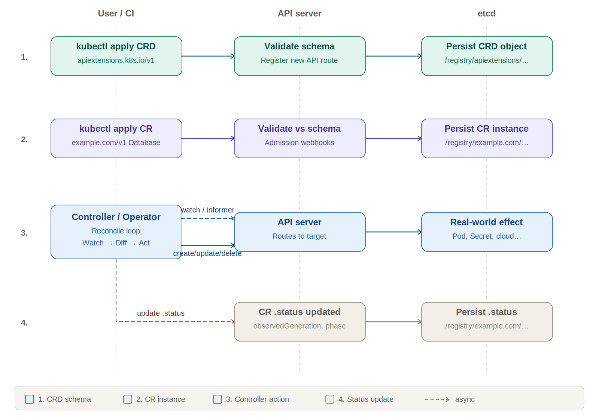
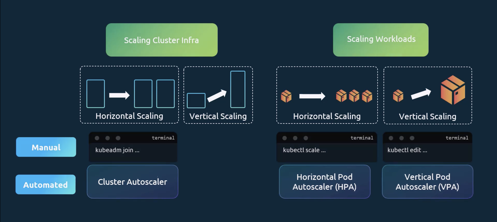

# Kubernetes CKA / CKAD Notes

---

# PlayGround Tools

1. **kubectl**  
    [https://kubernetes.io/docs/reference/kubectl/](https://kubernetes.io/docs/reference/kubectl/)  
    
2. **kustomize**  
    https://github.com/kubernetes-sigs/kustomize  
    
3. **kind**  
    [https://kind.sigs.k8s.io/docs](https://kind.sigs.k8s.io/docs)  
    
4. **minikube** - multinodes  
    [https://minikube.sigs.k8s.io/docs/](https://minikube.sigs.k8s.io/docs/)  
    
5. **kubeadm** - cluster deployment  
    [https://kubernetes.io/docs/setup/production-environment/tools/kubeadm/install-kubeadm/](https://kubernetes.io/docs/setup/production-environment/tools/kubeadm/install-kubeadm/)  
    
6. **Cluster API** - multiple clusters’ deployment  
    [https://cluster-api.sigs.k8s.io/](https://cluster-api.sigs.k8s.io/)  
    
7. **kops** - automated cluster deployment  
    [https://kops.sigs.k8s.io/](https://kops.sigs.k8s.io/)  
    
 8. **kubersplay** - Ansible playbook-based cluster deployment  
    [https://kubespray.io/#/](https://kubespray.io/#/)
    
 9. [MicroK8s](https://microk8s.io/)  - Local and cloud Kubernetes cluster for developers and production, from Canonical.
    
 10. [K3S](https://k3s.io/) - Lightweight Kubernetes cluster for local, cloud, edge, IoT deployments, originally from Rancher, currently a CNCF project.

---

# Main components


---  

## Control Plane Nodes
### 1. API Server
> **CKA / CKAD hints**
> 
> 1. get config and cmd flags
> `> kubectl get -n kube-system pod/kube-apiserver-controlplane -o yaml` 
> or 
> `> cat /etc/kubernetes/manifests/kube-apiserver.yaml`  - get its static pod manifest
> or 
> `controlplane> ps ax | grep apiserver`
> 2. get cmd flags
> `> kubectl exec -n kube-system pods/kube-apiserver-controlplane -- kube-apiserver --help` 
> 3. [Reference](https://kubernetes.io/docs/reference/command-line-tools-reference/kube-apiserver/)
> 4. [Concepts](https://kubernetes.io/docs/concepts/overview/kubernetes-api/)
>    
> Search pattern: *apiserver*

#### Concepts
1. The cluster gateway - all other K8s components communicate exclusively via the API Server.
2. Exposes a controlling RESTful API
3. Routes secondary/custom APIs
4. All other components communicate with ETCD via API
5. [AAA](#13-aaa-security) gatekeeper.  
   
   Endpoint examples   
       
6. [API Cluster access](Set%20up%20Cluster%20access.md)  

#### Parameters
1. **API resources ** 
   `> kubectl api-resources [--namespaced=(true | false)] [--sort-by=(name | kind)] [-o wide | name |...]`   
   
2. **API Groups - enabled versions**   
   `> kubectl api-versions`   
   
	1. Enable/disable the group version  (as a system service)
	   `> ExecStart=/usr/local/bin/kube-apiserver ... --runtime-config api/all=true,api/v1alpha1 ...`  
	   or (as a pod)   
	   `vi /etc/kubernetes/manifests/kube-apiserver.yaml` and edit *--runtime-config*  
	   
	2. Convert versions  
	   With [kuberctl-convert](https://kubernetes.io/docs/tasks/tools/install-kubectl-linux/#install-kubectl-convert-plugin)  
	   `> kubectl convert -f pod-definition.yaml --output-version=apps/v1 > pod-definition-converted.yaml`    
	   
	3. Preferred (default) version  
		1. Via proxy
		   `> kubectl proxy &`    
		   `> curl http://localhost:8001/apis`    
		   
		2. Raw output   
		   `> kubectl get --raw /api/v1 | jq -C . | less -iR`
		   or python way   
		   `> kubectl get --raw /api/v1 | python3 -m json.tool`   
		   
		3. From within pod
		  ```bash
		   TOKEN=$(cat /var/run/secrets/kubernetes.io/serviceaccount/token)
		   CACERT="/var/run/secrets/kubernetes.io/serviceaccount/ca.crt"

		   curl  --header "Authorization: Bearer $TOKEN" --cacert $CACERT https://kubernetes.default.svc
		  ```

3. API [available/enabled/disabled admission controllers](#1333-operations)  

4. **Network key params**
- *--advertise-address=<>* and *--secure-port=6443* - ip-address and port  for other component communication   
- *--service-cluster-ip-range=<>* - CIDR pool for ClusterIP Service allocation; must not overlap pod or node CIDRs  
- *--service-node-port-range=30000-32767* - Port range for NodePort Services

More key parameters, [see here](Kubernetes%20API-Server%20params.md)

---

### 2. Controller manager
  
> **CKA hints**
> 
> 1. get config and cmd flags
>    `> kubectl get -n kube-system pods/kube-controller-manager-controlplane -o yaml`
>    or
>    `> cat /etc/kubernetes/manifests/kube-controller-manager.yaml` - get its manifest
>    `> cat /etc/kubernetes/controller-manager.conf` - get its API client kubeconfig
>    or
>    `controlplane> ps ax | grep kube-controller-manager`
> 2. get cmd flags
>    `> kubectl exec -n kube-system pods/kube-controller-manager-controlplane -- kube-controller-manager --help`
> 3. [Reference](https://kubernetes.io/docs/reference/command-line-tools-reference/kube-controller-manager/)
> 4. [Concepts](https://kubernetes.io/docs/concepts/architecture/controller/)
> 5. [Cloud CM](https://kubernetes.io/docs/concepts/architecture/cloud-controller/)
> Search pattern: *controller manager*

#### Concepts
1. Watches for cluster state changes via API, comparing desired (declared) states and current ones;
2. Manages controllers (e.g. ReplicaSet, Deployment controllers) or Operators to restore consistent states of pods, endpoints, service accounts and tokens.
3. Cloud CM communicates with the cloud infrastructure layer to manage nodes, volumes, load balancers and routes  


#### Parameters
1. *--kubeconfig=/etc/kubernetes/controller-manager.conf* - kubeconfig, the controller-manager uses to authenticate to the API server; embeds cluster CA + client cert
2. **Network key params**
   - *--bind-address=127.0.0.1* and *--secure-port=10257* - HTTPS address/port for `/metrics`, `/healthz`, `/readyz`; **must be local address**
   - *--service-cluster-ip-range=* - **must match** **kube-apiserver**'s *--service-cluster-ip-range* value ; used by controllers that need to know the Service CIDR  
   - *--cluster-cidr*=*(empty)* - **Pod address space**; only active when *--allocate-node-cidrs=true*; must not overlap service or node CIDRs      
   - *--allocate-node-cidrs=false* - When *true*, the controller assigns a per-node pod CIDR from *--cluster-cidr*; required for in-tree IPAM; **CNI plugins** that manage their own IPAM leave this *false*


More key parameters, [see here](Kubernetes%20Controller%20Manager%20params.md)

---

### 3. Scheduler
> **CKA hints**
> 
> 1. get config and cmd flags
>    `> kubectl get -n kube-system pods/kube-scheduler-controlplane -o yaml`
>    or
>    `> cat /etc/kubernetes/manifests/kube-scheduler.yaml` - get its manifest
>    `cat /etc/kubernetes/scheduler.conf` - get its API client kubeconfig
>    or
>    `controlplane> ps ax | grep kube-scheduler
> 2. get cmd flags
>    `> kubectl exec -n kube-system pods/kube-scheduler-controlplane -- kube-scheduler --help`
> 3. [Reference](https://kubernetes.io/docs/reference/command-line-tools-reference/kube-scheduler/)
> 4. [Concepts](https://kubernetes.io/docs/concepts/scheduling-eviction/kube-scheduler/)
>    
> Search pattern: *scheduler*

#### Concepts
1. Decides on a new node’s discovery
2. [Distributes pods based on some factors:](#23-pod-scheduling)
	1. pods’ requirements vs node resources
	2. data locality
	3. [Node Affinity / Anti-Affinity](#232-nodeaffinity-node-label--pod-affinity)
	4. [Node Taints, Pod Tolerations](#231-node-taints--pod-tolerations)
	5. [Inter-Pod Affinity / Anti-Affinity](#233-inter-pod-affinity)
	6. etc

3. Returns decisions to the API for further workload deployment delegation  

#### Parameters
1. *--kubeconfig=/etc/kubernetes/scheduler.conf* - kubeconfig that is used to authenticate to the API server; absent = in-cluster ServiceAccount used instead

2. **Network key params**
*--bind-address=127.0.0.1* and *--secure-port=10259* - HTTPS port for `/metrics`, `/healthz`, `/readyz`;

More key parameters, [see here](Kubernetes%20Scheduler%20params.md)

---

### 4. ETCD
1. [ETCD](https://github.com/etcd-io/etcd/releases) stores configuration data as subnets, ConfigMaps, Secrets, etc, and state information and metadata for the entire cluster.
2. It is a strongly consistent key-value database. Data is added, not replaced, and periodically compacted. 
3. Its redundant cluster is based on the [Raft Consensus Algorithm](https://raft.github.io/), which allows a collection of machines to work as a coherent group that can survive the failures of some of its members.
4. Only the *API Server* communicates with it.
5. ETCD provides REST API and gRPC. **etcdctl** utility for low-level communication and debugging via gRPC.
6. It can be stacked within the Control Plane or be external storage.  
   
   


   
     
     

7. By default, the ETCD data is not encrypted at rest. Use the API Server `--encryption-provider-config` flag to use the appropriate *EncryptionConfiguration* [more](https://kubernetes.io/docs/tasks/administer-cluster/encrypt-data/)
8. [Maintenance](#3-etcd-backup) 

---

### 5. CoreDNS
> **CKA hints**
> 
> 1. [Tasks](https://kubernetes.io/docs/tasks/administer-cluster/dns-custom-nameservers/)
> 2. [Administer Task](https://kubernetes.io/docs/tasks/administer-cluster/dns-debugging-resolution/)
> 3. [Concepts: Svc/Pod](https://kubernetes.io/docs/tasks/administer-cluster/dns-debugging-resolution/)
> 
> Search pattern: *coredns*, *pod dns*

#### Concepts
**CoreDNS** is the default cluster DNS server in Kubernetes (replaced kube-dns, GA since 1.11). It runs as a Deployment in `kube-system`, exposed via a Service (traditionally named **kube-dns** for backward compatibility even when running CoreDNS), with pods typically pointed at it via *--cluster-dns* on the **kubelet**.
**CoreDNS** watches the Kubernetes API and dynamically generates DNS records for Services and Pods, so workloads can resolve each other by name instead of IP. It's built on a plugin chain architecture - each plugin does one job (the Kubernetes plugin is what provides cluster service discovery), configured via a `Corefile` stored in a ConfigMap named **coredns**.

Config
```yaml
# configmap coredns

data:
  Corefile: |
    .:53 {
        errors
        health {
            lameduck 5s
        }
        ready
        kubernetes cluster.local in-addr.arpa ip6.arpa {
            pods insecure
            fallthrough in-addr.arpa ip6.arpa
            ttl 30
        }
        prometheus :9153
        forward . /etc/resolv.conf
        cache 30
        loop
        reload
        loadbalance
    }

```

Usage
```yaml
# coredns deployment .spec.template.spec
containers:
  - name: coredns
    volumeMounts:
      - mountPath: /etc/coredns
        name: config-volume
        readOnly: true
    ...
volumes:
  - name: config-volume
    configMap:
      name: coredns
	  defaultMode: 420
      items:
        - key: Corefile
          path: Corefile 
```

#### Service DNS Entries
##### A/AAAA
`<service>.<namespace>.svc.cluster.local` resolves to Pod ClusterIP ip-address; a *headless* (ClusterIP: None) service resolves to the individual Pod ip-addresses.


#### Pod DNS Entries
`<pod-ipv4-address>.<namespace>.svc.cluster.local` resolves to Pod ip-address (ex. 172-12-6-1.... -> 172.12.6.1)
This can be changed with
```yaml
# pod.spec
# test-pod.test-subdomain.test-service.test-ns.cluster.local
spec:
  hostname: test-pod
  subdomain: test-subdomain
```

#### DNS Policy
```yaml
# pod.spec
spec:
  #1. Inherits Node policy
  dnsPolicy: Default
  
  #2. Resolves the cluster subdomain first, then asks upstream DNS
  dnsPolicy: ClusterFirst
  
  #3. Same but with 'hostNetworks' enabled
  dnsPolicy: ClusterFirstWithHostNet
  hostNetwork: true
  
  #4. Ignores cluster DNS environment settings and uses the 'dnsConfig' Pod's setting that has to be defined in this case
  dnsPolicy: "None"
  dnsConfig: 
  ...
```

#### DNS Config
*.spec.dnsConfig* forms `/etc/resolv.conf` in the Pod. It works with any policies, and its config is merged with the policies' settings. In the case of the *None* policy, it must be defined.  

```yaml
# pod spec
spec:
  dnsPolicy: "None"
  dnsConfig:
    nameservers:
      - 192.0.2.1
    searches:
      - ns1.svc.cluster-domain.example
      - my.dns.search.suffix
    options:
      - name: ndots
        value: "2"
      - name: edns0
```

#### Troubleshooting
1.Pod-scope
```bash
# create pod test pod
kubectl run dns-test --image=nicolaka/netshoot -it --rm --restart=Never -- bash
# try to resolve the key host
> nslookup kubernetes.default
# check resolver
> cat /etc/resolv.conf
```


---  

## Working Nodes
They can be allocated on bare metals, VMs or containers, comprising Pods of the Control Plane as well as “regular” ones.  
	
### 1. Kubelet

> **CKA hints** 
> 
> 1. [Troubleshooting cluster](https://kubernetes.io/docs/tasks/debug/debug-cluster/)
> 2. `> kubectl describe node <node-name>`
> 3. `node> sudo systemctl status kubelet`
> 4. `node> journal -u kubelet`
> 
> Search pattern: *troubleshoot cluster*


#### Concepts
1. Communicate with the [API Server](#1-api-server) and [Container Runtime](#3-container-runtime-cri-and-cri-shims).
2. Register and serve nodes.
3. Manage pods/containers deployed by Kubernetes via *CRI*, checking out and reporting their states to the *API Server*
4. Serve directly (without *API Server*) the special [**Static Pod**s](https://kubernetes.io/docs/concepts/workloads/pods/#static-pods)
	1. self-served control plane
	2. mirror this Pod to the *API Server*  
	   
5. Provide **kubelet API** for **API Server** (*kubeletctl* utility as well) access via:
	1. *RESTful* for read-only requests: kubelet health, pods/nodes stats/metrics, pod info, container logs.
	2. *WebSocket* for streaming exec, attach, port-forwarding.  
	   
6. **cAdvisor** - Container Advisor, as a kubelet subcomponent, retrieves metrics from Nodes and Pods for the API Server   
   `> kubectl apply -f https://github.com/kubernetes-sigs/metrics-server/releases/latest/download/components.yaml`   
   `> kubectl get pod metrics-server -n kube-system`   
7. Get Node's metrics  
   `> kubectl top nodes`   
   Pod's metrics  
   `> kubectl top pods -A`   
   Pod's container metrics  
   `> kubectl top pods --containers`  
   Get Pod's metrics sorted by cpu (memory)  
   `> kubectl top pods --sort-by=cpu`  
   Get raw data for node cr01-worker  
   `> kubectl get --raw /api/v1/nodes/cr01-worker/proxy/metrics/resource`   
   
#### Troubleshooting
`> kubectl get nodes -o wide`
`> kubelet describe nodes node01`  to see conditions
```txt
Conditions:
  Type                 Status  LastHeartbeatTime                 LastTransitionTime                Reason                       Message
  ----                 ------  -----------------                 ------------------                ------                       -------
  NetworkUnavailable   False   Sat, 27 Jun 2026 20:27:19 -0400   Sat, 27 Jun 2026 20:27:19 -0400   CalicoIsUp                   Calico is running on this node
  MemoryPressure       False   Wed, 01 Jul 2026 23:39:19 -0400   Wed, 10 Jun 2026 13:16:45 -0400   KubeletHasSufficientMemory   kubelet has sufficient memory available
  DiskPressure         False   Wed, 01 Jul 2026 23:39:19 -0400   Wed, 10 Jun 2026 13:16:45 -0400   KubeletHasNoDiskPressure     kubelet has no disk pressure
  PIDPressure          False   Wed, 01 Jul 2026 23:39:19 -0400   Wed, 10 Jun 2026 13:16:45 -0400   KubeletHasSufficientPID      kubelet has sufficient PID available
  Ready                True    Wed, 01 Jul 2026 23:39:19 -0400   Wed, 10 Jun 2026 13:16:58 -0400   KubeletReady                 kubelet is posting ready status

```

`node01> systemctl status kubelet`  
`node01> journalctl -u kubelet`  
`node01> cat /var/lib/kubelet/config.yaml`
- *clientCAFile* - TLS API server communication
- *containerRuntimeEndpoint* - Runtime communication (ex. containerd) socket 
- *resolvConf* - DNS servers and search configuration
  
`node01> cat /etc/kubernetes/kubelet.conf` - API Server communication
   
### 2. Kube-Proxy
> **CKA hints**
> TODO

#### Concepts
1. Responsible for dynamic updates and maintenance of all networking rules on the node
2. Responsible for TCP, UDP and SCTP stream forwarding
3. It is k8s default CNI and operates in conjunction with *iptables/ipvs/nftables*
4. Alternative CNI examples:
	1. Cilium (eBPF-based)
	2. KPNG (Kubernetes Proxy Next Gen)
	3. Calico
	4. Flanel
	   
---  

### 3. Container Runtime, CRI and CRI shims
#### 3.1. Responsibilities - RuntimeService and ImageService
1. **Pod & Container Lifecycle Management (runtimespec)**
    Own object lifecycle and reconciliation: create/start/stop/delete containers and PodSandboxes; persist and recover state across restarts; collect exit status; handle failure scenarios.
2. **Resource Isolation and Enforcement**
    Configure cgroups (CPU/memory/IO), namespaces, and security settings (seccomp/AppArmor/SELinux/capabilities) via OCI config passed to the low-level runtime; ensure enforcement and consistency.
3. **Runtime Delegation**
    Delegate actual spawn/exec to OCI runtimes (runc/crun/runsc/kata) and support pluggable runtime selection.
4. **Image Management / Image Policy / Security Integration (imagespec)**
    Pull/store content-addressed layers, unpack and dedupe layers; manage image metadata; integrate with registries.
    Integrate with signature/policy systems (where configured) and enforce configured trust policy; ensure rootfs integrity at unpack/mount time.    
5. **Garbage Collection**
    GC unused images + snapshots + containers + sandboxes to reclaim storage and avoid leaks.
6. **Filesystem / Storage Management**
    Assemble rootfs from snapshots (overlayfs, etc.), manage mounts, lifecycle, and cleanup.
7. **Network Namespace Management (handoff to CNI)**
    Create/own netns for PodSandbox; provide netns handle to CNI; teardown on sandbox deletion.
8. **Observability & Introspection**
    Expose events/metrics/health; provide container status; support log configuration/paths; support exec/attach streaming endpoints (implementation-dependent).

#### 3.2. Scope/definitions
1. **CRI** is the contract/spec that the **kubelet** communicates with the Runtime; the **gRPC API** is its implementation as part of the Runtime (CRI-O) or as a plugin (cri-containerd).
2. **CRI Runtime daemon**: the process the **kubelet** talks to over CRI (e.g., **containerd**, **CRI-O**).
3. **Low-level runtime (OCI / sandbox runtime)**: the component the daemon calls to actually create/exec the container process (e.g., **runc**, **crun**, **runsc**, **kata-runtime**).

#### 3.3. CRI Utilities
1. **ctr** (control **containerd**, communicate with containerd's native API, not friendly, debug useful; part of containerd pkg)
2. [**nerdctl**](https://github.com/containerd/nerdctl) (control **containerd**, communicate with containerd's native API, docker-like, friendly)
3. **Docker** (control Docker)
4. **crictl** (control Kubernetes CRI-compatible containers, debug and inspect, communicate with *CRI API* as well as *kubelet*, part of *cri-tools* pkg)
   
   
   
   
   
#### 3.4. CRI examples
1. **containerd** plugin (aka cri-containerd)  
   
   
2. **cri-dockerd**  
   
   

#### 3.5. Kubernetes CRI Chain Reference

| CRI Socket        | Runtime Implementation (daemon)                          | Low-level Runtime | Typical Chain                                                                               | Notes                                                                                                                                                                                             |
| ----------------- | -------------------------------------------------------- | ----------------- | ------------------------------------------------------------------------------------------- | ------------------------------------------------------------------------------------------------------------------------------------------------------------------------------------------------- |
| containerd CRI    | containerd (built-in `io.containerd.grpc.v1.cri` plugin) | runc              | `kubelet → CRI gRPC → containerd → shim → runc`                                             | Most common Kubernetes setup today                                                                                                                                                                |
| containerd CRI    | containerd (built-in `io.containerd.grpc.v1.cri` plugin) | crun              | `kubelet → CRI → containerd → shim → crun`                                                  | Alternative OCI runtime; lighter footprint, better performance                                                                                                                                    |
| containerd CRI    | containerd (built-in `io.containerd.grpc.v1.cri` plugin) | runsc (gVisor)    | `kubelet → CRI → containerd → shim → runsc`                                                 | User-space kernel sandbox; selected via RuntimeClass                                                                                                                                              |
| containerd CRI    | containerd (built-in `io.containerd.grpc.v1.cri` plugin) | kata-runtime      | `kubelet → CRI → containerd → containerd-shim-kata-v2 → kata-runtime → QEMU/CH/Firecracker` | Containers in lightweight VMs; shim carries isolation logic; VMM backend pluggable (QEMU default, Cloud Hypervisor/Firecracker preferred in production); selected via RuntimeClass                |
| CRI-O             | CRI-O                                                    | crun              | `kubelet → CRI → CRI-O → crun`                                                              | CRI-O purpose-built for Kubernetes CRI; crun default on RHEL/OpenShift                                                                                                                            |
| CRI-O             | CRI-O                                                    | runc              | `kubelet → CRI → CRI-O → runc`                                                              | OCI runtime pluggability; runc also supported                                                                                                                                                     |
| cri-dockerd       | cri-dockerd → dockerd → containerd                       | runc              | `kubelet → CRI → cri-dockerd → dockerd → containerd → shim → runc`                          | Legacy/transition path post-dockershim removal; maintained by Mirantis; modern Docker uses containerd internally making this path redundant                                                       |
| cri-dockerd (MCR) | cri-dockerd → MCR → containerd                           | runc              | `kubelet → CRI → cri-dockerd → MCR → containerd → shim → runc`                              | Mirantis enterprise path; MCR is a hardened, FIPS 140-2 validated Docker Engine fork; targets regulated industries (federal, financial) with existing Docker investment; commercial SLA supported |

**Key Architectural Notes**
- *CRI socket* is the Unix socket endpoint Kubelet connects to via gRPC, configured via *--container-runtime-endpoint*
- *shim* (`containerd-shim-runc-v2`) decouples container process lifecycle from the containerd daemon - daemon restarts do not affect running containers
- *RuntimeClass* is the Kubernetes mechanism enabling multi-runtime coexistence on a single node (e.g. runc alongside gVisor or Kata)
- *CRI-O vs containerd* - peers at the CRI layer; choice is ecosystem-driven (OpenShift/RHEL vs general Kubernetes)
- *cri-dockerd / MCR* - both ultimately route through containerd and runc; the added hops make these paths architecturally redundant for general use; MCR's value is compliance and commercial support, not runtime differentiation

---  

### 4. Addons
1. DNS
2. Dashboard
3. Monitoring
4. Logging
5. Device Plugins: GPU, NIC, etc
   
### 5. Network Communication
1. Container-to-Container  
   Within a pod, containers have the same Linux network namespace and communicate via `loopback` (via Pause service container, non-user container)	   
2. Pod-to-Pod communicate via [CNI](#91-container-network-interfaces--cni)
3. External-to-Pod  
   Communicate via Services declaration and provided by kube-proxy (e.g. iptables)  
   

---

## Component communication examples

### 1. Full Deployment lifecycle
1. `kubectl apply -f deployment.yaml` sends the Deployment spec to **kube-apiserver** (authn → authz → admission).
2. **kube-apiserver** persists the Deployment object in **etcd**.
3. **kube-controller-manager**'s **Deployment controller** watches kube-apiserver, sees a Deployment with no matching ReplicaSet, and sends a ReplicaSet-create request to kube-apiserver (using the Deployment's pod template, plus a `pod-template-hash` label).
4. **kube-apiserver** persists the new ReplicaSet object in etcd.
5. **kube-controller-manager**'s **ReplicaSet controller** watches kube-apiserver, sees actual Pod count < `.spec.replicas`, and sends Pod-create request(s) to kube-apiserver.
6. **kube-apiserver** persists the new Pod object(s) (unscheduled, empty `.spec.nodeName`) in etcd.
7. **kube-scheduler** watches kube-apiserver for Pods with empty `.spec.nodeName`; runs filtering + scoring; sends a **Binding** subresource request to kube-apiserver.
8. **kube-apiserver** writes `.spec.nodeName` onto the Pod object in etcd.
9. **kubelet** on the target node watches kube-apiserver filtered to Pods bound to its own node, and picks up the new Pod spec.
10. **kubelet** invokes **containerd** via **CRI** to pull the image(s) and start the container(s).
11. **kubelet** reports Pod status back to kube-apiserver, which persists it in etcd.
12. **kube-controller-manager**'s Deployment controller continues watching ReplicaSet/Pod status to drive rollout progress (e.g. `.status.availableReplicas`), updating the Deployment's own status via kube-apiserver as Pods become Ready.

> **Notes**:  Two nested reconciliation loops here, not one: Deployment → ReplicaSet (step 3) and ReplicaSet → Pod (step 5). Both go through kube-apiserver independently. The Deployment controller never creates Pods directly, and the ReplicaSet controller never creates Deployments or knows about rollout strategy. On rolling update, a **new** ReplicaSet is created (not the old one edited) - old and new ReplicaSets coexist during the rollout, scaled inversely per *maxSurge / maxUnavailable*.  

### 2. One of the nodes crashed
1. **kubelet** on the crashed node stops renewing its **NodeLease** (heartbeat, default every 10s) and stops sending node status updates.
2. After `--node-monitor-grace-period` (default 40s) with no heartbeat, the **node controller** of the **kube-controller-manager** sets the Node's `Ready` condition to **`Unknown`**. It sends this update to kube-apiserver, which persists it in **etcd**. 
   **Note**: `NotReady` is the string used when `Ready=False`; a crashed/unreachable node produces `Ready=Unknown`.
3. The **node controller** adds a `NoExecute` taint `node.kubernetes.io/unreachable` to the node via **kube-apiserver**. Pods get an **automatic toleration of `tolerationSeconds=300`** for this taint unless they already specify one - so they stay bound to the crashed node for up to 5 minutes before anything evicts them. (DaemonSet pods tolerate it indefinitely and are never evicted this way.)
4. During that window, Pod `.status.phase` may show `Unknown`, but the **Pod object itself still exists** and the ReplicaSet controller still counts it as "active" - so no replacement Pod is created yet. This is the step your version skips.
5. Once `tolerationSeconds` expires, **API-initiated eviction** deletes the Pod object via **kube-apiserver**.
6. _Now_ the **ReplicaSet controller** (watching via kube-apiserver) sees active Pod count < *.spec.replicas* and sends a new Pod-create request.
7. **kube-apiserver** persists the new (unscheduled) Pod in etcd.
8. **kube-scheduler** watches for unscheduled Pods, filters/scores healthy nodes, sends a **Binding** request to **kube-apiserver**.
9. **kube-apiserver** writes *.spec.nodeName* into **etcd**.
10. **kubelet** on the new node watches kube-apiserver, sees the Pod bound to it.
11. **kubelet** → **containerd** via CRI: pulls the image, starts the container.
12. **kubelet** reports the new Pod's status back to **kube-apiserver**.


---

# Maintenance

## 1. Cluster Installation
> **CKA hints**
> 1. [Setup](https://kubernetes.io/docs/setup/production-environment/tools/kubeadm/install-kubeadm/)
> 2. [Container runtime](https://kubernetes.io/docs/setup/production-environment/container-runtimes/)
> 3. [Setup tools: kubeadm](https://kubernetes.io/docs/reference/setup-tools/kubeadm/)
> 4. [Worker Nodes](https://kubernetes.io/docs/tasks/administer-cluster/kubeadm/adding-linux-nodes/)
> 5. `> source <(kubeadm completion bash)` - kubeadm completion simply
> 6. `> source <(crictl completion bash)` - crictl completion simply
> 7. `> kubeadm init -h`
> 8. `> kubeadm join -h`
> 9. `> kubeadm token create -h`
> 
> Search pattern: *cluster install*, *kubeadm init*, *cluster troubleshoot*

### 0. Prerequisites [All Nodes]
[Link](https://kubernetes.io/docs/setup/production-environment/tools/kubeadm/install-kubeadm/)
```bash
# 1. Disable swap
swapoff -a
sed -i '/swap/d' /etc/fstab

# 2. Enable IP forwarding - the only sysctl required by current docs
cat <<EOF | tee /etc/sysctl.d/k8s.conf
net.ipv4.ip_forward = 1
EOF
sysctl --system

# 3. Verify
sysctl net.ipv4.ip_forward    # must return 1
```

### 1. Container runtime [All Nodes]
[Link](https://kubernetes.io/docs/setup/production-environment/container-runtimes/)
```bash
# 1. Install Containerd
apt-get update && apt-get install -y containerd

# 2. Generate default config
mkdir -p /etc/containerd
containerd config default | tee /etc/containerd/config.toml

# 3. Enable systemd cgroup driver - must match kubelet
# containerd 1.x plugin path:
sed -i 's/SystemdCgroup = false/SystemdCgroup = true/' /etc/containerd/config.toml

systemctl restart containerd
systemctl enable containerd

# Verify
systemctl is-active containerd
```
> **Notes**: `SystemdCgroup = false` with kubelet using `systemd` cgroup driver causes kubelet to crash-loop. 
> This is one of the most common broken-cluster troubleshooting scenarios on CKS.

### 2. Install kubeadm, kubelet, kubectl [All Nodes]
[Link](https://kubernetes.io/docs/setup/production-environment/tools/kubeadm/install-kubeadm/#installing-kubeadm-kubelet-and-kubectl)
```bash
apt-get update && apt-get install -y curl gpg

# 1. Create keyring directory
mkdir -p -m 755 /etc/apt/keyrings

# 2. Add signing key (replace v1.34 with target minor version)
curl -fsSL https://pkgs.k8s.io/core:/stable:/v1.34/deb/Release.key \
  | gpg --dearmor -o /etc/apt/keyrings/kubernetes-apt-keyring.gpg

# 3. Add repository
echo "deb [signed-by=/etc/apt/keyrings/kubernetes-apt-keyring.gpg] \
  https://pkgs.k8s.io/core:/stable:/v1.34/deb/ /" \
  | tee /etc/apt/sources.list.d/kubernetes.list

# 4. Install
apt-get update
apt-get install -y kubelet kubeadm kubectl
apt-mark hold kubelet kubeadm kubectl    # prevent accidental upgrades

# (Optional but recommended) enable kubelet before init
systemctl enable --now kubelet
# kubelet will crash-loop here until kubeadm init completes - this is expected
```

### 3. Control plane init [CP]

#### 3.1. Single CP
[Link1](https://kubernetes.io/docs/setup/production-environment/tools/kubeadm/create-cluster-kubeadm/#initializing-your-control-plane-node), [Link2](https://kubernetes.io/docs/reference/setup-tools/kubeadm/kubeadm-init/)
```bash
kubeadm init \
  --pod-network-cidr=10.244.0.0/16 \        # must match CNI choice
  --service-cidr=10.96.0.0/12 \             # optional; this is the kubeadm default
  --apiserver-advertise-address=<CP_IP>     # required on multi-homed nodes
```

#### 3.2. HA CP with LB
[Link](https://kubernetes.io/docs/setup/production-environment/tools/kubeadm/high-availability/)
```bash
# Run only on the FIRST control plane node
kubeadm init \
  --control-plane-endpoint="<LB_DNS_OR_IP>:6443" \   # VIP or LB in front of all CP nodes
  --upload-certs \                                     # encrypts PKI; stored in kube-system Secret
  --pod-network-cidr=10.244.0.0/16 \
  --apiserver-advertise-address=<FIRST_CP_IP>
```

Two commands are displayed for the second CP and the following worker nodes
```bash
# For additional control plane nodes (contains --control-plane --certificate-key):
kubeadm join <LB>:6443 --token <token> \
  --discovery-token-ca-cert-hash sha256:<hash> \
  --control-plane --certificate-key <cert-key>

# For worker nodes:
kubeadm join <LB>:6443 --token <token> \
  --discovery-token-ca-cert-hash sha256:<hash>
```

> **Notes**: `--upload-certs` generates a certificate key with a **2-hour TTL**. If that window passes before you join additional control plane nodes, regenerate:
```bash
# On first CP node - regenerate cert key + new token
kubeadm init phase upload-certs --upload-certs   # prints new certificate-key
kubeadm token create --print-join-command        # prints new token + CA hash
# Combine both outputs manually into the --control-plane join command
```


### 4. Configure kubectl access [CP]
[Link](https://kubernetes.io/docs/setup/production-environment/tools/kubeadm/high-availability/)
How it displays with the init command:
```bash
# For non-root user:
mkdir -p $HOME/.kube
cp /etc/kubernetes/admin.conf $HOME/.kube/config
chown $(id -u):$(id -g) $HOME/.kube/config

# For root user (alternative):
export KUBECONFIG=/etc/kubernetes/admin.conf
```

### 5. Install CNI [CP]
It depends on the CNI provider. 
> [Pod Network](https://kubernetes.io/docs/setup/production-environment/tools/kubeadm/create-cluster-kubeadm/#pod-network)
> [Addons](https://kubernetes.io/docs/concepts/cluster-administration/addons/)

> **Exam trap**: pod CIDR *--pod-network-cidr* in `kubeadm init` must match what the CNI expects.
> A mismatch means pods can communicate on a node but not across nodes - silent and hard to diagnose.


### 6. Join Worker Nodes [WN]
[Link](https://kubernetes.io/docs/tasks/administer-cluster/kubeadm/adding-linux-nodes/)
```bash
# Drain is NOT required for a fresh worker join.
# It IS required if repurposing or re-joining an existing node:
kubectl drain <worker-node> --ignore-daemonsets --delete-emptydir-data

# On each worker node - use the command printed by kubeadm init:
kubeadm join <CP_OR_LB>:6443 \
  --token <token> \
  --discovery-token-ca-cert-hash sha256:<hash>

# If the bootstrap token expired (default TTL = 24h), regenerate on the control plane:
kubeadm token create --print-join-command

# Uncordon if the node was drained before joining:
kubectl uncordon <worker-node>
```

### 7. Verify
```bash
kubectl get nodes                   # all nodes Ready
kubectl get pods -n kube-system     # all control plane pods Running
kubectl run test --image=nginx --restart=Never
kubectl get pod test                # should reach Running
kubectl delete pod test
```

### Troubleshooting
```bash
# When kubectl does not work
# get alive containers
crictl ps

# get failing kube-apiserver
crictl ps -a | grep kube-apiserver
crictl logs <kube-apiserver-container-id>
crictl inspect <kube-apiserver-container-id>

# certs validation
kubeadm certs check-expiration
```

---

## 2. Cluster Upgrade
> **CKA hints**
> 1. [Task](https://kubernetes.io/docs/tasks/administer-cluster/kubeadm/kubeadm-upgrade/)
> 
> Search pattern: *upgrade cluster*, *community repo*

### Version Skew Policy

Using `kube-apiserver = N` as the reference version.

| Component                            | Allowed versions         | Notes                                                                                      |
| ------------------------------------ | ------------------------ | ------------------------------------------------------------------------------------------ |
| **kube-apiserver** in HA cluster     | `N` and `N-1`            | In HA, the newest and oldest API servers must be within **1 minor version**.               |
| **kube-controller-manager**          | `N` or `N-1`             | Must not be newer than the `kube-apiserver` it talks to.                                   |
| **kube-scheduler**                   | `N` or `N-1`             | Must not be newer than the `kube-apiserver` it talks to.                                   |
| **cloud-controller-manager**         | `N` or `N-1`             | Same control-plane version skew rule.                                                      |
| **kubelet**                          | `N`, `N-1`, `N-2`, `N-3` | Must not be newer than `kube-apiserver`. Can be up to **3 minor versions older**.          |
| **kube-proxy** vs **kube-apiserver** | `N`, `N-1`, `N-2`, `N-3` | Must not be newer than `kube-apiserver`.                                                   |
| **kube-proxy** vs local **kubelet**  | Within 3 minor versions  | `kube-proxy` must be no more than **3 minor versions different** from the local `kubelet`. |
| **kubectl**                          | `N+1`, `N`, `N-1`        | `kubectl` may be **one minor version newer or older** than `kube-apiserver`.               |
**Control plane components**: same as API server or 1 minor older
**kubelet / kube-proxy**: same as API server or up to 3 minor versions older
**kubectl**: API server ±1 minor version


### 0. Migrate to the community repository 
Replace the apt repo with community and fetch the public signed key (Debian-based)
```bash
export K8S_VERSION=v1.28

# Replace the repo
echo "deb [signed-by=/etc/apt/keyrings/kubernetes-apt-keyring.gpg] https://pkgs.k8s.io/core:/stable:/${K8S_VERSION}/deb/ /" | sudo tee /etc/apt/sources.list.d/kubernetes.list

# fetch the key
curl -fsSL https://pkgs.k8s.io/core:/stable:/v1.28/deb/Release.key | sudo gpg --dearmor -o /etc/apt/keyrings/kubernetes-apt-keyring.gpg

# update repo
sudo apt-get update
```  

RedHat -based
```bash
cat <<EOF | sudo tee /etc/yum.repos.d/kubernetes.repo
[kubernetes]
name=Kubernetes
baseurl=https://pkgs.k8s.io/core:/stable:/v1.28/rpm/
enabled=1
gpgcheck=1
gpgkey=https://pkgs.k8s.io/core:/stable:/v1.28/rpm/repodata/repomd.xml.key
exclude=kubelet kubeadm kubectl cri-tools kubernetes-cni
EOF
```

### 1. Upgrade Control Plane (Debian-based)
```bash
# 1. Check state
kubectl get nodes -o wide

# 2. Update the repo to target the minor version
sudo sed -i 's/v1.3X/v1.3Y/' /etc/apt/sources.list.d/kubernetes.list
sudo apt-get update

# 3. Upgrade kubeadm
sudo apt-mark unhold kubeadm
sudo apt-get install -y kubeadm=1.3Y.z-*
sudo apt-mark hold kubeadm
kubeadm version   # verify

# 4. Plan & apply
sudo kubeadm upgrade plan
sudo kubeadm upgrade apply v1.3Y.z

# 5. Drain
kubectl drain <node-name> --ignore-daemonsets

# 6. Upgrade kubelet + kubectl
sudo apt-mark unhold kubelet kubectl
sudo apt-get install -y kubelet=1.3Y.z-* kubectl=1.3Y.z-*
sudo apt-mark hold kubelet kubectl
sudo systemctl daemon-reload
sudo systemctl restart kubelet

# 7. Uncordon
kubectl uncordon <node-name>
```  

### 2. Upgrade Working Node
```bash
# On the control Plane first:
# 1. Drain the worker node
kubectl drain <worker-name> --ignore-daemonsets

# SSH to worker:
ssh <worker-name>

# 2. Update the repo to target the minor version
sudo sed -i 's/v1.3X/v1.3Y/' /etc/apt/sources.list.d/kubernetes.list
sudo apt-get update

# 3. Upgrade kubeadm
sudo apt-mark unhold kubeadm
sudo apt-get install -y kubeadm=1.3Y.z-*
sudo apt-mark hold kubeadm

# 4. Upgrade
sudo kubeadm upgrade node   # NOT apply!

# 6. Upgrade kubelet + kubectl
sudo apt-mark unhold kubelet kubectl
sudo apt-get install -y kubelet=1.3Y.z-* kubectl=1.3Y.z-*
sudo apt-mark hold kubelet kubectl
sudo systemctl daemon-reload
sudo systemctl restart kubelet
exit

# Back on control plane:
# 7. Uncordon
kubectl uncordon <worker-name>

# Verify
kubectl get nodes   # all should be Ready at the new version
```

### Operations
1.Get Cluster Certification expiration dates
`> kubeadm certs check-expiration`

2.Renew Cluster Certificates
`> kubeadm certs renew all`


---

## 3. ETCD backup
> **CKA hints**
> 
> 1. [Task](https://kubernetes.io/docs/tasks/administer-cluster/configure-upgrade-etcd/)
> 2. `> etcdctl snapshot save -h`  ! etcdCtl !
> 3. `> etcdutl snapshot restore -h`  ! etcdUtl !
> 4. `> source <(etcdctl completion bash)` - etcdctl completion simply
> 5. `> source <(etcdutl completion bash)` - etcdutl completion simply
> 6. Extra: [HA ETCD cluster with kubeadm](https://kubernetes.io/docs/setup/production-environment/tools/kubeadm/setup-ha-etcd-with-kubeadm/)
> 
> Search pattern: *etcd*

### 1. Define installation type

#### 1.1. Kubeadm installation / static pod

##### Backup
1. Define whether the service is deployed as static pods:
`> kubectl get -n kube-system pod -o wide | grep etcd`

2. Define the version and secure key params:
`> kubectl get -n kube-system pod/etcd-controlplane -o yaml`
```yaml
#...
  containers:
  - command:
    - etcd
    ...
    - --cert-file=/etc/kubernetes/pki/etcd/server.crt                          # cert file
    - --data-dir=/var/lib/etcd                                                 # DB location
    - --key-file=/etc/kubernetes/pki/etcd/server.key                           # key file  
    - --listen-client-urls=https://127.0.0.1:2379,https://192.168.252.2:2379   # endpoint
    - --trusted-ca-file=/etc/kubernetes/pki/etcd/ca.crt                        # CA cert
    ...
    image: registry.k8s.io/etcd:3.6.8-0                                        # image version ~ etcd version   
# ...      
```

Or directly from the manifest config on the hosted node
`> cat /etc/kubernetes/manifests/etcd.yaml`  


3. Install utilities

```bash
ETCD_VER=v3.6.8  # match your cluster version 
> curl -sL https://github.com/etcd-io/etcd/releases/download/${ETCD_VER}/etcd-${ETCD_VER}-linux-amd64.tar.gz \
		| sudo tar xz -C /usr/local/bin --strip-components=1 \
		etcd-${ETCD_VER}-linux-amd64/etcdctl \
		etcd-${ETCD_VER}-linux-amd64/etcdutl 

etcdctl version && etcdutl version
```

4. Make the backup
```bash
export ETCDCTL_API=3 # turn it on if you omitted the installation procedure - it change utility version and syntax 
> etcdctl snapshot save etcd-backup.db \
	--endpoints=https://127.0.0.1:2379 \
	--cacert=/etc/kubernetes/pki/etcd/ca.crt \
	--cert=/etc/kubernetes/pki/etcd/server.crt \
	--key=/etc/kubernetes/pki/etcd/server.key
```

##### Restore
1. Stop the API and ETCD static Pods, and check the backup file state
```bash
sudo -i
# check the backup state
etcdutl snapshot status backup.db --write-out=table

# stop the API and ETCD
mv /etc/kubernetes/manifests/kube-apiserver.yaml /tmp/
mv /etc/kubernetes/manifests/etcd.yaml /tmp/

# check if they still run
watch -n 1 crictl ps  --namespace kube-system
# or no output
crictl ps | grep -e api -e etcd
```

2. Backup the original directory and restore from the backup file backup.db
```bash
sudo -i
mv /var/lib/etcd /var/lib/etcd_backup
mkdir /var/lib/etcd
etcdutl snapshot restore backup.db --data-dir /var/lib/etcd
# fix permissions
chown -R root:root /var/lib/etcd
chmod -R go-rwx /var/lib/etcd
```
3. Restore the API and ETCD Pods
```bash
mv /tmp/etcd.yaml /etc/kubernetes/manifests/
mv /tmp/kube-apiserver.yaml /etc/kubernetes/manifests/
watch -n 1 crictl ps  --namespace kube-system
```
   4. Restart the Scheduler and Controller Manager, and kubelet as recommended
   ```bash
mv /etc/kubernetes/manifests/kube-scheduler.yaml /tmp/
mv /etc/kubernetes/manifests/kube-controller-manager.yaml /tmp/
watch -n 1 crictl ps
mv /tmp/kube-scheduler.yaml /etc/kubernetes/manifests/
mv /tmp/kube-controller-manager.yaml /etc/kubernetes/manifests/
watch -n 1 crictl ps  --namespace kube-system
systemctl restart kubelet
systemctl status kubelet
   ```
   5. Verify
   ```bash
   # create the simple pod
   kubectl run test --image=nginx
   kubectl get pod test -o wide
   ```

---

#### 1.2. System Service Installation
TODO


---

# Workload Resources

## 0. KubeConfig

> **CKA / CKAD hints**
> 1. `kubectl config -h`
> 2. [Tasks](https://kubernetes.io/docs/tasks/access-application-cluster/configure-access-multiple-clusters/)
> 
> Search pattern: *kubeconfig*

1. ~/.kube/config - default config location
   use different location
   `> kubectl config -kubeconfig=<new_location> ...`
   
   To bind to the alternative location, use env variable
   `export KUBECONF=<new_location>`
   
2. Set 3 params
```bash
# 1. Cluster
kubectl config set-cluster kube-cluster --server=https://192.168.100.1/6443 --certificate-authority=ca.crt --embed-certs=true

# 2. User credentials
kubectl config set-credentials kube-admin --client-key=kube-admin.key --client-certificate=kube-admin.crt --embed-certs=true

# 3. Connect them within context
kubectl config set-context kube-admin@kube-cluster --cluster=kube-cluster --user=kube-admin --current=true --namespace=dev

# or edit config file 
```

3. Update params
```bash
# update certificate path
# use a dot-delimited path to the variable
kubectl config set users.dev-user.client-certificate /etc/kubernetes/pki/users/dev-user/dev-user.crt

# or edit the config file
```  

4. More config context operations
```bash
# Get context names  
kubectl config get-contexts -o name  

# Get the current context name  
kubectl config current-context 

# Switch context  
kubectl config use-context <context_name>
```

5. Read config
```bash
# Read the whole config
kubectl config view

# Get config info with jsonpath and condition
kubectl config view --kubeconfig=my-kube-config -o jsonpath='{.contexts[?(.context.user=="aws-user")].name}'
   
# List of users with the respective context
kubectl config view --kubeconfig=my-kube-config -o jsonpath='{range .contexts[*]} {.context.user} {"\t"} {.name} {"\n"}{end}'
   
# Get the specific user's certificate
kubectl config view --raw -o jsonpath='{.users[?(@.name == "kubernetes-admin")].user.client-certificate-data}' | base64 -d
```


---

## 1. Namespace
### 1.1. Secure isolation
See [Admission control](#133-admission-control)

### 1.2. Scale space of names
### 1.3. Resource restriction
See [LimitRange](#273-limitrange) and [ResourceQuota](Kubernetes.md#274-resourcequota)  

### Operations
1. `> kubectl create namespace -h`
2. Switchover to the specific namespace - define the default namespace
   `> kubectl config set-context --current --namespace=$namespace`  
   view context  
   `> kubectl config view --minify | grep namespace`  
   
---

## 2. Pods / Containers

> **CKA / CKAD hints**
> 
> 1. [Concept](https://kubernetes.io/docs/concepts/workloads/pods/)
> 2. Skeleton manifest:`kubectl run test-pod --image=nginx --dry-run=client -o yaml`
> 
> Search patterns: *pod*

**Pods** are allocated in Nodes and comprise containers. The containers within the same pod communicate with each other via localhost.

### 1. Pod
A collection of one or more containers and volumes, where they share the same IP addresses  
     
### 2. [Static Pods](#1-kubelet)
Special pods that manifest are allocated in Nodes, so only the local *kubelet* serves them without the *API Server* and mirrors to the *API Server*  

 > **CKA hints**
 >
 > 1. [Tasks](https://kubernetes.io/docs/tasks/configure-pod-container/static-pod/)
 > 2. [Concepts](https://kubernetes.io/docs/concepts/workloads/pods/#static-pods)
 > 
 > Search patterns: *static pods*

The static pod manifest location is usually defined as */etc/kubernetes/manifests*
- either by *--pod-manifest-path* **kubelet** parameter 
- or in its *--config* by *staticPodPath*
- static pod name ended with `-<NodeName>`

---

### 2.1. Operations
1. Generate a skeleton manifest  
   `> kubectl run test-pod --image=nginx --dry-run=client -o yaml`   
   
```yaml
apiVersion: v1
kind: Pod
metadata:
  labels:
    run: test-pod
  name: test-pod
spec:
  containers:
    - image: nginx
      name: test-pod
      resources: {}
  dnsPolicy: ClusterFirst
  restartPolicy: Always
status: {}
```
   
2. Generate a test-pod manifest, override label, provide a container port  
   `> kubectl run test-pod --image=nginx --label='VAR1=VAL1,VAR2=VAL2' --port=80 --dry-run=client -o yaml`   
   
3. Do [more](https://kubernetes.io/docs/reference/kubectl/generated/kubectl_run/) - run a command in a Pod with args, using env variables, get output from its terminal and clean  
   `> kubectl run test-pod --image=busybox -it --rm --restart=Never --env='DIR=/root' --command -- ls -la '$(DIR)'`  
   
4. Collect info with *custom-columns*  
   `> kubectl get pod -o custom-columns=NAME:.metadata.name,IMAGES:.spec.containers[*].image`  
   
5. Collect info with *jsonpath*  
   `> kubectl get pod/tp -o jsonpath='{.status.phase}{"\n"}'`  
   `> kubectl get pod/tp -o jsonpath='{.status}'| jq .podIPs`  
   
6. Collect info with *json*  
   `> kubectl get pod/tp -o json`  
   
7. Collect Pod by selector with label VAR1=VAL1  
   `> kubectl get pod --selector VAR1=VAL1`  
   The *selector*, either in Deployment, ReplicaSet, or Service, selects the appropriate Pods based on their *labels*.  

---

### 2.2. POD lifecycle  

1. Phases  
   `> kubectl get pod test-pod -o jsonpath='{.status.phase}'`  
   List of pods:  
   `> kubectl get pods -o custom-columns=NAME:.metadata.name,PHASE:.status.phase`  


2. Pod statuses (integral)  
   `> kubectl get pods [-o (wide|yaml|..)] [-n namespace]`  
	1. Pending
	2. ContainerCreating
	3. Running  
	   
3. Pod conditions  
	   

---

### 2.3. POD Scheduling
#### 2.3.1. Node Taints / Pod Tolerations

> **CKA / CKAD hints**
> 
> 1. [Concepts](https://kubernetes.io/docs/concepts/scheduling-eviction/taint-and-toleration/)
> 2. `> kubectl taint node -h`
> 3. `> kubectl explain pod.spec.tolerations --recursive`
>
> Search pattern: *taint*, *toleration*


> **Note:**
> *Taints* are marked *Nodes* to repel *pods* if they are not tolerated. However, keep in mind that tolerant pods can occupy other nodes without any restricting taints (to bind them, use the [nodeAffinity approach](#232-nodeaffinity-node-label--pod-affinity)).  

--
##### 1. **Taint Nodes**
Taint a Node:  
`> kubectl taint node test-node KEY1=VAL1:[NoSchedule | PreferNoSchedule | NoExecute]`  

Get the Node taints  
`> kubectl get nodes test-node -o jsonpath='{.spec.taints}' | jq .`  
```json
[
  {
    "effect": "NoSchedule",
    "key": "node-role.kubernetes.io/control-plane"
  }
]
```
  
Remove taint  
`> kubectl taint node test-node KEY1=VAL1:NoSchedule-`  
or all entries with the key  
`> kubectl taint node test-node KEY1-`  


**Effects**:
1. `NoSchedule` - never put new intolerant Pods on this Node, the existing ones are not evicted
2. `PreferNoSchedule` - perhaps no schedule new intolerant Pods
3. `NoExecute` - no schedule new and evict the existing intolerant Pods. However, tolerant Pods that have a *tolerationSeconds* interval anyway will be evicted after the specified seconds!!!
4. No effects means all of them !!!
5. The Pods that are intolerant of one of the taints from the list - they are intolerant for the given nodes.
6. If *.spec.nodeName* is specified, then NoSchedule intolerance is ignored, but not NoExecute.

--
##### 2. **Tolerate Pods**  
Tolerating a *Pod*  !!! You can add new entries without pod replacement !!!  

```yaml
# .spec
tolerations:
  - key: "KEY1"           # double-quote is mandatory
    value: "VAL1"
    operator: "Equal"
    effect: "NoSchedule"
```  

or  

```yaml
# .spec
tolerations:
  - key: "KEY1"
    operator: "Exists"
    effect: "NoSchedule"
```  

**Operators**:
1. `Equal`
2. `Exists`
3. `Lt`, `Gt` - (v1.35 alpha) disabled by default

---


#### 2.3.2. nodeAffinity: Node Label / Pod's nodeAffinity

> **CKA / CKAD hints**
> 
> 1. [Concepts](https://kubernetes.io/docs/concepts/scheduling-eviction/assign-pod-node/)
> 2. [Tasks](https://kubernetes.io/docs/tasks/configure-pod-container/assign-pods-nodes-using-node-affinity/)
>
> Search pattern: *affinity*

> **Note:**
> **Affinity** binds relevant *Pods* to the specific labelled *Nodes*. However, keep in mind that other *Pods* can also occupy these *Nodes* (to decline them, use the [Taints/Tolerations approach](#231-node-taints--pod-tolerations)).  

--
##### 1. **Label Nodes**  
To label Nodes, the special prefix is recommended - *node-restriction.kubernetes.io/* to avoid removal by **kubelet**.
Get the node’s labels:  
`> kubectl get nodes --show-labels`  
   
Assign label:  
`> kubectl label nodes test-node KEY1=VAL1`  

--
##### 2. **Create Pod's nodeAffinity**
Configure *Pod* spec per affinity type:  

> **Note**:
> 1. *nodeSelectorTerms* carries **OR** logic - if one of the terms matches
> 2. *matchExpressions* carries **AND** logic - if all expressions match


**Affinity types**
1. *requiredDuringSchedulingIgnoredDuringExecution* - schedule if an appropriately labelled node exists or not at all  
```yaml
#.spec
affinity:
  nodeAffinity:
    requiredDuringSchedulingIgnoredDuringExecution:
      nodeSelectorTerms:
        - matchExpressions:
            - key: KEY1
              operator: In
              values:
                - VAL1
```  
2. *preferredDuringSchedulingIgnoredDuringExecution* - schedule preferably to a node with the appropriate label or elsewhere  
```yaml
#.spec
affinity:
  nodeAffinity:
    preferredDuringSchedulingIgnoredDuringExecution:
      - weight: 1
        preference:
          matchExpressions:
            - key: KEY1
              operator: In
              values:
                - VAL1
```  

**Operators** (negative express anti-affinity):
1. *In*, *NotIn*
2. *Exists*, *DoesNotExist*
3. *Lt*, *Gt*  

**Weight**: (1 - 100) - it makes a decision based on the weight summary within *preferredDuringSchedulingIgnoredDuringExecution* preference.

---

#### 2.3.3. Inter-Pod Affinity

**Inter-Pod affinity** defines pod coexistence and interdependency, determining whether pods are located together (affinity) or kept apart (anti-affinity) within a node or group of nodes.   
For consistency and node group definition, they must have an appropriate *topologyKey* label. If *kubernetes.io/hostname: node01* is applied automatically on each Node, then *topology.kubernetes.io/zone: zone-a* has to be added.

**Affinity types**
1. *requiredDuringSchedulingIgnoredDuringExecution* - hard 
2. *preferredDuringSchedulingIgnoredDuringExecution* - soft




1. **Frontend**, labels: app=`frontend` - hard anti-affinity across zones, revision-scoped
```yaml
    # ...
    spec:
      affinity:
        podAntiAffinity:
          # Hard: no two frontend pods in the same zone.
          # If only 2 zones exist and replicas=3, the third pod stays Pending.
          requiredDuringSchedulingIgnoredDuringExecution:
            - labelSelector:
                matchExpressions:
                  - key: app
                    operator: In
                    values:
                      - frontend
              # matchLabelKeys injects pod-template-hash automatically,
              # scoping this rule to the current revision only.
              # Prevents rolling-update deadlocks. Stable since k8s 1.29.
              matchLabelKeys:
                - pod-template-hash
              topologyKey: topology.kubernetes.io/zone
      containers:
        # ...

```  


2. **Cache**, labels: app=`cache` - hard affinity to `frontend`, same node, revision-scoped
```yaml
    # ...
    spec:
      affinity:
        podAffinity:
          # Hard: cache must land on the same node as a frontend pod.
          # Uses hostname as topologyKey → same physical/virtual node.
          requiredDuringSchedulingIgnoredDuringExecution:
            - labelSelector:
                matchExpressions:
                  - key: app
                    operator: In
                    values:
                      - frontend
              # matchLabelKeys: scopes to the frontend revision being
              # rolled out, not stale old-revision frontend pods.
              matchLabelKeys:
                - pod-template-hash
              topologyKey: kubernetes.io/hostname
      containers:
        # ...
```  


3. **Backend**, labels: app=`backend` - soft anti-affinity across zones, revision-scoped
```yaml
    # ...
    spec:
      affinity:
        podAntiAffinity:
          # Soft: prefer different zones, but never block scheduling.
          # Weight 100 makes this the strongest possible soft preference.
          preferredDuringSchedulingIgnoredDuringExecution:
            - weight: 100
              podAffinityTerm:
                labelSelector:
                  matchExpressions:
                    - key: app
                      operator: In
                      values:
                        - backend
                matchLabelKeys:
                  - pod-template-hash
                topologyKey: topology.kubernetes.io/zone
          # Secondary preference: also avoid the same node within a zone.
          # Lower weight so zone-spreading dominates.
            - weight: 50
              podAffinityTerm:
                labelSelector:
                  matchExpressions:
                    - key: app
                      operator: In
                      values:
                        - backend
                matchLabelKeys:
                  - pod-template-hash
                topologyKey: kubernetes.io/hostname
      containers:
        #...

```

> **Extra Notes**:
> 1. [Design proposal](https://github.com/kubernetes/design-proposals-archive/blob/main/scheduling/podaffinity.md)


---

#### 2.3.4. topologySpreadConstraints
> **CKA hints**
> 
> 1. [Concepts](https://kubernetes.io/docs/concepts/scheduling-eviction/topology-spread-constraints/)
> 
> Search pattern: *topology*


##### Concepts
**topologySpreadConstraints** (Pod spec field) controls how pods are distributed across failure domains - regions, zones, nodes, or any user-defined topology key - to balance availability and resource use.

```yaml
apiVersion: v1
kind: Pod
metadata:
  name: example-pod
  labels:
    app: foo
spec:
  topologySpreadConstraints:
    - maxSkew: 1
      # Max allowed diff between a domain's pod count and the global minimum.
      # Required, must be > 0.

      minDomains: 2
      # Min number of eligible domains expected to exist.
      # If fewer exist, global minimum is treated as 0 (not real skew).
      # Optional. Only valid when whenUnsatisfiable: DoNotSchedule.
      # GA since 1.30 (gate: MinDomainsInPodTopologySpread).

      topologyKey: topology.kubernetes.io/zone
      # Node label key defining a "domain". Required.

      whenUnsatisfiable: DoNotSchedule
      # DoNotSchedule (default) = hard constraint, pod stays Pending.
      # ScheduleAnyway = soft constraint, scheduler prioritizes skew-reducing nodes.

      labelSelector:
        matchLabels:
          app: foo
      # Selects which existing pods count toward skew per domain.

      matchLabelKeys:
        - pod-template-hash
      # Extra selector terms pulled from the incoming pod's own labels
      # (e.g. to avoid mixing old/new ReplicaSet pods across a rollout).
      # Since v1.34: merged explicitly into labelSelector by kube-apiserver
      # (gate: MatchLabelKeysInPodTopologySpreadSelectorMerge).
      # Cannot share a key with labelSelector. Optional; beta, enabled by default since 1.27.

      nodeAffinityPolicy: Honor
      # Honor (default if null) = only nodes matching nodeAffinity/nodeSelector count.
      # Ignore = all nodes count regardless of affinity.
      # GA since 1.33 (gate: NodeInclusionPolicyInPodTopologySpread).

      nodeTaintsPolicy: Ignore
      # Honor = only untainted nodes + tainted nodes the pod tolerates count.
      # Ignore (default if null) = all nodes count regardless of taints.
      # GA since 1.33 (gate: NodeInclusionPolicyInPodTopologySpread).

  containers:
    - name: pause
      image: registry.k8s.io/pause:3.1
```
Only one constraint per unique *(topologyKey, whenUnsatisfiable)* pair — a second entry with the same pair is rejected by the API. Multiple _distinct_ constraints are ANDed together.

Example: 
Zone constraint is hard (*DoNotSchedule*), hostname constraint is soft (*ScheduleAnyway*) - even zone spread guaranteed, best-effort node spread within a zone.
```yaml
spec:
  template:
    spec:
      topologySpreadConstraints:
      - maxSkew: 1
        topologyKey: topology.kubernetes.io/zone
        whenUnsatisfiable: DoNotSchedule
        labelSelector:
          matchLabels:
            app: web
      - maxSkew: 1
        topologyKey: kubernetes.io/hostname
        whenUnsatisfiable: ScheduleAnyway
        labelSelector:
          matchLabels:
            app: web
```


---

#### 2.3.5. nodeSelector
*nodeSelector* binds a *Pod* to one of the *Nodes* with a matching label, or it stays unscheduled if there is no given label on any of the Nodes  
1. Configure *Pod* spec:  
```yaml
# .spec
nodeSelector:
  size: Large
```  
2. Label Node:  
`> kubectl label node $TEST-NODE size=Large`  

---

#### 2.3.6. nodeName
*nodeName* binds to the specific *Node* by its name. It is not recommended to assign it manually; it is the final solution that should be made by the scheduler.  

```yaml
# .spec
nodeName: node01
```  

---

#### 2.3.6. PriorityClass [cluster-spaced]
> **CKA hints**
> 
> 1. `> kubectl create priorityclass -h`
> 2. [Concepts](https://kubernetes.io/docs/concepts/scheduling-eviction/pod-priority-preemption/)
> 
> Search patterns: *priorityclass*

**Description**
1. An example
```yaml
apiVersion: scheduling.k8s.io/v1
kind: PriorityClass
metadata:
  name: high-priority
value: 1000000000
description: "Priority class for mission-critical pods"
preemptionPolicy: PreemptLowerPriority
```  


1. *value* - (-2147483648 -1000000000, 0 - default) priority: the higher the priority;
   **Security Note**: Administrator must restrict ordinary user Pod priority to lower than special-need ones with *ResourceQuota*
2. *preemptionPolicy* 
	1. *PreemptLowerPriority* - (default, replace lower-priority Pods with higher ones within the graceful termination period);
	2. *Never* - do not touch the existing Pods, redistribute Pods that are in the queue;

**Operations**
1. Create a priority class
`> kubectl create priorityclass test-priority --value=1000 --description="test priority class`  

2. Assign the class during Pod creation
```yaml
# ...
spec:
  priorityClassName: test-priority
  containers:
  # ...
```
   

---
### 2.4. Container Probes

#### 2.4.1 Probe Types
> **CKA / CKAD hints**
> 
> 1. [Tasks](https://kubernetes.io/docs/tasks/configure-pod-container/configure-liveness-readiness-startup-probes/)
> 2. `kubectl explain pods.spec.containers`  
>   
> Search patterns: *liveness*, *readiness*, *startup*

##### 1. startupProbe
It probes if the container/app **is running and ready on startup**; otherwise, the kubelet **kills (and restarts) the container**. 

1. Until *startupProbe* succeeds, the other ones are disabled.
2. Use cases: 
   1. Slow-starting apps  

##### 2. readinessProbe
It probes if the container **is ready responding to requests**; otherwise, the kubelet **removes its Pod's ip-address** from *Service Endpoints* - STOP routing TRAFFIC to the Pod.  

1. Use cases:
	1. To prevent sending requests to the pod/container before it is ready
	2. Self-maintenance period
	3. To check the backend services that the app depends on  
	   
2. *readinessGates*
	1. Specify *.spec.readinessGates* to add an ==application extra signal== to PodStatus
	2. To change a customer condition, [use a library](https://kubernetes.io/docs/reference/using-api/client-libraries/) to PATCH condition statuses from the application  
		```yaml
		kind: Pod
		...
		spec:
		  readinessGates:
		    - conditionType: "www.example.com/feature-1"
		```   
##### 3. livenessProbe
It probes if the container **is running** and its apps are running; otherwise, the kubelet **kills (and restarts gracefully with terminationGracePeriodSeconds) the container**
1. Use cases:
	1. To check if the app is healthy. If the app crashes, the kubelet kills the container. If the app is running but is not functioning properly, it needs to be restarted.  

---

####  2.4.2. Container Probe check mechanism
1. *exec*
```yaml
# spec.containers
livenessProbe:
  exec:
    command:
      - cat
      - /tmp/healthy
  initialDelaySeconds: 5
  periodSeconds: 5
```
   
2. *httpGet*
```yaml
# spec.containers
ports:
  - name: liveness-port
    containerPort: 8080
livenessProbe:
  httpGet:
    # host: 127.0.0.1
    # scheme: HTTP | HTTPS
    port: liveness-port # or number
    httpHeaders:
      - name: Accept
        value: application/json
```

3. *tcpSocket*
```yaml
# spec.containers
readinessProbe:
  tcpSocket:
    port: 8080
  initialDelaySeconds: 15
  periodSeconds: 10
```  

4.*grpc*
```yaml
# spec.containers
livenessProbe:
  grpc:
    port: 2379
    service: liveness
  initialDelaySeconds: 10
  periodSeconds: 10
  timeoutSeconds: 2
  failureThreshold: 3
```

---

#### 2.4.3. Container Probe configuration
1. *initialDelaySeconds* - (default: 0, min: 0) - number of seconds after the **container starts** before the probe begins. If a *startupProbe* is configured, liveness and readiness probes are disabled until the startup probe succeeds. 
2. *periodSeconds* - (default: 10, min: 1) - how often to probe. While a container is **not Ready**, the kubelet **may probe more frequently** than periodSeconds.  
3. *timeoutSeconds* - (default: 1, min: 1) - number of seconds after which the probe times out and is treated as failed.
4. *failureThreshold* - (default: 3, min: 1) - number of **consecutive probe failures** required for the probe to be considered failed.
5. *successThreshold* - (default: 1, min: 1) - number of **consecutive successes** required for a failed probe to be considered successful again. It must be `1` for liveness and startup probes.
6. *terminationGracePeriodSeconds* - (default: 30, min: 1) - grace period before the kubelet forces it to stop. It can be configured for **liveness and startup probes, but not readiness probes**.
   
---

### 2.5. Container lifecycle/status  
   `> kubectl describe pod test-pod`  
1. Pod's *restartPolicy*: \[Always|OnFailure|Never\], restart with BackOff - 10s, 20s, 40s, ... 300s - policy on Pod's exit - **DOES NOT affect Probes**
2. with *ReduceDefaultCrashLoopBackOffDecay* 1, ..., 60
3. with per node's kubelet config -  *crashLoopBackOff.maxContainerRestartPeriod*\[1-300\]: 10, .., maxContainerRestartPeriod

---

### 2.6. Container command/args  
   *.spec.containers[\*].command* - Docker ENTRYPOINT   
   `> kubectl run $TEST-POD --image=$TEST-IMAGE --command -- $TEST_COMMAND $ARG1 $ARG2`   
   
   *.spec.containers[\*].args* - Docker CMD  
   `> kubectl run $TEST-POD --image=$TEST-IMAGE -- $ARG1 $ARG2`   
  
---

### 2.7. Pod / Container Resources  
With `PodLevelResources` [feature gate](https://kubernetes.io/docs/reference/command-line-tools-reference/feature-gates/) enabled:  
 - Priority: When both pod-level and container-level resources are specified, pod-level resources take precedence.

#### 2.7.1. Per Container / Pod
> **CKA / CKAD hints**
> 
> 1. [Concepts](https://kubernetes.io/docs/concepts/configuration/manage-resources-containers/)
> 2. [Tasks CPU](https://kubernetes.io/docs/tasks/configure-pod-container/assign-cpu-resource/)
> 3. [Tasks Memory](https://kubernetes.io/docs/tasks/configure-pod-container/assign-memory-resource/)
> 4. `kubectl explain pod.spec.resources --recursive`
> 
> Search patterns: *resources cpu*

**Resources declaration**
**1. Per Container**
*.spec.containers[\*].resources*
 - *requests*: desired (minimum) amount of resources; kube-schedule decides which node to place the Pod on; otherwise, the Pod is pending.
 - *limits* - maximum amount of resources - **kubelet** (and CRI) enforces the limits to avoid the Container from overuse (by Linux cgroups)
	 - *memory*: Mi/M/Gi/G - the Pod may be terminated (OOMkilled) under memory pressure
	 - *cpu*: m - the Container is throttled
	 - *hugepages-(sizeMi/Gi)*: Mi/M/Gi/G - allows abnormal memory page <sizeMi/Gi> in Linux 
	 - *ephemeral-storage*: Mi/M/Gi/G - counts volume for the individual Container and sums up for the Pod [with the scanning procedure or using FS project quota mechanism](https://kubernetes.io/docs/concepts/storage/ephemeral-storage/#resource-emphemeralstorage-consumption) (Pod is evicted at overload): 
		 - *emptyDir* (not in case of *media: Memory*)
		 - logs volume (Node-level logs of the Container apps)
		 - writable layer of the Container


**2. Per Pod**
*.spec.resources* - Pod scope resources (cpu, memory, hugepages) are available if `--feature-gates=PodLevelResources=true` is enabled.
	
If resources are defined at both levels - Pod and Container, the **Pod is preceded**!

**Resize policy**
*.spec.containers.[\*].resizePolicy*  - defines cpu/memory resize with or without restart 

---

#### 2.7.2. QoS Class 
> **CKA / CKAD hints**
> 
> 1. [Tasks](https://kubernetes.io/docs/tasks/configure-pod-container/quality-service-pod/)
> 
> Search patterns: *qosclass*

*.status.qosClass* - is computed based on assigned resources  
1. *Guaranteed*  
	1. Pod/Container defined and *requests.cpu* == *limits.cpu*
	2. Pod/Container defined and *requests.memory* == *limits.memory*
2. *Bursted* - no meets all Guaranteed conditions, either some parameters are not defined or not equal
3. *BestEffort* - no restrictions assigned

---

#### 2.7.3. LimitRange
> **CKA / CKAD hints**
> 
> 1. [Concepts](https://kubernetes.io/docs/concepts/policy/limit-range/) and then lots of examples at the bottom
> 2. `> kubectl explain limitrange --recursive`
> 
> Search patterns: *limitrange*

##### Concepts
*LimitRange* - works as a control per Pod, Container and PVC within the given **namespace**.   
Validations occur only at the **Pod admission stage** and do not impact the existing ones.  
You get `403 Forbidden` if over the limit: cpu, memory, storage

**Resource Description**


*.spec.limits*: 
- *type*: Container
	- *default*: defines/injects default *limits* explicitly if it's not specified in Container resources
	- *defaultRequest*: defines/injects default *requests* explicitly if it's not specified in Container resources
	- *max*: checks if the defined *limits* specified in Container resources are not over the limits
	- *min*: checks if the defined *requests* specified in Container resources are not less than *min* 
	- *maxLimitRequestRatio* = limit/request per resource
- *type*: Pod
	- *max*: checks if max(app Container summary, highest InitContainers) resource is not over the limits
	- *min*
- *type*: PersistentVolumeClaim
	- controls *spec.resources.requests.storage*
	- *max*
	- *min*
	  
```yaml
apiVersion: v1
kind: LimitRange
metadata:
  name: team-limits
  namespace: dev    # LimitRange is always namespace-scoped
spec:
  limits:

    # ── TYPE: Container ─────────────────────────────────────────────────────
    # Enforced per container - including init containers and sidecar containers.
    # Admission injects 'default' as limits and 'defaultRequest' as requests
    # when any container (regular OR init) omits its resources block.
    - type: Container
      default:              # injected as limits when container omits limits
        cpu: 500m
        memory: 256Mi
      defaultRequest:       # injected as requests when container omits requests
        cpu: 100m           # if absent, defaultRequest = default → Guaranteed QoS
        memory: 64Mi
      min:                  # every container's request must be >= min
        cpu: 50m
        memory: 32Mi
      max:                  # every container's limit must be <= max
        cpu: "2"
        memory: 1Gi
      maxLimitRequestRatio: # limit / request <= ratio, per resource independently
        cpu: 10             # e.g. request=100m limit=1000m → ratio 10 ✔; limit=2001m → 403

    # ── TYPE: Pod ───────────────────────────────────────────────────────────
    # Enforced on the aggregate of ALL containers in the pod.
    # Aggregate = max(each init container limit) + sum(regular container limits).
    # Both min and max are enforced. No injection - Pod scope never injects anything.
    # default, defaultRequest, and maxLimitRequestRatio are NOT valid here
    # (apiserver rejects them with a validation error at apply time).
    - type: Pod
      min:                  # aggregate cpu/memory must be >= min
        cpu: 200m
        memory: 128Mi
      max:                  # aggregate cpu/memory must be <= max
        cpu: "4"
        memory: 2Gi

    # ── TYPE: PersistentVolumeClaim ─────────────────────────────────────────
    # Enforced at PVC creation time only (not on PV, not on StorageClass).
    # Only min and max on storage are valid. No default injection for PVCs.
    # Does NOT affect existing PVCs.
    - type: PersistentVolumeClaim
      min:
        storage: 1Gi        # PVC .spec.resources.requests.storage must be >= 1Gi
      max:
        storage: 10Gi       # PVC .spec.resources.requests.storage must be <= 10Gi
```  

**Operations**
1. Get limit ranges  
   `> kubectl get limitranges -A`  
   `> kubectl describe limitranges test-limits -n default`  
2. Generate a LimitRange  
   There is **no skeleton manifest generator**.  

**Troubleshooting**
During the investigation of the overlimit issues, use [the newer api](#2101-events) with `kubectl events` instead of `kubectl get events`. Especially when you change the existing resources. They can look good because they can continue working silently with the previous definitions. Neither `kubectl describe` nor `kubectl get events` shows the issues, meanwhile `kubectl events` shows the issue messages from the ReplicaSet controller.
```text
6m5s                 Warning   FailedCreate        ReplicaSet/nginx-before-limit-84597f4dd9   Error creating: pods "nginx-before-limit-84597f4dd9-nclm6" is forbidden: minimum cpu usage per Container is 100m, but request is 50m
```

```txt
2m43s (x8 over 8m8s)   Warning   FailedCreate        ReplicaSet/nginx-before-limit-69d45c8b59   (combined from similar events): Error creating: pods "nginx-before-limit-69d45c8b59-kjq7j" is forbidden: maximum cpu usage per Container is 1, but limit is 1100m
```

---

#### 2.7.4. ResourceQuota

> **CKA / CKAD hints**
> 
> 1. [Concepts](https://kubernetes.io/docs/concepts/policy/resource-quotas/)
> 2. `> kubectl create quota -h`
> 
> Search patterns: *quotas*

##### Concepts
*ResourceQuota* enforces aggregate hard limits per **namespace** on compute resources (cpu, memory, ephemeral storage), storage (PVC capacity per StorageClass), extended resources (e.g. GPUs via `requests.nvidia.com/gpu`), and object counts (Pods, Services, Secrets, ConfigMaps, PVCs, etc.). The ResourceQuota admission controller is compiled into the apiserver binary and is **enabled by default** in standard distributions; it can be explicitly listed via `--enable-admission-plugins=ResourceQuota`, and must not be removed via `--disable-admission-plugins`.  
When a *requests.cpu* or *requests.memory* (or their *limits.\** equivalents) quota is defined for a namespace, **every new Pod must declare cpu and memory requests/limits** - either explicitly in the manifest or injected by a *LimitRange* default. This works because *LimitRanger* runs in the **mutating** admission phase and injects defaults before *ResourceQuota* runs in the **validating** phase. For non-cpu/memory quota types (storage, object counts, extended resources), this mandatory declaration requirement does **not** apply.  

**Resource Description**  
*.spec.hard*  
- cpu
- memory, 
- storage, 
- pods
- configmaps
- secrets
- replicationcontrollers
- services
- services.loadbalancers
- services.nodeports
- persistentvolumeclaims
- resourcequotas
	
*.spec.scopeSelector* - scope of definable and predefined entity classes.  

```yaml
apiVersion: v1
kind: ResourceQuota
metadata:
  name: dev-quota
  namespace: dev
spec:
  hard:
    # ── 1. COMPUTE RESOURCES ─────────────────────────────────
    # non-terminal pod - Pending, Running, Unknown phase, NOT - Failed or Succeeded
    # Sum of requests.cpu across ALL containers in ALL non-terminal pods.
    requests.cpu: "4"
    # Sum of limits.cpu across ALL containers in ALL non-terminal pods.
    limits.cpu: "8"
    # Sum of requests.memory across ALL containers in ALL non-terminal pods.
    requests.memory: 4Gi
    # Sum of limits.memory across ALL containers in ALL non-terminal pods.
    limits.memory: 8Gi

    # ── 2. OBJECT COUNT ──────────────────────────────────────
    # Maximum number of pods (non-terminal phase) in the namespace.
    pods: "20"
    # Maximum number of Services (any type).
    services: "10"
    # Total NodePorts allocated by Services of type NodePort or LoadBalancer.
    services.nodeports: "3"
    # LoadBalancer services specifically.
    services.loadbalancers: "2"
    # ReplicationControllers (legacy; usually 0 in modern clusters).
    replicationcontrollers: "0"
    # Total number of Secret objects in the namespace.
    secrets: "20"
    # ConfigMaps.
    configmaps: "15"
    # PersistentVolumeClaims.
    persistentvolumeclaims: "10"

    # ── 3. STORAGE RESOURCES ─────────────────────────────────
    # Total storage requested across all PVCs in namespace.
    requests.storage: 50Gi
    # Total storage for PVCs bound to the "fast" StorageClass.
    fast.storageclass.storage.k8s.io/requests.storage: 20Gi
    # Maximum PVCs for the "fast" StorageClass.
    fast.storageclass.storage.k8s.io/persistentvolumeclaims: "4"
    # Ephemeral storage requests (pod's local ephemeral storage).
    requests.ephemeral-storage: 10Gi
    limits.ephemeral-storage: 20Gi
```

**Operations**

1. Generate a skeleton manifest  
   `> kubectl create quota test-quota -n test-ns --hard="requests.cpu=0.5,requests.memory=500Mi,limits.cpu=2,limits.memory=2Gi"`  

---

### 2.8. Pod / Container Security Context
Tools to manage pod and container privileges and access   

> **CKA / CKAD hints**
> 
> 1. [Tasks](https://kubernetes.io/docs/tasks/configure-pod-container/security-context/)
> 2. [Concepts](https://kubernetes.io/docs/concepts/security/pod-security-standards/)
> 3. `kubectl explain pods.spec.securityContext --recursive`
> 4. `kubectl explain pods.spec.containers.securityContext --recursive`
>
>Search patterns: *securitycontext*
> **Notes**:
> - Keep in mind that when we get the existing pod manifest, there is *spec.securityContext*, even though it is empty and **rewrites are declared above**.

#### 2.8.1. Per Container / Per Pod
1. *RunAsUser*
2. *RunAsNonRoot*
3. *RunAsGroup*
4. *SupplementalGroups* list; (Pod-specific)
5. *SupplementalGroupsPolicy* ; (Pod-specific)
	1. *Merge* (default) - add/evaluate groups from /etc/group
	2. *Strict* - stricts by the list of *SupplementalGroups* , *RunAsGroup* and *fsGroup*
6. *fsGroup* - controls ownership and permissions of the mounted volumes and changes them recursively as needed; (Pod-specific)
7. *fsGroupChangePolicy* - how to change ownership and permissions; (Pod-specific)
	1. *Always* - changes after mounting
	2. *OnRootMismatch* - changes if root fs permissions mismatch configured ones
8. [CSI](#1523-container-storage-interface-csi) drivers can provide different criteria  
9.  *sysctls*
10. *seccompProfile*
11. *appArmorProfile*
12. *seLinuxOptions
	   
---

#### 2.8.2. Per Container
1. *allowPrivilegeEscalation* - false/true; *true* if 1) run as *Privileged* 2) has *CAP_SYS_ADMIN*
2. *privileged* - false/true; false by default
3. *procMount*
4. *readOnlyRootFilesystem*
5. *capabilities* - "CAP_" linux properties like *SYS_ADMIN*, *NET_ADMIN*; breaks down root privileges to smaller permissions 


An example in *Deployment*
```yaml
...
kind: Deployment
spec:
  #...
  template:
    #...
    spec:
      securityContext:
        runAsUser: 1000
        runAsGroup: 3000
        fsGroup: 2000
        supplementalGroups: [4000]
      #...
      containers:
        - name: test-container
          #...
          securityContext:
            allowPrivilegeEscalation: false
            privileged: false
            capabilities:
              add: ["NET_ADMIN", "SYS_TIME"]
```

---

### 2.9. Container types and multi-container pods
> **CKA / CKAD hints**
> 
> 1. [Concepts: InitContainer](https://kubernetes.io/docs/concepts/workloads/pods/init-containers/)
> 2. [Concepts: Sidecar](https://kubernetes.io/docs/concepts/workloads/pods/sidecar-containers/)
> 3. `> kubectl run ... -o yaml` for the main app Container and edit for additional ones.
> 
> Search pattern: *containers*, *init container*, *sidecar*

#### 2.9.1. Application containers *.spec.containers*
1. Co-located within a Pod.
2. Their start order is undefined.
#### 2.9.2 Init Containers *.spec.initContainers*
1. They start and must **complete successfully** before the App Containers start
2. They run **sequentially**, in the order listed in *.spec.initContainers*.
3. Use cases
	1. Service check
	2. Initial config fetch
	3. Certificate validation
	4. Resource wait (volume attached, DNS resolved) 
#### 2.9.3. Sidecar containers *.spec.initContainers*
1. An init container (among initContainers) with *restartPolicy: Always*
2. Start in order of the init container list
3. Start before the application containers and stop after them
4. Use cases
	1. Logs collector
	2. Metrics collector
	3. Proxy (Istio, Linkerd), in the old classification "Ambassador"
	4. Config sync
	5. Caching/preprocessing
	6. Adapter - from the old classification, to transform in/out data and protocols to avoid changing the main application
#### 2.9.4. Ephemeral containers
Ephemeral containers are temporary troubleshooting containers added to an existing Pod.
`> kubectl debug test-pod -it --image=busybox --container=test-ephemeral-container --target=test-app-container`  
- non-removable
- non-restartable
- non-modifiable
- can be stopped by ending its main process or internally - kill 1   
  `> kubectl exec -c test-ephemeral-container test-pod -- kill 1`    

---

### 2.10. Troubleshooting
> **CKA / CKAD hints**
> 
> 1. [Application](https://kubernetes.io/docs/tasks/debug/debug-application/)
> 2. [Cluster](https://kubernetes.io/docs/tasks/debug/debug-cluster/)
> 
> Pattern search: *troubleshooting*

#### 2.10.1. Events
1. From events in the description  
   `kubectl describe pod test-pod`  
2. From event listing  
   `kubectl events --namespace test-ns` or all `-A` or `kubectl get events`  
3. Sorting  
   `> kubectl events --sort-by='.metadata.creationTimestamp'`  

> **Notes**: Modern Kubernetes controllers (ReplicaSet, Job, etc.) emit events using the new `events.k8s.io/v1` API, which stores the linked object in a field called `regarding`.
>`> kubectl get events` uses `--field-selector involvedObject.*` - that's the **old** field name from `core/v1`. So when you filter by it, you're querying the wrong field for events emitted by modern controllers. They either show up late (after de-duplication forces a write-back to the old format) or not at all.
> `> kubectl events` queries **both** API groups, maps field names correctly, and merges the results - so it sees everything immediately.
> **One-liner**:`kubectl get events` speaks only the old dialect; `kubectl events` is bilingual.**

##### Container Exit Codes
> Seen via `kubectl describe pod` under `Exit Code:` and `State.Terminated.Reason`.

| Code    | Meaning                                                                                              |
| ------- | ---------------------------------------------------------------------------------------------------- |
| 0       | Container completed successfully                                                                     |
| 1       | Application error / uncaught exception                                                               |
| 126     | Container command not executable                                                                     |
| 127     | Container command not found (bad `command`/`entrypoint`)                                             |
| 128     | Invalid argument to exit                                                                             |
| **137** | SIGKILL - commonly **OOMKilled**                                                                     |
| **143** | SIGTERM - normal termination; if the app doesn't exit before the grace period, SIGKILL (137) follows |

> **Note**: Exam focus 137 and 143 are the two most likely to appear - diagnose with `kubectl describe pod` or `kubectl logs --previous`.


#### 2.10.2. Logs
1. Read the Pod logs  
   `> kubectl logs pods/test-pod` or in real-time `-f`   
2. Read the crashed Pod logs  
   `> kubectl logs pods/test-pod -p`  
   
3. Validate the running Pod configuration 
   `> kubectl apply --validate -f test-pod.yaml`
   


#### 2.10.3. Debug
> **CKA / CKAD hints**
> 1. `> kubectl debug -h`


1. If a given **Container** *test-app-container* is running and has a shell, it is possible to inspect it  
   `> kubectl exec test-pod -it -c test-app-container -- sh`  
   or attach to its running process  
   `> kubectl attach test-pod -it -c test-app-container`  
   
   
2. To connect to the **running Pod** *test-pod* with the **failing Container** *test-app-container* and share its **PID** and **Storage**, it requires creating an ephemeral container within the existing Pod and using the *--target* flag   
   `> kubectl debug test-pod -it --image=busybox --target=test-app-container`   

   So, in this case, ps/top will show *test-app-container* processes. Having the running app APP_PID, it is possible to access its image storage */proc/APP_PID/root* directory   
   `> ls -la proc/1/root/`   
   The containers' states can be discovered as usual  
   `> kubectl describe pod test-pod`    
   As an ephemeral, it stops after exit.  
   
3. If the **Pod**  *test-pod*  **is failing**, it requires copying this Pod to the new one *test-pod-debug* with a supplemental **Container** *debugger* based on *--image*  
   `> kubectl debug test-pod -it --image=busybox --container=debugger --copy-to=test-pod-debug --share-processes -- sh`   
   Due to the Pod *test-pod-debug* is non-ephemeral, it needs to be removed manually.  
   
4. If you choose *--container* as a given app container *test-app-container*, then it allows you to replace its start command in the Pod copy  
   `> kubectl debug test-pod -it --container=test-app-container --copy-to=test-pod-debug --share-processes  -- sh`  
   
5. Debug Pod on the given node + privileged mode  
   `> kubectl debug nodes/test-node -it --image=busybox --profile=sysadmin`  
   the test-node filesystem  
   `> ls /proc/1/root`  


---

## 3. ReplicaSet (ReplicationController)
1. ReplicaSet controller provides HA control and keeps a specified number of Pod replicas, even if only one replica exists.
2. Horizontal scaling and load balancing.
3. The “selector” declaration allows control of Pods not created under the given ReplicaSet (note that legacy ReplicationController has not selector0.
4. **Label Selectors**
	1. Equality-based KEY1=VAL1
	2. Set-based - KEY1: Exists; KEY1 in (VAL1,VAL2)
5. ReplicaSet skeleton manifest can not be generated imperatively but via the Deployment creation and editing 
	1. `> kubectl create deployment test-rs --image=nginx -o yaml --dry-run=client`
	2. replace `kind` with ReplicaSet and 
	3. remove *"spec.strategy* stanza.   
	   
```yaml
apiVersion: apps/v1
kind: ReplicaSet
metadata:
  labels:
    app: test-rs
  name: test-rs
spec:
  replicas: 1
  selector:
    matchLabels:
      app: test-rs     # <== must match POD's labels
  template:
    # POD Template
    metadata:
      labels:
	    app: test-rs   # POD's label
	spec:
      containers:    
	...
```  

6. Get object with labels
   `> kubectl get all --show-labels`
7. Get objects by selector  
   `> kubectl get all --selector KEY1=VAL1`  
	   


---

## 4. Deployment  
> **CKAD /CKA hints**
> 
> 1. `> kubectl create deployment --dry-run=client -o yaml ...` 
> 2. `> kubectl create deployment -h`
> 3. [Concepts](https://kubernetes.io/docs/concepts/workloads/controllers/deployment/)
> 4. [Tasks](https://kubernetes.io/docs/tasks/run-application/run-stateless-application-deployment/)
> Search patterns: *deployment*, *stateless app*

### Concepts
1. The *Deployment* is a workload resource for managing stateless apps.
2. The deployment controller manages rollout and rollback changes. It is an architect/planner, and it does not participate in state restoration.
3. Produce ReplicaSet and Pods
4. Generate a skeleton manifest  
   `> kubectl create deployment test-deployment --image=nginx --replicas=5 -o yaml --dry-run=client`  
   
```yaml
apiVersion: apps/v1
kind: Deployment
metadata:
  labels:
    app: test-deployment
  name: test-deployment
spec:
  replicas: 5
  selector:
    matchLabels:
      app: test-deployment
  strategy: {}
  template:
    metadata:
      labels:
        app: test-deployment
    spec:
      containers:
      - image: nginx
        name: nginx
        resources: {}
status: {}
```  

5. Scale Deployment imperatively  
   `> kubectl scale deployment test-deployment --replicas=10`   
6. Setting/replacing an image imperatively triggers rollout  
   `> kunectl set image deployment test-deployment test-container=test-image`

---

### 4.1. Update strategy. 
Any updates to the Pod's section trigger rollout.

#### 4.1.1. Built-in strategies 
Deployment *.spec.strategy*
1. *rollingUpdate*  
```yaml
spec:
  strategy:
    type: rollingUpdate
    rollingUpdate:
      maxSurge: 25%
      maxUnavailable: 25%

```
2. *Recreate*    
   
     
	   
#### 4.1.2. Blue / Green  
Switchover Service from Deployment v1 to v2 imperatively. The selector picks up **exclusively Pod labels**, not Deployment ones.  
`> kubectl set selector service my-service 'version=v2'`  
     
#### 4.1.3. Canary
Involve the small percentage of v2 in use for testing (e.g. Istio allows routing the number of pods with better granularity)
Imperatively, scale up v2 and scale out v1.  
`> kubectl scale deployment canary replicas=5`  
`> kubectl scale deployment primary replicas=0`  
     
#### Update global params
1. *.spec.progressDeadlineSeconds*  - (600 sec) deadline for the update procedure to indicate failure state and retry deploying anyway 
2. *.spec.minReadySeconds* - (0 sec) minimum time any Containers in the new Pod should be ready to be considered healthy
3. *.spec.revisionHistoryLimit* - (10) a number of ReplicaSets that can be rolled back

 ---
 
### 4.2. The ways to roll out
1. Yaml update + annotation for history *.metadata.annotations.kubernetes.io/change-cause*  
   `> kubectl apply -f deployment_definition.yaml`  
     
2. Imperatively edit and apply + annotation for history *.metadata.annotations.kubernetes.io/change-cause*  
   `> kubectl edit deployment $deployment_name`  
        
3. Imperative CLI command + annotation for history  
   `> kubectl set image deployments $deployment_name $container_name=$image_name`  
   `> kubectl annotate deployments $deployment_name kubernetes.io/change-cause="Update the new revision 3"`  
     
4. Rollout with **pause** - postpones the actual rollout for changes **within** *.spec.template* **only** (other changes applied immediately)!!!  
   `> kubectl rollout pause deployment $deployment_name`    
   `> kubectl set resources deployments $deployment_name -c $container_name --limits=cpu=200m,memory=512Mi`    
   `> kubectl annotate deployments $deployment_name kubernetes.io/change-cause="Update the new revision"`    
   ... set something else  
   !!! *.spec.pause=true*, and any config outputs can show some params that have just been declared and still not applied  
   `> kubectl rollout resume deployment $deployment_name`   
      
5. Check out   
   `> kubectl rollout status deployment $deployment_name -w`   
   `> kubectl rollout history deployment $deployment_name`   
   Look at revision details:  
   `> kubectl rollout history deployment $deployment_name --revision=$revision_from_history`    
	      
---

### 4.3. Roll back
1. To the previous version   
   `> kubectl rollout undo deployment $deployment_name`  
2. To the specific version  
   `> kubectl rollout undo deployment $deployment_name --to-revision=$revision_from_history`     


---

## 5. StatefulSet
> **CKA / CKAD hints**
> 
> 1. `kubectl create deployment --dry-run=client -o yaml ...`, 
> 	- then replace kind with *kind: StatefulSet*
> 	- remove *spec.strategy* (it uses *spec.updateStrategy* instead)
> 	- add required *spec.serviceName*
> 	- optionally add *spec.volumeClaimTemplates* if you need per-Pod storage
> 2. [Concepts](https://kubernetes.io/docs/concepts/workloads/controllers/statefulset/)
> 3. [Tutorials](https://kubernetes.io/docs/tutorials/stateful-application/basic-stateful-set/)
> 4. `kubectl explain sts`  
> 
> Search patterns: *statefulset*


### Concepts

The _StatefulSet_ is a workload resource for running **stateful applications** that need **stable network identities and persistent storage** for each Pod replica. Thus, it provides sticky identities for Replica Pods.   
It usually works with a [Headless Service](#^headless-service) to give each Pod its own DNS name (e.g. db-0, db-1, …), which is critical for systems such as databases, queues, and clustered storage engines.  

     
### Use cases

1. Relational DB clusters (PostgreSQL, MySQL primary–replica)  
    - db-0 = primary, db-1, db-2 = replicas  
    - Each Pod has its own PVC with DB data.  
2. Distributed NoSQL stores (Cassandra, MongoDB, CockroachDB)  
    - Cluster members need fixed hostnames and volumes for data partitions.  
3. Message queues / streaming (Kafka, RabbitMQ cluster)  
    - Brokers keep stable IDs (for partitions/replication) and durable logs on their own PVs.   
4. Consensus systems (etcd, ZooKeeper, Raft-based config stores)
    - Stable member IDs + ordered startup help maintain cluster health and quorum.
5. Sharded / partitioned workers
    - worker-0 handles shard 0, worker-1 shard 1, etc.
    - Identity + volume stay bound to the same shard across restarts.


---

## 6. DaemonSet

> **CKA / CKAD hints**
> 
> 1. [Concepts](https://kubernetes.io/docs/concepts/workloads/controllers/daemonset/)
> 2. `kubectl create deployment --dry-run=client ...`
> 	- then replace kind with *kind: DaemonSet*
> 	- remove *spec.replicas* 
> 	- remove *spec.strategy* (it uses *spec.updateStrategy* instead)
> 	- optionally add node targeting rules (*spec.template.spec.tolerations*)
> 3. `kubectl explain ds`
>
> Validation:  
> 4. `kubectl get ds test-ds --show-labels`  
> 5. `kubectl get pod -A -l test-ds=test-label -o wide`    
> 
> Search patterns: *daemonset*

### Concepts

The *DaemonSet* is a workload resource for running **exactly one Pod instance on each node** (or on a **selected group of nodes**). It’s typically used for **cluster-level agents** and **node-local services** such as logging, monitoring, networking, and storage daemons. 
The binding mechanism to the Nodes is the same as for the user.  
1. *DaemonSet* controller creates *spec.affinity.nodeAffinity* within the [Pod template](#232-nodeaffinity-node-label--pod-affinity) context.
2. *DaemonSet* controller adds a special set of tolerations within the [Pod template](#231-node-taints--pod-tolerations) context to run its Pod even though on Nodes that are marked unschedulable for application Pods.
3. Scheduler assigns *nodeName* within the [Pod template](#236-nodename) context.
4. The default scheduler can be replaced with an assigned one with *.spec.schedulerName* within the Pod template context.
5. The user can restrict a group of Nodes with *spec.affinity.nodeAffinity* and *spec.nodeSelector* within the [Pod template](#235-nodeselector) context.
6. Update strategy types
	1. *OnDelete* - update if DS Pod has been deleted
	2. *RollingUpdate* - (default) - DS template updated
		1. *.rollingUpdate.maxUnavailable* (default: 1)
		2. *.rollingUpdate.maxSerge* (default: 0)
		3. *spec.minReadySeconds* (default: 0) - Pod will be considered available as soon as it's ready 
7. *spec.restartPolicy* must be *Always*

### Use cases

1. Logging agents
    - e.g. Fluent Bit, Fluentd, Vector
    - Collect container logs from /var/log or container runtime and ship to Elasticsearch/Loki/etc.
2. Metrics / monitoring agents
    - e.g. node-exporter, Prometheus agent, Datadog/Vector agents
    - Scrape node + Pod metrics and send to a central system.
3. CNI / networking components
    - e.g. Cilium/Calico agents, kube-proxy (in some setups)
    - Provide data plane or iptables/ipvs rules on every node.
4. Storage / Volume daemons
    - e.g. Ceph, Rook, OpenEBS, local-PV provisioners
    - Manage node-local disks or storage backends.
5. Node management helpers
    - Security agents, log forwarders, node health checkers, GPU drivers, etc.

---

## 7. Job
> **CKAD hints**
> 
> 1. `kubectl create job -h`
> 2. [Concepts](https://kubernetes.io/docs/concepts/workloads/controllers/job/)
> 3. `kubectl explain jobs.spec --recursive`
>
> Search patterns: *jobs*

### Concepts
1. Like the one-off task Deployment, but it always has *restartPolicy: Never* or *OnFailure*
2. Label Selector is generated automatically
3. Generate a skeleton manifest and then add more parameters  
   `> kubectl create job test-job --image=busybox --dry-run=client --output=yaml -- date`  
   
```yaml
apiVersion: batch/v1
kind: Job
metadata:
  name: test-job
spec:
  backoffLimit: 4
  completions: 3
  parallelism: 2
  template:
    spec:
      containers:
      - name: test-job
        image: busybox
        command:
          - 'date'
      restartPolicy: Never
```
   
4. Get job output  
   `kubectl logs jobs/test-job`    
   
5. States: Complete and Failed  
   
### Parameters 
1. *.spec.completions* - waits for a number of the successfully completed Pods
2. *.spec.parallelism* - runs a number of the parallel Pods
3. *.spec.activeDeadlineSeconds* - stops the job after deadline seconds
4. *.spec.backoffLimit* - stops the job after the number of failure retries
5. *.spec.ttlSecondsAfterFinished* - removes the job after ttl seconds

---

## 8. CrontabJob

> **CKAD hints**
> 
> 1. `kubectl create cronjobs -h`
> 2. [Concepts](https://kubernetes.io/docs/concepts/workloads/controllers/cron-jobs/)
> 3. `kubectl explain cronjobs.spec --recursive`
>
> Search patterns: *cronjob*

### Concepts
1. Like a Job creates a task on a repeating schedule
2. Creates a Job with *.spec.jobTemplate* and Cron-like schedule *.spec.schedule*  
   
3. Generate a skeleton manifest  
   `> kubectl create cronjob test-cj --image=busybox --schedule="*/5 * * * *" -- date`  

### Parameters
1. *.spec.startingDeadlineSeconds* - optional, interval in seconds during which the job may still run after missing its scheduled time
2. *.spec.concurrencyPolicy* - whether it is possible to run or not the job, or in what manner, when the previous one is still running
	1. *Allow* (default)
	2. *Forbid* - not run at the scheduled moment, but may be run if the previous one finishes within *startingDeadlineSeconds* 
	3. *Replace*
3. *.spec.successfulJobsHistoryLimit* - (default: 3)
4. *.spec.failedJobsHistoryLimit* - (default: 1)
5. *.spec.suspend* - (default: false), if *true*, it suspends the job performance, but not its scheduling. All accumulating jobs will run (if *startingDeadlineSeconds* is not defined) once. *.spec.suspend* becomes *false* !!!

   

---

## 9. Networking

### 9.1. Container Network Interfaces / CNI
1. Built-in
	1. loopback
	2. bridge
	3. host-local
	4. hostNetwork
2. External / Third-party Software Defined Network, **SDN**
	1. MACvlan
	2. IPvlan
	3. Flannel
	4. Weave
	5. **Calico**
	6. **Cilium**
	7. etc
3. Specialized
	1. Kube-Router
	2. Kube-OVN


### 9.2. Service
> **CKA / CKAD hints**
> 
> 1. `kubectl create service -h`
> 2. `kubectl expose -h`
>
> Search patterns: *service*

#### 9.2.1. ClusterIP

 *ClusterIP* - provides a base cluster-wide *stable internal FQDN* to serve a set of Pods. Every pod has its unique cluster-wide ip-address, but they are ephemeral as well as their Pods.  All types inherit *ClusterIP*, excluding *ExternalName*.  
 
 1. **Base Service** *.spec.ClusterIP* = "ip-address" - it provides FQDN and a stable internal ip-address that is routed within the cluster *service*.*namespace*.svc.cluster.local .   
    Cluster pod intercommunication is a use case.  
        
    
    <a id="headless-service"></a>
 2. **Headless Service**  *.spec.ClusterIP* = **None** - instead of providing a virtual ClusterIP, it exposes DNS records that resolve directly to Pod ip-addresses via A/AAAA records ^headless-service
    - it enables per-Pod FQDNs (e.g., *pod-0*.*service*.*namespace*.svc.cluster.local) 
    - and, for the service name itself, returns multiple Pod ip-addresses via round-robin DNS (A/AAAA records)  
	[StatefulSet](#5-statefulset) is a use case.    
	  
    
 3. Generate a skeleton manifest:  
    `> kubectl create service clusterip test-service --dry-run=client -o yaml --tcp=$port:$targetPort`   
    or   
    `> kubectl expose pod test-pod --port=$port --target-port=$tport --name test-service --dry-run=client -o yaml`  
	   
	   
#### 9.2.2. NodePort
*NodePort* - exposes Pod's ports to the Node's ip-address   

Generate a skeleton manifest:  
   `> kubectl create service nodeport test-service --dry-run=client -o yaml --tcp=8080:80 --node-port=30080`   
   or   
   `> kubectl expose pod test-pod --port=80 --targetPort=80 --name test-service --type=NodePort --dry-run=server -o yaml`   
   
   The `expose` command does not have the *nodePort* parameter and generates a random NodePort from the allowed range. So, if a specific nodePort is required, use `kubectl edit svc` or edit the service manifest.  
     
   The Service Selector binds it to the appropriate Pods based on their *labels*.  
     
In the multi-node case, NodePort is created on each of them.  
   
       

#### 9.2.3. LoadBalancer  
 *LoadBalancer* - Cloud-Control-Manager provides an external load balancer configuration   
`> kubectl create service loadbalancer test-service --dry-run=client -o yaml --tcp=8080:80 --node-port=30080`   
   or  
`> kubectl expose pod test-pod --port=80 --targetPort=80 --name test-service --type=LoadBalancer --dry-run=server -o yaml`  
 specific *.spec.loadBalancerIP* permanent external ip-address if it needs  
#### 9.2.4. External Name
*ExternalName* - provide access to an external service by its FQDN  
TODO
#### 9.2.5. External IPs
*.spec.externalIPs* - to access the Service/Pods via the external ip-address and ports. It needs to route these IPs with external tools because Kubernetes does not manage these IPs and their routing. 
TODO


### 9.3. Ingress
> **CKA / CKAD hints**
> 
> 1. `kubectl create ingress -h`
> 2. [Concepts](https://kubernetes.io/docs/concepts/services-networking/ingress/)
> 3. [Blog](https://kubernetes.io/blog/2026/02/27/ingress-nginx-before-you-migrate/) - rewrite annotation, GatewayAPI migration
>
> Search patterns: *ingress*

#### Concepts
1. Ingress Controller processes and routes HTTP/HTTPS (Layer 7) requests according to rules to Services and Resources. This is an alternative to *NodePort* and LoadBalancer.  
     
2. Create an ingress with the prepared Service `test-service`:   
   `> kubectl create ingress test-ingress --rule=/test=test-service:8080 --dry-run=client -o yaml`  
   
3. *.spec.ingressClassName* implements if it's specified, else default.  
4. Rules. *.spec.rules* route requests by URL to the backend.  
	1. *host*
	2. *http* -> *paths* -> *path*
5. Path types *.spec.rules[\*].paths[\*].pathType*
	1. *Prefix* - /aaa matches /aaa, /aaa/, /aaa/bbb (subpath), but not /aaabbb
	2. *Exact* - /aaa mathes /aaa, but not /aaa/
	3. *ImplementationSpecific*  - matching is up to the *IngressClass*
	   
6. Backend *.spec.rules[\*].paths[\*].path.backend*
	1. Service *..backend.service*
	2. CRD - Customer Resource Backend *..backend.resource* - assets provider (e.g. files)
	3. *.spec.defaultBackend* - usually it is provided by the ingress controller - processes all unmatched requests  
	   
7. TLS *.spec.tls*  
```yaml
spec:
  tls:
  - hosts:
    - app.example.com
    secretName: app-tls
```
   
8. [Ingress Controllers Plugins](https://kubernetes.io/docs/concepts/services-networking/ingress-controllers/) (some of):
	1. [Cilium](https://cilium.io/) 
	2. [HAProxy](https://www.haproxy.org/)
	3. [Istio](https://istio.io/)
	4. [Nginx](https://www.f5.com/products/nginx/nginx-ingress-controller)
	5. [Traefik](https://doc.traefik.io/traefik/providers/kubernetes-ingress/)
	6. etc  
	   
#### Types of Ingress
1. Single service (default backend)  
   `kubectl create ingress test-ingress --class=default --default-backend=default-service:80`		   
```yaml
apiVersion: networking.k8s.io/v1
kind: Ingress
metadata:
  name: test-ingress
spec:
  ingressClassName: default
  defaultBackend:
	service:
	  name: default-service
	  port:
		number: 80
```  
	
2. Simple fanout  - ingress -> URI paths (*.spec.rules[\*].http.paths[\*].path*) -> service  
   `> kubectl create ingress test-ingress --class=nginx --rule=/foo*=service1:4200 --rule=/bar*=service2:8080`  
     
   
3. Name-based virtual hosting - ingress -> FQDN (*.spec.rules[\*].host*) -> services  
   `> kubectl create ingress test-ingress --class=nginx --rule=foo.bar.com/*=service1:80 --rule=bar.foo.com/*=service2:80`  
     
4. TLS + [Secret TLS](#114-secret-tls)  
   `> kubectl create ingress test-ingress --class=nginx --rule=foo.bar.com/*=service1:80,tls=secret1`   
   
5. LoadBalancer  
   

---

### 9.4. GatewayAPI
> **CKA / CKAD hints**
> 
> 1. [Guides](https://gateway-api.sigs.k8s.io/guides/user-guides/http-redirect-rewrite/)
> 2. [K8s Concepts](https://kubernetes.io/docs/concepts/services-networking/gateway/)
> 3. `> kubectl explain gatewayclass --recursive`
> 4. `> kubectl explain gateway --recursive`
> 5. `> kubectl explain httproute  --recursive`
> 
> Search pattern: *gatewayapi* (K8s docs)

#### Concepts
##### 1. GatewayClass [cluster-scoped]
Names a controller implementation. Created by the infrastructure provider; referenced by cluster operators in *Gateway.spec.gatewayClassName*. The controller pod watches for GatewayClass resources whose *controllerName* matches its own identifier.

**Example**
```yaml
apiVersion: gateway.networking.k8s.io/v1
kind: GatewayClass
metadata:
  name: nginx
spec:
  controllerName: gateway.nginx.org/nginx-gateway-controller
```

**Status**

| Condition                    | Meaning                                                                                              |
| ---------------------------- | ---------------------------------------------------------------------------------------------------- |
| `Accepted: True`             | Controller recognises and accepts this GatewayClass.                                                 |
| `Accepted: False`            | *controllerName* unknown or config invalid.                                                          |
| `SupportedVersion: True`     | Controller supports the installed CRD version (≥ 1.26).                                              |
| `status.supportedFeatures[]` | Optional features the implementation supports e.g. `HTTPRouteMethodMatching`, `TLSRoutePassthrough`. |
> **Notes**: *controllerName* is immutable. 
> Always verify *status.conditions[Accepted]=True* before creating a Gateway that references this class.

--
##### 2. Gateway [namespaced]
Instantiates a GatewayClass into a real load balancer or proxy. Defines one or more listeners (protocol + port + optional TLS). Owned by the cluster operator; Route resources attach to it via *parentRefs*.

**Example**
```yaml
apiVersion: gateway.networking.k8s.io/v1
kind: Gateway
metadata:
  name: prod-gw
  namespace: infra
spec:
  gatewayClassName: nginx
  listeners:
  - name: http
    protocol: HTTP
    port: 80
    allowedRoutes:
      namespaces:
        from: Selector
        selector:
          matchLabels:
            shared-gateway-access: "true"
  - name: https
    protocol: HTTPS
    port: 443
    hostname: "*.example.com"
    tls:
      mode: Terminate
      certificateRefs:
      - name: wildcard-tls    # same namespace - no ReferenceGrant needed
    allowedRoutes:
      namespaces:
        from: All
```

**Status**

| Condition                                     | Meaning                                                                                       |
| --------------------------------------------- | --------------------------------------------------------------------------------------------- |
| *Accepted: True*                              | Gateway config is syntactically valid and accepted by the controller.                         |
| *Programmed: True*                            | Data plane is configured and ready to serve traffic.                                          |
| *status.addresses[]*                          | Actual IPs/hostnames assigned by the controller.                                              |
| *status.listeners[].conditions[Accepted]*     | This specific listener is valid.                                                              |
| *status.listeners[].conditions[Programmed]*   | This listener is active in the data plane.                                                    |
| *status.listeners[].conditions[ResolvedRefs]* | All *certificateRefs* resolved. *False* if Secret missing or ReferenceGrant absent.           |
| *status.listeners[].attachedRoutes*           | Count of Routes currently attached to this listener. Unexpected value = rogue route attached. |

> **Note**: Cross-namespace *tls.certificateRefs* always requires a *ReferenceGrant* in the Secret's namespace. Missing it causes *ResolvedRefs=False* on the listener.
> **CKS**: *allowedRoutes.namespaces.from: All* is a blast-radius risk. Prefer *Selector* with an explicit label in production and exam hardening tasks.
> A critical reason for the requirement that **Listeners** are distinct is that traffic flowing through a Gateway **must only match a single Listener**. Any particular traffic must only be able to be assigned to a single **Listener**, and once that **Listener** is chosen, the traffic **must** be routable via an attached, protocol-specific Route, **or it must be dropped by the Gateway**.
> However, for the **Route** -> **Gateway** relationship, the most important thing is that Routes **attach** to one or more Listeners on the the Gateway.

--
##### 3. Routes [namespaced]
###### 3.1. HTTPRoute
Layer 7 HTTP/HTTPS routing. The primary Route kind for web traffic. Supports *hostname*, *path*, *header*, *method*, and *query-param* matching; traffic splitting via weights; request/response modification; redirects; and per-rule timeouts.

Examples: One HTTP listener + two HTTPS listeners (distinct hostnames) + HTTPRoutes
```yaml
apiVersion: gateway.networking.k8s.io/v1
kind: Gateway
metadata:
  name: multi-gateway
spec:
  gatewayClassName: example-class        # REQUIRED
  listeners:
  # --- Listener 1: plain HTTP ---
  - name: http                           # REQUIRED - unique per Gateway, referenced by Route sectionName
    protocol: HTTP                       # REQUIRED
    port: 80                             # REQUIRED
    hostname: "*.example.com"            # OPTIONAL - omit to match any Host header
                                         # NOTE: no `tls` field here - FORBIDDEN/meaningless for protocol: HTTP
    allowedRoutes:                       # OPTIONAL - defaults to same-namespace, kinds matching protocol
      namespaces:
        from: Same

  # --- Listener 2: HTTPS for foo.example.com ---
  - name: foo-https                      # REQUIRED, unique
    protocol: HTTPS                      # REQUIRED
    port: 443                            # REQUIRED
    hostname: foo.example.com            # OPTIONAL field in general, but REQUIRED in practice here -
                                         # two HTTPS listeners on the same port are only "distinct"
                                         # (non-conflicting) if their hostname fields differ
    tls:                                 # CONDITIONAL - required because protocol: HTTPS
      mode: Terminate                    # OPTIONAL - defaults to Terminate when omitted; HTTPS supports no other mode anyway
									     # Since HTTPRoute can only attach to terminated listeners, to pass an encrypted connection
									     # to a Service use TLS protocol in the passthrough Gateway listener and a TLSRoute then;
      certificateRefs:                   # REQUIRED when mode: Terminate
      - kind: Secret                     # OPTIONAL field on the ref itself - defaults to "Secret"
        name: foo-example-com-cert       # REQUIRED

  # --- Listener 3: HTTPS for bar.example.com ---
  - name: bar-https                      # REQUIRED, unique
    protocol: HTTPS                      # REQUIRED
    port: 443                            # REQUIRED - same port as foo-https is fine, hostname differs
    hostname: bar.example.com            # see note above - required in practice for distinctiveness
    tls:                                 # CONDITIONAL - required because protocol: HTTPS
      mode: Terminate                    # OPTIONAL (default)
      certificateRefs:                   # REQUIRED when mode: Terminate
      - name: bar-example-com-cert       # REQUIRED


---

apiVersion: gateway.networking.k8s.io/v1
kind: HTTPRoute
metadata:
  name: http-route
spec:
  parentRefs:                            # REQUIRED - at least one entry
  - name: multi-gateway                  # REQUIRED
    sectionName: http                    # OPTIONAL - omit to attach to all compatible listeners;
                                         # set it to pin this Route to exactly one Listener
  hostnames:                             # OPTIONAL - inherits Listener hostname if omitted
  - "plain.example.com"
  rules:                                 # REQUIRED - at least one entry
  - matches:                             # OPTIONAL - defaults to catch-all PathPrefix "/"
    - path:
        type: PathPrefix                 # REQUIRED if `matches` is present
        value: /
    backendRefs:                         # OPTIONAL (but needed for traffic to go anywhere)
    - name: plain-svc                    # REQUIRED
      port: 8080                         # REQUIRED

---

apiVersion: gateway.networking.k8s.io/v1
kind: HTTPRoute
metadata:
  name: foo-route
spec:
  parentRefs:
  - name: multi-gateway
    sectionName: foo-https               # OPTIONAL, but strongly recommended: without it, this Route
                                         # would try to attach to every compatible listener (http, foo-https, bar-https)
  hostnames:                             # OPTIONAL, but should match/narrow the listener hostname
  - foo.example.com
  rules:
  - backendRefs:
    - name: foo-svc
      port: 8080

---

apiVersion: gateway.networking.k8s.io/v1
kind: HTTPRoute
metadata:
  name: bar-route
spec:
  parentRefs:
  - name: multi-gateway
    sectionName: bar-https               # OPTIONAL, same recommendation as above
  hostnames:
  - bar.example.com
  rules:
  - backendRefs:
    - name: bar-svc
      port: 8080
```

###### 3.2. TLSRoute
A Gateway API resource that routes TLS-encrypted connections to backend Services using **SNI hostname** as the discriminator, without inspecting higher-level protocol properties (e.g., HTTP). It attaches to a *TLS*-protocol Listener, supporting *Passthrough* mode (Core - Gateway forwards the encrypted stream untouched) or *Terminate* mode (Extended - Gateway decrypts but still doesn't parse the higher-level protocol). OSI placement: somewhere between layer 4 and 7.

Example: TLS listener, Passthrough + TLSRoute : TLS Transparent connection Postgres DB  

```yaml
apiVersion: gateway.networking.k8s.io/v1
kind: Gateway
metadata:
  name: db-gateway
spec:
  gatewayClassName: example-class      # REQUIRED
  listeners:
  - name: tls-passthrough              # REQUIRED, unique per Gateway
    protocol: TLS                      # REQUIRED - Passthrough is only valid under protocol: TLS, never HTTPS
    port: 5432                         # REQUIRED, hostname is REQUIRED, if there are two listeners on the same port
    tls:                               # CONDITIONAL - required whenever protocol: TLS or HTTPS; absent for HTTP
      mode: Passthrough                # REQUIRED explicit value here - omitting `mode` defaults to Terminate, not Passthrough
      # certificateRefs: FORBIDDEN/meaningless in Passthrough mode - the backend owns the cert, not the Gateway

---

apiVersion: gateway.networking.k8s.io/v1
kind: TLSRoute
metadata:
  name: postgres-route
spec:
  parentRefs:                          # REQUIRED - at least one entry
  - name: db-gateway                   # REQUIRED
    sectionName: tls-passthrough       # OPTIONAL - omit to attach to all compatible TLS listeners; set to pin to one
  hostnames:                           # REQUIRED for TLSRoute (unlike HTTPRoute/GRPCRoute) - FQDN only, no IPs
  - "db.example.com"
  rules:                               # REQUIRED - at least one entry
  - backendRefs:                       # REQUIRED, at least one - TLSRoute has no `matches`/`filters`, this is the only routing lever
    - name: postgres-svc               # REQUIRED
      port: 5432                       # REQUIRED - backend terminates its own TLS since the Gateway never decrypts
```

Example: TLS listener, Terminate (Extended) + TLSRoute : TLS Terminated connection to Kafka

```yaml
apiVersion: gateway.networking.k8s.io/v1
kind: Gateway
metadata:
  name: db-gateway-2
spec:
  gatewayClassName: example-class      # REQUIRED
  listeners:
  - name: tls-terminate                # REQUIRED, unique per Gateway
    protocol: TLS                      # REQUIRED
    port: 8443                         # REQUIRED, hostname is REQUIRED, if there are two listeners on the same port
    tls:                               # CONDITIONAL - required whenever protocol: TLS or HTTPS; absent for HTTP
      mode: Terminate                  # OPTIONAL - this is the default when `mode` is omitted; note this specific
		                               # combination (TLS protocol + Terminate + TLSRoute) is Extended support, not Core
      certificateRefs:                 # REQUIRED when mode: Terminate
      - kind: Secret                   # OPTIONAL - defaults to "Secret" if omitted
        name: db-example-com-cert      # REQUIRED

---

apiVersion: gateway.networking.k8s.io/v1
kind: TLSRoute
metadata:
  name: kafka-route
spec:
  parentRefs:                          # REQUIRED
  - name: db-gateway-2                 # REQUIRED
    sectionName: tls-terminate         # OPTIONAL - pins this Route to exactly this Listener
  hostnames:                           # REQUIRED for TLSRoute - FQDN only, no IPs
  - "kafka.example.com"
  rules:                               # REQUIRED
  - backendRefs:                       # REQUIRED, at least one entry
    - name: kafka-svc                  # REQUIRED
      port: 9092                       # REQUIRED - gateway decrypts, forwards plaintext bytes as-is (not parsed as HTTP)
```


> **Notes**:
> - `HTTPS`+`Terminate` and `TLS`+`Terminate` both decrypt at the Gateway. The difference is what happens next: **HTTPRoute** does full L7 processing on the plaintext (host/path/header matching, filters). **TLSRoute** does not - routing was already decided by **SNI** during the handshake; the decrypted bytes are handed to the backend as-is, without HTTP interpretation.
   -`protocol` is a hard gate on which Route kind can attach: **TLS** mode does not change it. An **HTTPRoute** cannot attach to a **TLS listener,** and a **TLSRoute** cannot attach to an **HTTPS listener**, regardless of mode.

###### 3.3. GRPCRoute
Layer 7 gRPC routing. Same `parentRefs` / `backendRefs` model as HTTPRoute but with gRPC-specific match fields (service name, method name). Uses HTTP/2 - the listener must be `HTTPS` or HTTP/2 capable.

Example
```yaml
apiVersion: gateway.networking.k8s.io/v1
kind: Gateway
metadata:
  name: grpc-gateway
spec:
  gatewayClassName: example-class      # REQUIRED
  listeners:
  - name: grpc-https                   # REQUIRED, unique per Gateway
    protocol: HTTPS                    # REQUIRED — GRPCRoute attaches to HTTP or HTTPS, never a "GRPC" protocol
    port: 443                          # REQUIRED
    hostname: "grpc.example.com"       # OPTIONAL — recommended distinct from any HTTPRoute hostname on this Gateway
    tls:                               # CONDITIONAL — required because protocol: HTTPS
      mode: Terminate                  # OPTIONAL (default); HTTPS supports no other mode
      certificateRefs:                 # REQUIRED when mode: Terminate
      - kind: Secret
        name: grpc-example-com-cert

---

apiVersion: gateway.networking.k8s.io/v1
kind: GRPCRoute
metadata:
  name: user-service-route
spec:
  parentRefs:                          # REQUIRED
  - name: grpc-gateway
    sectionName: grpc-https            # OPTIONAL — pins to this Listener
  hostnames:                           # OPTIONAL
  - "grpc.example.com"
  rules:                               # REQUIRED
  - matches:                           # OPTIONAL — omit to match all services/methods on this hostname
    - method:                          # OPTIONAL block; at least one of service/method required if present
        service: com.example.UserService   # OPTIONAL
        method: GetUser                    # OPTIONAL
    backendRefs:                       # OPTIONAL structurally, needed to route anywhere
    - name: user-read-svc
      port: 50051
  - matches:
    - method:
        service: com.example.UserService
        method: UpdateUser
    backendRefs:
    - name: user-write-svc
      port: 50051
```

###### 3.4. TCPRoute
Layer 4 TCP routing. No hostname or header matching - routes all TCP traffic on a listener port to a backend. One TCPRoute per listener port is the standard pattern. Requires the experimental CRD channel.

###### 3.5. UDPRoute
Layer 4 UDP routing. Identical structure to TCPRoute but for UDP traffic. Listener must use `protocol: UDP`. Few implementations support this - verify via `GatewayClass.status.supportedFeatures` before writing a UDPRoute.

--
##### Operation
1. Validate if the Gateway (nginx-gateway) is bound to the controller via the appropriate GatewayClass  
`> kubectl describe -n nginx-gateway gateway/test-nginx-gateway`  

Failure case:
```yaml
Status:
  Conditions:
    Last Transition Time:  1970-01-01T00:00:00Z
    Message:               Waiting for controller
    Reason:                Pending
    Status:                Unknown
    Type:                  Accepted
    Last Transition Time:  1970-01-01T00:00:00Z
    Message:               Waiting for controller
    Reason:                Pending
    Status:                Unknown
    Type:                  Programmed
```

Successful case:
```yaml
Status:
  Conditions:
    Last Transition Time:  2026-06-26T03:30:46Z
    Message:               Gateway is accepted
    Observed Generation:   2
    Reason:                Accepted
    Status:                True
    Type:                  Accepted
    Last Transition Time:  2026-06-26T03:30:46Z
    Message:               Gateway is programmed
    Observed Generation:   2
    Reason:                Programmed
    Status:                True
    Type:                  Programmed
  Listeners:
    Attached Routes:  0    # <= no attached routes yet
    Conditions:
      Last Transition Time:  2026-06-26T03:30:46Z
      Message:               Listener is accepted
      Observed Generation:   2
      Reason:                Accepted
      Status:                True
      Type:                  Accepted
      Last Transition Time:  2026-06-26T03:30:46Z
      Message:               Listener is programmed
      Observed Generation:   2
      Reason:                Programmed
      Status:                True
      Type:                  Programmed
      Last Transition Time:  2026-06-26T03:30:46Z
      Message:               All references are resolved
      Observed Generation:   2
      Reason:                ResolvedRefs
      Status:                True
      Type:                  ResolvedRefs
      Last Transition Time:  2026-06-26T03:30:46Z
      Message:               No conflicts
      Observed Generation:   2
      Reason:                NoConflicts
      Status:                False
      Type:                  Conflicted
```


2. Validate if the Route is bound to the appropriate Gateway
`> kubectl describe httproutes/test-nginx-route`  

```yaml
Status:
  Parents:
    Conditions:
      Last Transition Time:  2026-06-27T04:16:59Z
      Message:               The Route is accepted
      Observed Generation:   1
      Reason:                Accepted
      Status:                True
      Type:                  Accepted
      Last Transition Time:  2026-06-27T04:16:59Z
      Message:               All references are resolved
      Observed Generation:   1
      Reason:                ResolvedRefs
      Status:                True
      Type:                  ResolvedRefs
    Controller Name:         gateway.nginx.org/nginx-gateway-controller
    Parent Ref:
      Group:         gateway.networking.k8s.io
      Kind:          Gateway
      Name:          test-nginx-gateway
      Namespace:     default
      Section Name:  http2
```

`> kubectl describe -n nginx-gateway gateway/test-nginx-gateway`  

```yaml
Status:
  Conditions:
    ...
  Listeners:
    Attached Routes:  1 # <= changed
    Conditions:
    ...
```

3. Validate if the Route connects the appropriate Service properly
   
- Double-check the Service
`> kubectl run test --image=busybox --restart=Never --rm -it -- wget -O- -T 5 test-service:8080`  

- Find the Gateway Pod
`> kubectl get pod -A -o wide | grep gateway`
```bash
default           test-nginx-gateway-nginx-84668c79cb-qgqv5       1/1     Running     0               15m     10.244.140.84    node02         <none>           <none>
nginx-gateway     nginx-gateway-5c7564c845-xsvxh                  1/1     Running     0               13h     10.244.140.85    node02         <none>           <none>
```
 The `test-nginx-gateway-nginx-84668c79cb-qgqv5` is the required Pod, and its ip-address: `10.244.140.84`
 `> kubectl run test --image=busybox --restart=Never --rm -it -- wget -O- -T 5 10.244.140.84:8080`

> **Extra links**
> 1. [Nginx Gateway Fabric installation](https://docs.nginx.com/nginx-gateway-fabric/install/helm/)

---


### 9.5. EndpointSlices
> **CKA / CKAD hints**
> 
> 1. [Concepts](https://kubernetes.io/docs/concepts/services-networking/endpoint-slices/)
>
> Search patterns: *entrypointslices*

A set of network endpoints (ip-addresses) and ports
1. Mapped to the Service name if generated by it.
2. Type: IPv4 and IPv6  
3. Get the information about Endpoints associated with the Service  
   `> kubectl get endpointslices`  
   or  
   `> kubectl describe service test-service`  
   

---

### 9.6. NetworkPolicy
> **CKA / CKAD hints**
> 
> 1. [Conception](https://kubernetes.io/docs/concepts/services-networking/network-policies/)
> 2. [Tasks](https://kubernetes.io/docs/tasks/administer-cluster/declare-network-policy/)
> 3. `kubectl explain networkpolicy.spec --recursive`
> 4. `kubectl describe netpol <netpol_name>` - gives a verdict/explanation of configuration
>
> Search patterns: *netpol*, *network policy*

#### Concepts

1. Isolation Types (allowed by default if not specified) *.spec.policyTypes*:
	1. Ingress *.spec.ingress*
	2. Egress *.spec.egress*
2. Entity isolation
	1. Pod - label identification with *podSelector*
	2. Namespace - label identification with *namespaceSelector*
	   The namespace can be specified by its specific-assigned label or by its name using its immutable label:  
	    *kubernetes.io/metadata.name: NS-NAME*
	3. IP Block - description with  *ipBlock* 
	4. Ports - *port*, *protocol*
3. Selectors *from* and *to* 
4. [The AND or OR logic of rules](https://kubernetes.io/docs/concepts/services-networking/network-policies/#behavior-of-to-and-from-selectors)
	1. **AND** works within the same member of the selector list
	2. **OR** works among members of the list
	
	  OR logic works within the *from* section, between the list members *podSelector* and *ipBlock*.  
	  Whereas, AND logic works between the dict members *podSelector* and *namespaceSelector*.  
	  
		Once *Egress* is mentioned within *policyTypes*, all egress traffic is blocked from the DB Pod, excluding the stateful ingress rule *from* and the egress rule *to*.  
     


An example



1. Allow ingress from the Internet to the `frontend`, and allow all egress by default  
   
```yaml
apiVersion: networking.k8s.io/v1
kind: NetworkPolicy
metadata:
  name: allow-ingress-internet
  namespace: frontend
spec:
  podSelector:
    matchLabels:
      app: frontend
  policyTypes:
  - Ingress
  ingress:
  - from:
    - ipBlock:
        cidr: 0.0.0.0/0       # all IPv4; pair with 0::/0 for dual-stack
    ports:
    - protocol: TCP
      port: 80
```

2. Deny all in the `backend` ns as part of Zero Trust Principle (ZTP)

```yaml
apiVersion: networking.k8s.io/v1
kind: NetworkPolicy
metadata:
  name: default-deny-all
  namespace: backend          # apply per-namespace
spec:
  podSelector: {}             # selects ALL pods in namespace
  policyTypes:
  - Ingress
  - Egress
# ingress: {} - vs allows all
# egress: {}  - vs allows all
```


Allow the required only for the `backend`  

```yaml
apiVersion: networking.k8s.io/v1
kind: NetworkPolicy
metadata:
  name: allow-ingress-from-frontend
  namespace: backend
spec:
  podSelector:
    matchLabels:
      app: backend
  policyTypes:
  - Ingress
  - Egress  
  ingress:
  # Backend allows ingress ONLY from pods labelled app:frontend
  # in the namespace labelled ns:frontend - both conditions must match
  - from:
    - podSelector:             # ┐ single list item → AND (both must match)
        matchLabels:           # │
          app: frontend        # │
      namespaceSelector:       # ┘
        matchLabels:
          kubernetes.io/metadata.name: frontend   # built-in label since k8s 1.21
    ports:
    - protocol: TCP
      port: 8080
  
  egress:
  # Allow to Database
  - to:
    - podSelector:             # ┐ single list item → AND (both must match)
        matchLabels:           # │
          app: db              # │
      namespaceSelector:       # ┘
        matchLabels:
          kubernetes.io/metadata.name: database   # built-in label since k8s 1.21
    ports:
    - protocol: TCP
      port: 5432    
  
  # DNS egress - always required when locking egress   
  - to:
    - namespaceSelector:
        matchLabels:
          kubernetes.io/metadata.name: kube-system
      podSelector:
        matchLabels:
          k8s-app: kube-dns
    ports:
    - protocol: UDP
      port: 53
    - protocol: TCP
      port: 53  
```

3. Allow ingress from the `backend` to the `db`, and allow all egress by default

```yaml
apiVersion: networking.k8s.io/v1
kind: NetworkPolicy
metadata:
  name: allow-ingress-db
  namespace: database
spec:
  podSelector:
    matchLabels:
      app: db
  policyTypes:
  - Ingress
  
  ingress:
  - from:
    - namespaceSelector:
        matchLabels:
          kubernetes.io/metadata.name: backend
      podSelector:
        matchLabels:
          app: backend 
    ports:
    - protocol: TCP
      port: 5432
```


**Note**: Working with Egress policy, **DO NOT FORGET** about requests to **DNS anywhere**  
  ```yaml
  egress:
  - to:
      ...
  - ports:
      - port: 53
        protocol: TCP
      - port: 53
        protocol: UDP
  ```  


---

### 9.7. Network Tools
#### 9.7.1. Port Forwarding
Serves for debugging only, to forward a port from a Pod to the local machine that has access to the cluster  
```bash
kubectl port-forward pods/test-pod 8030:80   
curl http://localhost:8030
```  

or its Deployment, Service, ReplicaSet  
```bash
kubectl port-forward deployment/test-nginx 8030:80   
kubectl port-forward service/test-nginx 8030:80   
kubectl port-forward replicaset/test-nginx 8030:80 
```  

#### 9.7.2. Test pod
Run test utilities on the given source *Pod* with the given properties (label, namespace, etc)  against the testing *Service*  
`> kubectl exec source-pod -it -- wget -O- -T 10 test-service:80`  

Run the debug *Container* in the given *Pod* if the given *Container* does not comprise the required utilities  
```bash
kubectl debug source-pod --image=busybox -it -- wget -O- -T 10 test-service:80  
kubectl debug source-pod --image=busybox -it -- nc -zv -w 10 test-service 80  
kubectl debug source-pod --image=nginx:alpine -it -- curl -m 10 test-service:80 
``` 

Do not use temporary or fast-executing pods **against NetworkPolicy**. They might not have had NetworkPolicy rules applied before they completed [(see Pod Lifecycle)](https://kubernetes.io/docs/concepts/services-networking/network-policies/#pod-lifecycle). In other words, NetworkPolicy enforcement is applied asynchronously by the CNI plugin after pod start, so a pod that runs and exits faster than that reconciliation completes may finish before any isolation rules ever take effect.
**BAD choice**:  
~~`> kubectl run tmp --image=nginx:alpine --rm --restart=Never --labels=app=test-label -it --command -- curl -m 5 nginx-api-svc:8080`~~  

**Right choice:** 
```bash
kubectl run tmp --image=nginx:alpine --rm --restart=Never --labels=app=test-label -it --command -- sh  
curl -m 5 nginx-api-svc:8080  
```  

Or run a debug *container* within the source-pod with appropriate labels
```bash
kubectl debug source-pod --image=busybox -it -- sh
wget -O- -T 5 nginx-api-svc:8080
```

---

## 10. ConfigMap
> **CKA / CKAD hints**
> 
> 1. `kubectl create configmap -h`
> 2. [Tasks](https://kubernetes.io/docs/tasks/configure-pod-container/configure-pod-configmap/) (lots of examples)
> 3. [Concepts](https://kubernetes.io/docs/concepts/configuration/configmap/) (enough examples)
>
> Search patterns: *configmapref* (envfrom), *configmapkeyref*(env), *configmap*

### 10.1. Literal Config  
`> kubectl create configmap test-config-map --from-literal=APP_VAR1=VAL1 --from-literal=APP_VAR2=VAR2 --dry-run=client -o yaml`   

Generated ConfigMap manifest:  
```yaml
apiVersion: v1 
kind: ConfigMap  
metadata:  
  name: test-config-map 
data:  
  APP_VAR1: "VAL1"
  APP_VAR2: "VAL2"
```

1. Use as env vars per variable *configMapKeyRef* with renaming ability  
```yaml
#.spec.template.spec.containers.[*]
env:
  - name: NEW_NAME_APP_VAR1
    valueFrom:
      configMapKeyRef:
        name: test-config-map
        key: APP_VAR1
```

2. Use of the whole configMap *configMapRef*  
```yaml
#.spec.template.spec.containers.[*]
envFrom:
  - configMapRef:
      name: test-config-map
```

3. This *ConfigMap* can be mounted [as a volume](#103-config-filedirectory) *configMap.name* where each key will be a filename that comprises its value

--

### 10.2. Config Env File
Create ConfigMap
`> kubectl create configmap test-config-map --from-env-file=test-config.properties`   

We get the same secret as with the *--from-literal* method. So, use it in the same way.

--

### 10.3. Config file/directory  
Create ConfigMap
`> kubectl create configmap test-configmap --from-file=test-config.txt`   

To rename the key filename in *data:* specify the new key name, e.g. *new-test-name*:  
`> kubectl create configmap test-configmap --from-file=new-test-name=test-config.txt`  


File test-config.txt:  
```txt
permission=read-only
allowed="true"
resetCount=3
```

Generated a skeleton manifest:  
```yaml
apiVersion: v1 
kind: ConfigMap  
metadata:  
  name: test-configmap 
data:
  # or new-test-name: |
  test-config.txt: |
    permission=read-only
    allowed="true"
    resetCount=3 
```

Use as a mounted file in Deployment:  
```yaml
#.spec.template.spec
volumes:
  - name: test-config-volume
    configMap:
      name: test-configmap
      # optionally to rename the key filename in the mounted directory: test-config.txt -> app-config.txt
      items:
        - key: test-config.txt
          path: app-config.txt
#.spec.template.spec.containers.[*]
volumeMounts:
  - name: test-config-volume
    mountPath: "/config"       # -> /config/app-config.txt
    readOnly: true
```

If we need to gather several config files from a directory into a single *ConfigMap*  
`> kubectl create configmap test-configmap --from-file=config-dir/`  

---

## 11. Secret
> **CKA / CKAD hints**
> 
>1. `kubectl create secret -h`
>2. [Tasks](https://kubernetes.io/docs/tasks/inject-data-application/distribute-credentials-secure/)
>3. [Concepts](https://kubernetes.io/docs/concepts/configuration/secret/)
>
> Search patterns: *secretref* (envfrom), *secretkeyref*(env), *secretname*(volume), *secrets*

### Concepts
The secret data is encoded but not encrypted in ETCD by default. It requires additional efforts
1. Encrypt/decrypt data in an application
2. Rest encryption usage [https://kubernetes.io/docs/tasks/administer-cluster/encrypt-data/](https://kubernetes.io/docs/tasks/administer-cluster/encrypt-data/)
3. Secret Store CSI Driver
4. Helm Secrets, [HashiCorp Vault](https://www.vaultproject.io/).
5. Some tools [https://www.youtube.com/watch?v=EonWeoFPpvM](https://www.youtube.com/watch?v=EonWeoFPpvM)     

### 11.1. Literal Secret
Create Secret
 `> kubectl create secret generic test-secret --type=Opaque --from-literal=APP_VAR1=VAL1 --from-literal=APP_VAR2=VAR2`  
  
Generated a skeleton manifest  
```yaml
apiVersion: v1
data:
  APP_VAR1: VkFMMQ==
  APP_VAR2: VkFSMg==
kind: Secret
metadata:
  name: test-secret
type: Opaque
```

 1. Use as env vars per variable *secretKeyRef*  
```yaml
env:
  - name: APP_VAR1
    valueFrom:
      secretKeyRef:
        name: test-secret
        key: APP_VAR1
```

2. Usage of the whole secret - *secretRef*  
```yaml
envFrom:
  - secretRef:
      name: test-secret
``` 


Check  
`> kubectl exec -it test-pod -- /bin/sh -c 'echo $APP_VAR1'`   

3. This *Secret* can be mounted [as a volume](#113-secret-file) *secret.secretName* where each key will be a filename that comprises its value  
```bash
> ls -l /etc/secret-data/
total 0
lrwxrwxrwx    1 root     root            15 Jul 19 21:48 APP_VAR1 -> ..data/APP_VAR1
lrwxrwxrwx    1 root     root            15 Jul 19 21:48 APP_VAR2 -> ..data/APP_VAR2
```
   

--

### 11.2. Secret Env File
Create Secret
 `> kubectl create secret generic test-secret --type=Opaque --from-env-file=secret.env`
 ```text
 APP_VAR1=VAL1
 APP_VAR2=VAL2
 ```  
 We get the same secret as with the *--from-literal* method. So, use it in the same way.
 
--

### 11.3. Secret File
Create secret:
`> kubectl create secret generic test-secret --type=Opaque --from-file=secret.txt`   

Use as a mounted file  
```yaml
apiVersion: v1
kind: Pod
metadata:
  name: app
spec:
  containers:
    - name: app
      image: nginx
      volumeMounts:
        - name: secret-volume
          mountPath: /etc/secret-data
          readOnly: true
  volumes:
    - name: secret-volume
      secret:
        secretName: test-secret
```

```bash
# /etc/secret-data/secret.txt
> ls -l /etc/secret-data/
total 0
lrwxrwxrwx    1 root     root            17 Jul 19 21:58 secret.txt -> ..data/secret.txt
```

--
### 11.4. Secret TLS
Create Secret
`> kubectl create secret tls test-tls-secret --cert=tls.crt --key=tls.key`  

Use as a volume
```yaml
apiVersion: v1
kind: Pod
metadata:
  name: app
spec:
  containers:
    - name: app
      image: nginx
      volumeMounts:
        - name: tls
          mountPath: /etc/tls
          readOnly: true
  volumes:
    - name: tls
      secret:
        secretName: test-tls-secret
```

--

### 11.5. Docker Regitry Secret
> **CKA hints**
> 
> 1. [Tasks](https://kubernetes.io/docs/tasks/configure-pod-container/pull-image-private-registry/)
> 2. [Reference](https://kubernetes.io/docs/reference/kubectl/generated/kubectl_create/kubectl_create_secret_docker-registry/)
> 3. `> kubectl create secret docker-registry -h`
> Search pattern: *docker-registry*

Create Secret
`> k create secret docker-registry <private-registry-secret> --docker-username=<username> --docker-password=<password> --docker-server=<private-registry-url> --docker-email=<email>`

Use in Pod *.spec* context:
```yaml
imagePullSecrets:
  - name: <private-registry-secret>
```

--

### 11.6. Declarative-way Secret
If it's required to enter values declaratively in .yaml, they should be encoded  
- Encode:`> echo -n 'VAL1' | base64`
- Decode:`> echo -n ‘VAL1‘ | base64 -decode`  
  or  
- Instead of *data:* use *stringData*  
```yaml
kind: Secret
...
stringData:
  APP_VAR1: VAL1
  APP_VAR2: VAL2 
```

Extract data  
   `> kubectl get secret test-secret -o jsonpath='{.data}'`  
    

---

## 12. ServiceAccount
> **CKA / CKAD hints**
> 
> 1. `kubectl create sa -h`
> 2. [Tasks](https://kubernetes.io/docs/tasks/configure-pod-container/configure-service-account/)
> 3. [Concepts](https://kubernetes.io/docs/concepts/security/service-accounts/)
> 
> Search patterns: *serviceaccount*

### Concepts
1. Identity for a Pod and its application access to the Kubernetes API. The app Pods that do not need any access to the API must have *automountServiceAccountToken: false*
2. Every namespace has a *default* SA, and it is mounted to all pods automatically, unless either 
	- *spec.automountServiceAccountToken: false* within Pod context, or
	- *automountServiceAccountToken: false* within SA context
3. To read/decode the token:  
   `> TOKEN=$(kubectl create token test-sa)`   
   `> echo "$TOKEN" | cut -d "." -f2 | base64 -d | jq`  
```json
{
    "aud": [
        "https://kubernetes.default.svc.cluster.local"
    ],
    "exp": 1781907927,
    "iat": 1781904327,
    "iss": "https://kubernetes.default.svc.cluster.local",
    "jti": "79389dd6-cddb-4e21-b2f6-ce64f4ed9904",
    "kubernetes.io": {
        "namespace": "default",
        "serviceaccount": {
            "name": "test-sa",
            "uid": "05a8e513-8fdf-4bf2-8675-fca33ad24adf"
        }
    },
    "nbf": 1781904327,
    "sub": "system:serviceaccount:default:test-sa"
}
```


### Typical SA/Token workflow

> **Security Note**: Only workloads that legitimately call the Kubernetes API should have a dedicated SA with *automountServiceAccountToken: false* overridden to *true* explicitly, and their permissions should be restricted by namespace-scoped RBAC with least-privilege verbs and resources. All other SAs, including *default*, should have *automountServiceAccountToken: false* and no RBAC bindings.

1. **User**: `> kubectl create sa test-sa`  
   Lightweight SA object created in etcd. No token, no Secret.

2. **User**: Create [Role](#1-role) and [RoleBinding](#2-rolebinding) to bind resource permissions and SA (see [Authorization](#132-authorization))  

3. **User**:`> kubectl apply -f test-pod.yaml`  
   Add *serviceAccountName: test-sa* to Pod *.spec*, the command submits to the API server.

4. **Scheduler**:  Pod scheduled to Node  
   Pod assigned to Node, transitions *Pending* → *Running*.

5. **Kubelet**: `TokenRequest` API call  
   Token requested, bound to pod UID + SA + audience.

6. **API server**: JWT issued  
   Signed JWT with `exp`, `aud`, `pod.uid` claims returned to kubelet.

7. **Kubelet**: Token mounted on tmpfs  
   Written to `/var/run/secrets/kubernetes.io/serviceaccount/token`, never touches **ETCD**.

8. **Container**: App reads token  
   Application reads token directly from the mounted file path.

9. **Kubelet**: Token rotated at 80% TTL  
   The new token is silently requested and written to the same path. App picks it up transparently.

10. **API server**: Pod deleted  
   Token invalidated via `pod.uid` claim check. Any stolen copy becomes immediately useless.


   
Create a **short-lived token** for the given SA. This
`> kubectl create token test-sa`  
   
### Troubleshooting
Extract *.spec.serviceAccountName* from a Pod configuration  
`> kubectl get pod test-pod ( -o jsonpath='{.spec.serviceAccountName}' | -o custom-columns=SA:.spec.serviceAccountName )`  

Check the token presence
```bash
kubectl exec test-pod -it -- sh
test-pod> cat /var/run/secrets/kubernetes.io/serviceaccount/token
test-pod> curl -k  https://<api_server_ip>:6443/api --header 'Authorization: Bearer <token_content>'
```

Create an extra **short-lived token** for the given SA.
`> kubectl create token test-sa (--duration=1h --audience=test-service)`  


### Long-lived token workflow (not recommended)
Using the Secrets bound to the ServiceAccount test-sa via annotation  (from **v1.22+**, SA uses a token which is auto-rotated and auto-mounted as a projected volume)
```yaml
apiVersion: v1
kind: Secret
metadata:
  name: test-sa-secret
  annotations:
    kubernetes.io/service-account.name: test-sa
type: kubernetes.io/service-account-token
data:
  token: ENCODED-TOKEN
```  
Identify the bound token to SA:  
`> kubectl describe serviceaccount test-sa`  

Extract the token from the given secret:  
`> kubectl get secret test-sa-secret -o jsonpath='{.data.token}' | base64 -d`  


---

## 13. AAA Security
### 13.1. Authentication

#### 13.1.1. Kind of Users
1. Normal users
2. [Service account](#12-serviceaccount)
   `> kubectl create serviceaccount`
3. Authentication modules
	1. X509 Client Certificates
	2. Static Token - infinite token
	3. Bootstrap Tokens
	4. ServiceAccount Tokens  
	   `> kubectl create serviceaccount jenkins`   
	   `> kubectl create token jenkins`  
	5. OpenID Token
	6. Authenticating proxy and Webhook provide LDAP, SAML, and Kerberos external authenticators

#### 13.1.2. TLS Certificates

#####  1. Basic TLS Workflow
Client/server key pairs:
**tls.key** - a private key
**tls.crt** - a public key/cert

Certificate Authority key pair issued by a trusted centre (in K8s-case are based on the API server side):
**ca.key** - CA private key
**ca.crt** - CA public key/cert  


1. Create a self-signed private key / public certificate pair in 2 steps
```bash
# 2-step method

# 1. Generate a private key (legacy)
openssl genrsa -out tls.key 2048
# (modern)
openssl genpkey -algorithm RSA -pkeyopt rsa_keygen_bits:2048 -out tls.key

# Extract the public key
openssl rsa -in tls.key -pubout > tls.pub

# 2. Self-signed certificate
openssl req -x509 -new \
  -key tls.key \
  -out tls.crt \
  -days 365 \
  -subj "/CN=my-service.default.svc" \
  -addext "subjectAltName=DNS:my-service.default.svc,DNS:my-service.default.svc.cluster.local"
```

2. Create a self-signed private key / public certificate pair in 1 steps
```bash
# 1-step method
# -nodes is deprecated - use noenc
openssl req -x509 -newkey rsa:2048 \
  -keyout tls.key \
  -out tls.crt \
  -days 365 \
  -noenc \
  -subj "/CN=my-service.default.svc" \
  -addext "subjectAltName=DNS:my-service.default.svc,DNS:my-service.default.svc.cluster.local"
```

3. Create a CA-assigned pair
```bash
# 1. Generate a private key (legacy)
openssl genrsa -out tls.key

# 2. Generate Certificate Signing Request
openssl req -new \
  -key tls.key \
  -out tls.csr \
  -subj "/CN=my-service.default.svc" \
  -addext "subjectAltName=DNS:my-service.default.svc,DNS:my-service.default.svc.cluster.local"
  
# Sign with CA
openssl x509 -req \
  -in tls.csr \
  -CA ca.crt \
  -CAkey ca.key \
  -CAcreateserial \
  -out tls.crt \
  -days 365 \
  -copy_extensions copy
```

##### 2. Kubernetes TLS Workflow
> **CKA hints**
> 
> 1. [Task](https://kubernetes.io/docs/tasks/tls/certificate-issue-client-csr/)
> 2. `> kubectl certificate -h`
> 3. `> kubectl config -h`
> 
> Search pattern: *csr* 

--
###### 2.1. User certificate signed by  kubernetes.io/kube-apiserver-client / csr [cluster-scope]
1. Issue CSR with CN=username
```bash
openssl genrsa -out admin2.key 4096
openssl req -new -key admin2.key -out admin.csr -subj "/O=kubeadm:cluster-admins/CN=admin2"
```


2. Encode CSR
`> cat admin2.csr | base64 -w 0`

3. Create CSR and submit to the cluster
```yaml
# admin2_csr.yaml

apiVersion: certificates.k8s.io/v1
kind: CertificateSigningRequest
metadata:
  name: admin2 # example
spec:
  # This is an encoded CSR. Change this to the base64-encoded contents of myuser.csr
  request: <encoded csr>
  signerName: kubernetes.io/kube-apiserver-client
  expirationSeconds: 86400  # one day
  usages:
  - client auth
```

`> kubectl apply -f admin2_csr.yaml`

4. Approve CSR - issue an assigned by cluster CA certificate 
`> kubectl certificate approve admin2`

5. Get a signed certificate and decode
`> kubectl get csr admin2 -o jsonpath='{.status.certificate}' | base64 -d > admin2.crt`
   
6. Check Issuer and Subject:
`openssl x509 -in admin2.crt -noout -subject -issuer`
```text
subject=O=kubeadm:cluster-admins, CN=admin2
issuer=CN=kubernetes
```

7. Create the user credentials in [Kube Config](#0-kubeconfig)
`> kubectl config set-credentials admin2 --client-key=admin2.key --client-certificate=admin2.crt --embed-certs=true`  

8. Create the [RBAC Role/ClusterRole](#1-role)

9. Create the [RBAC RoleBinding/ClusterRoleBinding](#2-rolebinding)

--
##### 2.2. ServiceAccount
Meanwhile, the `user` is not a real workload object;  [ServiceAccont](#12-serviceaccount) is a persistent resource in the cluster and used by a Pod to access the API with a short-term token, authorizing with the RBAC approach.

--
##### 2.3. Secret TLS


--
##### 2.4. Node Authentication
###### Join Node
With `kubeadm join`, TLS bootstrapping handles the full lifecycle: 
- The **kubelet** starts with a bootstrap token issued by the **API Server**;
- Submits a CSR with the correct `system:node:<name>` / `system:nodes` identity;
- The Controller-Manager auto-approves and signs it using the `kubernetes.io/kube-apiserver-client-kubelet` signer;
- The resulting cert ends up at `/var/lib/kubelet/pki/kubelet-client-current.pem`, and the path is referenced in `/etc/kubernetes/kubelet.conf`;  
  
###### Inspection
`> openssl x509 -in /var/lib/kubelet/pki/kubelet-client-current.pem -noout -subject -issuer` 
```text
subject=O = system:nodes, CN = system:node:node01
issuer=CN = kubernetes
```

###### Remote inspection
`> openssl s_client -connect node01:10250`  

```text
...
---
Certificate chain
 0 s:CN = node01@1781111805
   i:CN = node01-ca@1781111805
   a:PKEY: rsaEncryption, 2048 (bit); sigalg: RSA-SHA256
   v:NotBefore: Jun 10 16:16:44 2026 GMT; NotAfter: Jun 10 16:16:44 2027 GMT
 1 s:CN = node01-ca@1781111805
   i:CN = node01-ca@1781111805
   a:PKEY: rsaEncryption, 2048 (bit); sigalg: RSA-SHA256
   v:NotBefore: Jun 10 16:16:44 2026 GMT; NotAfter: Jun 10 16:16:44 2027 GMT
---
Server certificate
-----BEGIN CERTIFICATE-----
...
-----END CERTIFICATE-----
subject=CN = node01@1781111805
issuer=CN = node01-ca@1781111805
---
Acceptable client certificate CA names
CN = kubernetes
...
```

###### Re-Join Node
To re-init the Node kubelet (ex., after its downtime when it could not renew expired certificates)
```bash
# 1. On a working control-plane node
kubeadm token create --print-join-command

# 2. On the broken node
systemctl stop kubelet
mv /etc/kubernetes/kubelet.conf /root/backup/
mv /var/lib/kubelet/pki/kubelet-client* /root/backup/

# 3. Re-join (worker node)
kubeadm join <cp-ip>:6443 --token <token> \
  --discovery-token-ca-cert-hash sha256:<hash>
```

---

### 13.2. Authorization

[Authorization](https://kubernetes.io/docs/reference/access-authn-authz/authorization/)  is determined by an ordered chain of authorizers configured on the API server, either via the `--authorization-mode` flag (e.g. `--authorization-mode=Node,RBAC`) or via a structured `AuthorizationConfiguration` file passed with `--authorization-config`. The two flags are mutually exclusive.  

#### 13.2.1. Node
The Node authorizer is a special-purpose authorization mode that specifically authorizes API requests made by kubelets - it is not intended for user authorization. To be authorized by the Node authorizer, kubelets must use a credential that identifies them as members of the `system:nodes` group, with a username of `system:node:<nodeName>`. 
`> openssl x509 -in /var/lib/kubelet/pki/kubelet-client-current.pem -noout -subject`
```text
Subject: O = system:nodes, CN = system:node:node01
```

#### 13.2.2. ABAC 
Attribute-based authorizer.  

#### 13.2.3. RBAC
Role-Based authorizer.

> **CKA / CKAD hints**
> 
> 1. `> kubectl create (role | clusterrole) -h`
> 2. `> kubctl create (rolebinding | clusterrolebinding) -h`
> 
> Search pattern: *rbac*, *clusterrole*, *rolebinding*

##### 1. Role
1. Generate a skeleton manifest for a role or a cluster role  
   `> kubectl create (role|clusterrole) test-role --resorce=pod,replicaset,deployment --verb=get,list,watch,create,update --dry-run=client -o yaml`  
2. Generate a skeleton manifest for a cluster non-resourceful role  
   `> kubectl create clusterrole test-role --non-resorce-url=/metrics --verb=get --dry-run=client -o yaml`  

##### 2. RoleBinding
1. Generate a skeleton manifest for role binding to users and groups  
   `> kubectl rolebinding test-rolebinding (--role|--clusterrole)=test-role --user=test1,test2 --group=testgroup1 --dri-run=client -o yaml`  
   > **Note**: Though *rolebinding* (namespaced) can bind a *clusterrole* (cluster-scope), permissions are restricted by *role/rolebinding* namespace  
   
2. Generate a skeleton manifest for the role binding to a service account *test-sa* from the *default* namespace in a non-default *test-ns* namespace  
   `> kubectl create rolebinding test-rb -n test-ns --role=test-role --serviceaccount=default:test-sa --dry-run=client -o yaml`   
   
   Validate if *test-sa* from *default* namespace can `get pods` within *test-ns* namespace  
   `> kubectl auth can-i get pods --as=system:serviceaccount:default:test-sa -n test-ns`  
   Where:  *default:test-sa* - Service Account location (namespaced), *-n test-ns* - the operation (*get pods*) namespace 
	   
#### 13.2.4. Webhook - by third-party decisions
   

---

### 13.3. Admission control
> **CKA / CKAD hints**
> 
> 1. [Reference](https://kubernetes.io/docs/reference/access-authn-authz/extensible-admission-controllers/)
> 
>    Search pattern: *admission*

#### 13.3.1. Types of Admission Controllers:
1. Mutating - transforms/changes a request before applying
2. Validating - validates a request
3. Both
4. Webhooks - sending a request to an external Admission Webhook Server
	1. MutatingAdmission ([WebhookAdmission Example](WebhookAdmission%20Example.md))
	2. ValidatingAdmission  
		     

#### 13.3.2. Built-in PodSecurity Admission controller
Controls Pod security **level** and **mode** restrictions within the given **namespace**. By default, no restrictions are applied (though they can exist on the lower layer - CRI).  
Namespace label: *pod-security.kubernetes.io/* Mode: Level  

1. Level
	1. *privileged* - unrestricted, suitable for a test env
	2. *baseline* - minimally restrictive, well-known restrictions
	3. *restricted* - hard restricted, production best practice
2. Mode
	1. *enforce* - rejects Pod deployment
	2. *audit* - triggers defined audit logging, allowing the deployment
	3. *warn* - triggers a warning, allowing the deployment
	
Assign label:  
`> kubectl label namespace pod-security.kubernetes.io/warn=baseline`  

Get label:  
`> kubectl get namespace test-ns --show-label`  

#### 13.3.3. Operations
1. Get enabled/disabled admission controllers on the control plane from the API-server static pod manifest  
   `> cat /etc/kubernetes/manifests/kube-apiserver.yaml | grep admission-plugins`  
   Get with kubectl  
   `> kubectl get -n kube-system pod kube-apiserver-<control-plane-node-name> -o yaml| grep admission-plugins`   
   
2. Get available/enabled by default admission controllers  
   `> kubectl exec -n kube-system kube-apiserver-<control-plane-node-name> -it -- kube-apiserver -h | grep admission-plugins`  
   
3. Enable/Disable admission controller plugins - add to the manifest /etc/kubernetes/manifests/kube-apiserver.yaml  
   `--enable-admission-plugins/--disable-admission-plugins`  
   Add a configuration file location if required
   `--admission-control-config-file=`
   
4. Enable/Disable specific API versions, API groups and API resources at runtime in the API-server manifest, e.g.  
   `--runtime-config=batch/v1=false,batch/v2alpha1=true,apps/v1beta1=false`  
   

---

## 14. Monitoring
1. Tools
	1. Heapster (deprecated)
	2. Metrics Server
	3. Prometheus
	4. ELK
	5. Datalog
	6. Dynatrace  

---

## 15. Volumes
> **CKA / CKAD hints**
> 
> 1. [Concepts](https://kubernetes.io/docs/concepts/storage/volumes/)
> 2. [Concepts/local/nodeAffinity](https://kubernetes.io/docs/concepts/storage/volumes/#local)
> 
> Search pattern: *volumes*

### 15.1. Volume definition and usage
#### 15.1.1. Pod's definition *.spec.volumes*
```yaml
spec:
  volumes:
    - name: cache-volume
      <volume-provider>:          # ex. emptyDir | hostPath | local | configMap | secret | DownwardAPI
        <volume-provider-options>
```  

#### 15.1.2. Pod's usage *.spec.containers.volumeMounts*
*mountPath*
1. *subPath* or
2. *subPathExpr* 

```yaml
spec:
  volumes:
  - name: cache-volume
    ...
  containers:
    - name: ...
      volumeMounts:
        - mountPath: /mnt
          name: cache-volume
```

1. *mountPath.subPath* - specifies a sub-path inside the referenced volume instead of its root. Classic use case: one PVC shared by multiple containers in a pod (e.g. a LAMP stack), each container getting its own subdirectory.  

```yaml
spec:
  volumes:
  - name: site-data
    ...
  containers:
  - name: ...
	volumeMounts:
	- mountPath: /var/lib/mysql
	  name: site-data
	  subPath: mysql
	- mountPath: /var/www/html
	  name: site-data
	  subPath: html
```

2. *mountPath.subPathExpr* - is the same as *subPath*, but the value is a template expanded from the container's environment at mount time. Use the *subPathExpr* field to construct *subPath* directory names from downward API environment variables. Typical pattern: give each pod its own per-pod log directory on a shared *hostPath*  

```yaml
spec:
  containers:
  - name: container1
    env:
    - name: POD_NAME
      valueFrom:
        fieldRef:
          apiVersion: v1
          fieldPath: metadata.name
    volumeMounts:
    - name: workdir1
      mountPath: /logs
      subPathExpr: $(POD_NAME)   # round brackets, not curly
```

> **Notes**: *subPath* does **not** get live-updated; if the underlying file in the source volume changes (e.g. a ConfigMap update), a *subPath*-mounted file will **not** reflect the update, unlike a full volume mount which propagates updates via symlink swap.


--

### 15.2. Volume Types and Drivers	   
#### 15.2.1. Volume Types
1. **Persistent** (PV) exists beyond the lifetime of any Pods
2. **Ephemeral** (EV) has a lifetime linked to a Pod
3. **Projective** TODO
	   
#### 15.2.2. In-Tree Volume drivers
1. *emptyDir* - (EV), it is removed with its Pod's removal, but is safe with its Pod's crash (if *media: Memory*, it is allocated as tmpfs in memory).
```yaml
volumes:
  - name: cache-volume
    emptyDir:
      sizeLimit: 500Mi
      medium: Memory
```  

2. *hostPath* - does not work in a multinode env, use *local
```yaml
volumes:
  - name: data-volume
    hostPath:
      # directory location on host
      path: /data 
      # "" - no check; Directory | DirectoryOrCreate | File | FileOrCreate | Socket | CharDevice | BlockDevice
      type: Directory 
```
3. *local* - (PV) multinode local storage
Use *local* as PV with Node binding
```yaml
apiVersion: v1
kind: PersistentVolume
metadata:
  name: example-pv
spec:
  capacity:
    storage: 100Gi
  volumeMode: Filesystem
  accessModes:
  - ReadWriteOnce
  persistentVolumeReclaimPolicy: Delete
  storageClassName: local-storage
  local:
    path: /mnt/disks/ssd1
  nodeAffinity:
    required:
      nodeSelectorTerms:
      - matchExpressions:
        - key: kubernetes.io/hostname
          operator: In
          values:
          - example-node
```
   
4. *configMap* - (EV) ([usage](#103-config-filedirectory))
5. *secret* - (EV) ([usage](#113-secret-file))
6. *downwardAPI* - (EV), to inject Pod and Container fields into Container - metadata, spec, status, resource  
	   
#### 15.2.3. Container Storage Interface (CSI)
[Out-of-Tree Volume drivers](https://github.com/kubernetes-csi/external-provisioner)  

1. nfs - NFS storage ([NFS Volume Example](NFS%20Volume%20Example.md))
2. fc - Fibre Channel storage, vendor-specific
3. iscsi - SCSI over IP, vendor-specific
4. Ceph RBD 
5. CephFS
6. Longhorn  
7. Amazon EBS
8. AzureDisc
9. AzureFile
10. Google Compute Engine Persistent Disk (GCE PD)
11. OpenStack Cinder
12. vSphere
13. VMware Cloud Provider (vCP)
14. Image (container image) - (EV)


### 15.3. PersistentVolume / PersistentVolumeClaim Lifecycle
*PersistentVolume* PV [cluster-scoped] and  *PersistentVolumeClaim* PVC [namespaced] lifecycle  
*PVC* serves to decouple a Pod from *PV*  

> **CKA / CKAD hints**
> 
> 1. [Tutorial](https://kubernetes.io/docs/tutorials/configuration/configure-persistent-volume-storage/)
> 2. [Concepts](https://kubernetes.io/docs/concepts/storage/persistent-volumes/)
> 
> Search patterns: *persistentvolume*

#### 15.3.1. Provisioning Types.  

##### 1. Static: **PVC -> PV**
For **Static Provisioning**, set *StorageClassName = ""* on both PV and PVC to avoid triggering dynamic provisioning.  


   
   
##### 2. Dynamic: **PVC -> PV via StorageClasses**  
For **Dynamic Provisioning**, the *DefaultStorageClass*  [Admission Controller](#133-admission-control) must be enabled on API Server as part of  *--enable-admission-plugins=*   


  


#### 15.3.2. Binding criteria and scenario.  

##### 1. Criteria
1. **Sufficient Capacity** - PV >= PVC
2. **Volume Modes** - must match
3. **Access Modes** - PVC must be a subset of PV.
   > Notes:
   > 1. A volume can be mounted using only one access mode at a time, even if it supports multiple.
   > 2. **Access modes don't determine the actual mount flags.** They're a _contract_ between the cluster and the storage system. The actual filesystem permissions on the mounted volume are controlled by `fsGroup`, `readOnlyRootFilesystem`, and the `mountOptions` on the PV, or `volumeMounts[].readOnly: true` - not the access mode directly. So, they mainly describe how storage can be attached or shared: for example, one node, many nodes, or one pod. 
   >      
4. **Storage Class** - must match exactly
5. **Label Selector** - PV labels must satisfy
  
##### 2. Scenario

1. Permanently PV -> PVC with PV *.spec.claimRef* referencing the PVC name (pre-bind PV for PVC). The other criteria should be valid as well. 
    
```yaml
...
kind: PersistentVolume
spec:
  storageClassName: ""
  claimRef:
    name: test-pvc
    namespace: ns-test
  persistentVolumeReclaimPolicy: Retain  

```

2. Permanently PVC -> PV with *spec.volumeName* referencing PV's name (pre-bind PVC for PV). The other criteria should be valid as well. It does not prevent another PVC use that PV - use PV *.spec.claimRef* method (#1) to bind them together.
   
```yaml
apiVersion: v1
kind: PersistentVolumeClaim
metadata:
  name: foo-pvc
  namespace: foo
spec:
  storageClassName: "" # Empty string must be explicitly set up, otherwise the default StorageClass will be set
  volumeName: foo-pv
```
 
3. Permanently PV -> Node with *spec.nodeAffinity* in PV declaration  
```yaml
nodeAffinity:
  required:
    nodeSelectorTerms:
      - matchExpressions:
          - key: kubernetes.io/hostname
            operator: In
            values:
              - cr01-worker4
```
   

4. Permanently PVC -> PV with Label *selector* referencing PV's *labels*    
   *matchLabels* and *matchExpressions* have AND logic  
```yaml
apiVersion: v1
kind: PersistentVolumeClaim
metadata:
  name: test-pvc
spec:
  #...
  selector:
    matchLabels:
      release: "stable"
    matchExpressions:
      - key: environment
        operator: In
        values:
          - dev
```  
  

5. Dynamically PVC -> PV with *storageClassName*  
   PVC defined with *storageClassName* or *DefaultStorageClass* initializes to create a PV with the StorageClass *provisioner*  
	1. If PVC's *storageClassName* = "" - it's bound to PV with no annotation, or *storageClassName* = "" - no dynamic provisioning
	2. If PVC's *storageClassName* is not mentioned
		1. *DefaultStorageClass* is ON, but is not defined -> means OFF
		2. *DefaultStorageClass* is ON and defined -> PVC -> DefaultStorageClass PV
			1. If there are several *DefaultStorageClass* defined, a new PVC -> newest
		3. *DefaultStorageClass* is OFF - no dynamic provisioning

##### 3. Unbinding scenario 
Pod -> PVC -> PV

```bash
# 0. Protect data
kubectl patch pv <pv> -p '{"spec":{"persistentVolumeReclaimPolicy":"Retain"}}'
# or use 'kubectl edit'

# 1. Detach consumers (pvc-protection blocks deletion while Pods use it)
kubectl delete pod <pod>            # or scale the controller to 0

# 2. Delete old claim → PV goes Released
kubectl delete pvc <old-pvc>

# 3. Reserve PV for the new claim (edit claimRef in place, keep only name/namespace)
kubectl patch pv <pv> --type merge -p \
  '{"spec":{"claimRef":{"name":"<new-pvc>","namespace":"<ns>","uid":null,"resourceVersion":null}}}'
# or use 'kubectl edit'
# → PV 'Released' becomes 'Available', locked to <new-pvc>

# 4. Create new PVC (new params; size ≤ PV, modes ⊆ PV, same storageClassName)
#    spec.volumeName: <pv>  → binds immediately

# 5. Recreate Pod pointing at <new-pvc>; restore reclaim policy if needed
```

#### 15.3.3. Usage  
   A *PersistentVolume* is a cluster-scoped resource that exists independently of any Pod. A Pod **cannot reference a PV directly** - it must go through a namespace-scoped *PersistentVolumeClaim*, which acts as a request/binding layer. So, PV can be used via PVC, while EV can be used directly via their driver. 
     
```yaml
# Pod
spec:
  volumes:
    - name: data
      persistentVolumeClaim:
        claimName: block-pvc

  containers:
    - name: ...
      volumeDevices:
        - name: data
          devicePath: /dev/xvda
    # or
      volumeMounts:
        - name: data
          mountPath: /mnt
```

#### 15.3.4. Parameters.
1. *PersistentVolume* and *PersistentVolumeClaim* parameters
	1. *capacity.storage*
	2. *volumeMode*
		1. Filesystem (default)
		2. Block
	3. *accessModes*
		1. *ReadWriteOnce* - RW from one node (but handle multi-pod node)
		2. *ReadOnlyMany* - RO from multiple nodes
		3. *ReadWriteMany* - RW from multiple nodes (nfs, CephFS, AzureFile)
		4. *ReadWriteOncePod* - RW from one pod only  
		   
	4. *persistentVolumeReclaimPolicy* and PV workflow
		1. *Retain* - retain data to re-use
		2. *Recycle* - (deprecated for security reasons) remove data only (only nfs and hostPath support)
		3. *Delete* - delete volume  
		   
	5. *storageClassName* - the name of *StorageClass*  ANDed with PVC's *selector*
	6. *selector* - in PVC to identify PV by *matchLabels* and/or *matchExpressions* with AND logic  
	   
2. *ProjectedVolume* - maps several existing volume sources into the same directory  
   
### 15.4. StorageClass (cluster-scoped)

> **CKA / CKAD hints**
> 
> 1. [Tasks](https://kubernetes.io/docs/tasks/administer-cluster/change-default-storage-class/)
> 2. [Concepts](https://kubernetes.io/docs/concepts/storage/storage-classes/)
> 
> Search patterns: *storageclass*, *persistentvolume*

**Parameters:**
1. *provisioner* - a vendor, internal or external CSI
2. *parameters* - usually vendor-specific
3. *reclaimPolicy* - volume data reclamation
	1. Retain
	2. Delete
	3. Recycle
4. *volumeBindingMode* - defines when binding should happen - it matters what type to avoid getting stuck PV in the Pod-specific wrong location
	1. *Intermediate* (default) - bind to PV once PVC is created - best for **global-access storage** - NFS, CephFS, iSCSI
	2. *WaitForFirstConsumer* - bind PV to PVC once a Pod is scheduled - best for **topology-constrained**, **zoned** storage - Cloud-based, local, node-based ZFS/Longhorn  
5. *allowedTopologies.matchLabelExpressions* - restricts binding within labelled zones  
			   

### 15.5. VolumeClaimTemplate
Defines how PersistentVolumes are [dynamically provisioned](#2-dynamic-pvc---pv-storageclasses) for each Pod in a [StatefulSet](#5-statefulset). In other words, each Pod in the StatefulSet gets its own PersistentVolumeClaim based on this template.   


   


---

## 16. Kubernetes Extensions
1. Client - controllers request kube-apiserver
2. Webhook - Kubernetes as a client requests backend
3. Points of
	1. Client - kubectl plugins   
	   `> kubectl plugin list`  
	2. API
		1. CustomResourceDefinition (CRD) - define a custom resource and its schema to use as a built-in one
		2. API Aggregation (AA) - allows integrate a custom API behind the K8s API to use as a built-in one
	3. API access
		1. [Authentication (webhook backend)](#131-authentication)
		2. [Authorization (webhook backend)](#132-authorization)
		3. [Dynamic Admission Control](#133-admission-control)
	4. Infrastructure
		1. [CSI](#1523-container-storage-interface-csi)
		2. [CNI](#91-container-network-interfaces--cni)
	5. Scheduling  
		   

---

## 17. Custom Resource Definition (**CRD, CR, Operator**)
> **CKA / CKAD hints**
> 
> 1. [Concepts](https://kubernetes.io/docs/concepts/extend-kubernetes/api-extension/custom-resources/) - CRD
> 2. [Tasks](https://kubernetes.io/docs/tasks/extend-kubernetes/custom-resources/custom-resource-definitions/) - CR
> 3. [Tasks:Versioning](https://kubernetes.io/docs/tasks/extend-kubernetes/custom-resources/custom-resource-definition-versioning/)
> Search pattern: *crd*

### Concepts 

Kubernetes ships with a fixed set of built-in resource types (`Pod`, `Deployment`, `Service`, etc.). As soon as you need the cluster to manage your domain objects - a `Database`, a `CertificateRequest`, a `KafkaTopic` - you need a way to extend the API server without patching its source. CRDs are that mechanism.  

A `CustomResourceDefinition` is itself a Kubernetes resource (`apiextensions.k8s.io/v1`) that registers a new API endpoint. Once applied, the API server starts accepting, persisting, and serving instances of your new type - stored in etcd just like built-ins.


The three-layer model:
**Layer 1: CRD (the schema):** tells the API server "a resource kind `Foo` in group `example.com/v1` exists, with this OpenAPI v3 schema." It's a contract, not data.

**Layer 2:  CR (Custom Resource / instance):** an actual object conforming to the CRD's schema. This is what users `kubectl apply`.

**Layer 3: Controller / Operator:** a control loop watching CRs and reconciling real-world state toward the declared spec. Without a controller, CRs are just inert data in etcd.
The CRD + Controller pattern is what the ecosystem refers to as an **Operator**.



### Operations
1. Get the installed CRD  
   `> kubectl get crd`  
2. Get CRD info   
   `> kubectl explain <crd_name>`  
3. Get description  
   `> kubectl describe crd <crd_name>`  
4. Create CRD  
   no skeleton builder (see **kubebuilder**)  

### CRD Key Structure

```yaml
apiVersion: apiextensions.k8s.io/v1
kind: CustomResourceDefinition
metadata:
  name: databases.example.com        # must be <plural>.<group>
spec:
  group: example.com
  scope: Namespaced                  # or Cluster
  names:
    plural: databases
    singular: database
    kind: Database
    shortNames: [db]
  versions:
    - name: v1
      served: true                   # this version is active
      storage: true                  # persisted version in etcd
      schema:
        openAPIV3Schema:
          type: object
          properties:
            spec:
              type: object
              required: [engine, version]
              properties:
                engine:   { type: string, enum: [postgres, mysql] }
                version:  { type: string }
                replicas: { type: integer, minimum: 1, default: 1 }
            status:
              type: object
              properties:
                phase: { type: string }
      subresources:
        status: {}                   # enables /status sub-endpoint
        scale:                       # enables /scale (HPA compat)
          specReplicasPath: .spec.replicas
          statusReplicasPath: .status.readyReplicas
      additionalPrinterColumns:
        - name: Engine
          type: string
          jsonPath: .spec.engine
        - name: Phase
          type: string
          jsonPath: .status.phase
```

### CR Example
```yaml
apiVersion: "database.example.com/v1"
kind: Database
metadata:
  name: test-postgres-cr
spec:
  engine: postgres
  version: "18.4"
  replicas: 3
```


### Operator
1. [History](https://web.archive.org/web/20170129131616/https://coreos.com/blog/introducing-operators.html)  
2. Operators' repository https://operatorhub.io/


---

## 18. HELM
> **CKAD / CKA hints**
> 
> 1. [Docs](https://helm.sh/docs/)
> 2. [Cheat Sheet](https://helm.sh/docs/intro/cheatsheet/)
> 
> Search pattern: *using*, *cheat*

### Concepts
Helm is the **package manager for Kubernetes**. It packages a related set of Kubernetes resources into a versioned, templatable unit called a **chart**, so an entire application stack (Deployments, Services, ConfigMaps, RBAC, CRDs, subcharts) can be installed, upgraded, rolled back, and uninstalled as **one release**.

**Chart file structure**
Canonical layout Helm expects inside a chart directory (directory name = chart name, no version):

```text
mychart/
  Chart.yaml          # REQUIRED - chart metadata
  values.yaml         # default configuration values
  values.schema.json  # OPTIONAL - JSON Schema validating the final .Values
  LICENSE             # OPTIONAL - plain-text license
  README.md           # OPTIONAL - Markdown docs (surfaced by chart hubs)
  charts/             # subchart dependencies (unpacked dirs or .tgz)
  crds/               # CustomResourceDefinitions (plain YAML, NOT templated)
  templates/          # Go-templated manifests → rendered K8s objects
  templates/NOTES.txt # OPTIONAL - post-install/status message (templated)
  templates/_helpers.tpl  # partial templates (files starting with _ emit no manifest)
```

### 18.1. Repository / Hub
1. Add a repository  
   `> helm repo list`  
   `> helm repo add bitnami https://charts.bitnami.com/bitnami`  #  [Bitnami repository](https://charts.bitnami.com/)  
2. Update a repository  
   `> helm repo update bitnami`   
   
3. Search a chart in the repo by name   
   `> helm search repo bitnami/nginx`  
   
   All existing versions   
   `> helm search repo bitnami/nginx -l`   
   
   Search charts  
   `> helm search hub fastapi` # search within default repository [ArtifactHub](https://artifacthub.io/)   

### 18.2. Install 
1. Install overriding values  
	- Get available values in the given chart  
	  `> helm show values REPO/CHART-NAME`  
	 
	- Install a chart customizing a required value  
	  `> helm install RELEASE-NAME REPO/CHART-NAME --set VALUE-NAME=REQUIRED-VALUE`  
	  Example:  
	  `> helm install app-nginx bitnami/nginx --version 12.0.6 --namespace ns-helm --set replicaCount=2`  
	  
	- Install a chart using a customized value file  
	  `> helm install RELEASE-NAME REPO/CHART-NAME --values CUSTOMIZED-VALUES.yaml`  
 
 2. Retrieve info from the installed chart  
	- Get the list of all installed releases in any status (default) and all namespaces (`-a` flag is not needed anymore)  
	  `> helm list -A`  
	- Get **user-supplied** values from the installed chart  
	  `> helm get values RELEASE-NAME`   
	- Get all values merged with user-supplied ones  
	  `> helm get values RELEASE-NAME --all`   
	- Get/render all manifests of the given release  
	  `> helm get manifest RELEASE-NAME`  
	- Get all the info from the installed chart, e.g. including the readme examples for nginx-ingress-controller  
	  `> helm get all RELEASE-NAME`  
  

### 18.3. LifeCycle/Upgrade
1. Learn repo
   Get info about the required application version
   `> helm search repo CHART-NAME -l`
   Example:
   `> helm search repo nginx`  
   
2. Install the required version of the chart with the appropriate application version
   If we need to change some values, there are two ways
   - On the fly with `--set`
     `> helm install RELEASE-NAME REPO/CHART-NAME --set VALUE-NAME=REQUIRED-VALUE --version=REQUIRED-CHART-VERSION`
     Example:
     `> helm install app-nginx bitnami/nginx --set replicaCount=5 --version=25.0.0`
     
   - Or fetch the chart, update `values.yaml` and install from the local chart
     `> helm pull REPO/CHART-NAME --untar --version=REQUIRED-CHART-VERSION`
     update `./CHART-NAME/values.yaml`
     `> helm install RELEASE-NAME ./CHART-NAME`
     Example:
     `> helm pull bitnami/nginx --untar --version=25.0.0`
     `> vi ./nginx/values.yaml`
     `>helm install app-nginx ./nginx`

3. Upgrade by reusing previously set values and the required **chart version**  
   `> helm upgrade RELEASE-NAME REPO/CHART-NAME --version CHART-VERSION`  
   Example:  
   `> helm upgrade app-nginx bitnami/nginx --version=25.1.0`   
4. Get the release history  
   `> helm history RELEASE-NAME`  
   
> **Note**: Helm upgrade inherits all custom/user value settings implicitly. If you use `--set / -f` flags, Helm resets previous settings and overwrites defaults with `--set`. In this case, use the `--reuse-values` flag to keep the previous settings and merge them with `--set` values.


### 18.3. Template
Render template from the given chart.
```bash
# get versions of the chart
helm search repo bitnami/nginx --versions

# choose the required version and generate template
helm template nginx bitnami/nginx --version=25.0.9

# or from the local chart
helm pull bitnami/nginx --version=25.0.9
helm template nginx nginx-25.0.9.tgz
```

Render presetting values
```bash
# get a list of available values
helm show values bitnami/nginx  --version=25.0.9

# generate template and set the required value
helm template nginx bitnami/nginx --version=25.0.9 --set tls.enabled=true
```

---

## 19. Kustomize
> **CKA / CKAD hints**
> 
> 1. [Tasks](https://kubernetes.io/docs/tasks/manage-kubernetes-objects/kustomization/)
>    
>Search patterns: *kustomize*

> External Links (out of CKA/CKAD):
> 2. [Docs](https://kubectl.docs.kubernetes.io/references/kustomize/kustomization/)
> 3. [GitHub](https://github.com/kubernetes-sigs/kustomize)

### Concepts
#### 1. Config stages and params
##### 1.1. *resources*
##### 1.2. generators
1. *configMapGenerator*
2. *secretGenerator*
3. *generatorOptions*

##### 1.3. transformers
1. *commonAnnotations*
2. *commonLabels* - sets common labels and selectors (**deprecated**)
```yaml
commonLabels:
  env: qa
``` 
3. *labels.pairs* - adds common labels and optionally selectors
	1. *includeSelectors*: true|false(default) - sets *.metadata.labels*, *.spec.selector.matchLabels* and *.spec.templates.metadata.labels* like *commonLabels*
	2. *includeTemplates*: true|false(default) - sets *.metadata.labels* and *.spec.templates.metadata.labels*.This can be used to add labels to Pods from owner resources, such as Deployments and StatefulSets, without modifying selectors.
	3. *includeVolumeClaimTemplates*: true|false(default)  - sets *.metadata.labels* and *.spec.volumeClaimTemplates.metadata.labels*. This can be used to add labels to PersistentVolumeClaims from owner resources, such as StatefulSets. False by default.
```yaml
# (Kustomize v5+)
labels:
  - pairs:
	  env: qa
	  app: myapp
   includeSelectors: true
   includeVolumeClaimTemplates: true
```
4. *images*
	   1. *name* (*image*: name) -> 
		   1. *newName*
		   2. *newTag*
5. *namespace*
6. *namePrefix* (custom-prefix-, net-api-)
7. *nameSuffix* (-custom-suffix, -dev)

##### 1.4. *patches* 
([Kustomize patch examples](Kustomize%20patch%20examples.md))

###### 1.4.1. [Strategic merge patch](https://kubectl.docs.kubernetes.io/references/kustomize/kustomization/)
*patch* (inline) 

or *path* (file)

###### 1.4.2. [Json6902 patch](https://kubectl.docs.kubernetes.io/references/kustomize/kustomization/patchesjson6902/)
   1. *target*
	   - *group*
	   - *version*
	   - *kind*
	   - *name*
	   - *namespace*
	   - *labelSelector*
	   - *annotationSelector*
   2. *patch* (inline) or *path* (file)
	   - *op* - operator
		   - *add* - path - value
		   - *remove* - path
		   - *replace* - path - value
		   - *copy* - from - path
		   - *move* - from - path
		   - *test* - path - value
   3. *options*
	   - *allowNameChange*: true|false (default)
	   - *allowKindChange*: true|false (default)

##### 1.5. validators  
   
#### 2. Overlays approach
#### 3. Components approach [docs](https://kubectl.docs.kubernetes.io/guides/config_management/components/)
   
### Operations
1. Build/generate result
	1. kubectl  
	   `> kubectl kustomize ./`   
	   or a general approach  (use `--dry-run=server` to verify against the existing cluster)  
	   `> kubectl apply --dry-run=server -o yaml -k ./`  
	2. kustomize  
	   `> kustomize build ./`  
2. Apply  
	1. kubectl  
	   `> kubectl apply -k ./`  
	2. kustomize  
	   `> kustomize build ./ | kubectl apply -f -`  
3. Delete  
	1. kubectl  
	   `> kubectl delete -k ./`  
	2. kustomize  
	   `> kustomize build ./ | kubectl delete -f -`  


---

## 20. Service MESH

1. [Consul](https://www.consul.io/)
2. [Istio](https://istio.io/)
3. [Kuma](https://kuma.io/)
4. [Linkerd](https://linkerd.io/)
5. [Cilium](https://cilium.io/)
6. [Traefik Mesh](https://traefik.io/traefik-mesh/)
7. [Tanzu Service Mesh](https://tanzu.vmware.com/service-mesh)

---

## 21. Scaling



### 21.1. HPA
> **CKA / CKAD hints**
> 
> 1. `> kubectl autoscale -h`
> 2. `> kubectl describe hpa ...`
> 3. [Concepts](https://kubernetes.io/docs/concepts/workloads/autoscaling/horizontal-pod-autoscale/)
> 4. [Apps](https://kubernetes.io/docs/tasks/run-application/horizontal-pod-autoscale-walkthrough/)
> 5. [DNS Task](https://kubernetes.io/docs/tasks/administer-cluster/dns-horizontal-autoscaling/)
> Search pattern: *autoscale*, *hpa*

#### Concepts
A **HorizontalPodAutoscaler** is a Kubernetes API object **and** a controller in the control plane that automatically adjusts the replica count of a scalable workload (Deployment, StatefulSet, ReplicaSet, ReplicationController) to match observed load.

- **Horizontal** scaling = add/remove **Pods**. Contrast with **vertical** (VPA) = change per-Pod CPU/memory.
- Does **not** apply to unscalable objects (e.g. DaemonSet).
- Owns `spec.replicas` of the target via the **`/scale` subresource** - it is the sole writer of that field.

**Control loop**:
Every sync (`--horizontal-pod-autoscaler-sync-period`, default **15s**) the controller:
1. Reads the current scale + fetches metrics from the metrics APIs.
2. Computes `desiredReplicas = ceil(currentReplicas × currentValue ÷ targetValue)`.
3. Clamps to `[minReplicas, maxReplicas]`.
4. Applies tolerance (±**10%** default), stabilization windows, and pod-readiness filtering.
5. Writes the new `spec.replicas`; the workload controller reconciles the Pods.

#### Operation
`> kubectl autoscale deployment nginx3 --cpu=(50%|500m) --memory=(90%|5Mi) --max=3 --min=1`

|Target `type`|Formula|Needs `requests`?|Example|
|---|---|---|---|
|`Utilization`|`usage ÷ requests`|**Yes**|`averageUtilization: 70` (% of request)|
|`AverageValue`|`usage ÷ podCount`|No|`averageValue: 500Mi` (absolute)|

> **Note**:`Utilization` is a percentage of *resources.requests*, never of *limits*. Missing the request on **any container** in the Pod - including auto-injected **sidecars** (Istio/Linkerd) - makes utilization uncomputable and the HPA goes inert.

**Utilization** example (cpu):

```yaml
apiVersion: autoscaling/v2
kind: HorizontalPodAutoscaler
metadata:
  creationTimestamp: "2026-07-01T21:43:24Z"
  name: nginx
  namespace: hpa-ns
  resourceVersion: "4356201"
  uid: af6726a3-8023-4304-a6be-ddc02e1e7f9d
spec:
  maxReplicas: 5
  metrics:
  - resource:
      name: cpu
      target:
        averageUtilization: 50
        type: Utilization           # <== type
    type: Resource
  minReplicas: 1
  scaleTargetRef:
    apiVersion: apps/v1
    kind: Deployment
    name: nginx
...
```


#### Metric sources
- **Resource** metrics (CPU/memory) → `metrics.k8s.io`, served by **metrics-server**.
- **Custom** metrics (per-object) → `custom.metrics.k8s.io` (e.g. prometheus-adapter).
- **External** metrics (outside the cluster) → `external.metrics.k8s.io`.


#### Key defaults (kube-controller-manager flags)

| Flag                                                    | Default | Meaning                               |
| ------------------------------------------------------- | ------- | ------------------------------------- |
| *--horizontal-pod-autoscaler-sync-period*               | `15s`   | Control-loop interval                 |
| *--horizontal-pod-autoscaler-tolerance*                 | `0.1`   | ±10% dead-band; also per-HPA in ≥1.33 |
| *--horizontal-pod-autoscaler-downscale-stabilization*   | `5m`    | Scale-down look-back window           |
| *--horizontal-pod-autoscaler-cpu-initialization-period* | `5m`    | Ignore startup CPU                    |
| *--horizontal-pod-autoscaler-initial-readiness-delay*   | `30s`   | Ignore metrics of just-started Pods   |
To change defaults
```bash
# 1. fetch from controller manager
kubectl exec -n kube-system pods/kube-controller-manager-controlplane -it -- kube-controller-manager -h &> kube-controller-manager.txt

# 2. find autoscale params in kube-controller-manager.txt
# 3. apply in /etc/kubernetes/manifest/kube-controller-manager-<control-plane-id>.yaml config file
# 4. wait for the controller manager restart
```  


#### Troubleshooting
- Read the last **Warning event** in `> kubectl describe hpa`, not the `<unknown>` in `TARGETS`.
- `Utilization` target with no `requests` → inert (`FailedGetResourceMetric: missing request for cpu`).
- No metrics-server → inert (`FailedGetResourceMetric: no metrics returned from resource metrics API`).


---

### 21.2. VPA

#### Concepts
**VPA** right-sizes the **CPU and memory `requests`** (and optionally `limits`) of the containers in a workload, based on **historical and live usage** - instead of scaling the _number_ of replicas the way HPA does. It up-scales pods that are under-requesting (throttled / OOMKilled) and down-scales pods that are over-requesting (wasted capacity), and it preserves the request-to-limit ratio from the original pod spec.

> **Notes**: Not part of core Kubernetes Unlike `HorizontalPodAutoscaler` (which lives in the built-in `autoscaling/v2` API group), VPA is a **Custom Resource Definition** plus an **add-on controller set**. It must be installed separately (`kubernetes/autoscaler` repo → `./hack/vpa-up.sh`, or the upstream Helm chart). There is no VPA on a stock kubeadm cluster.

##### The three components
VPA runs intermittently (not a continuous control loop). Three cooperating controllers:

1. **Recommender** - queries the metrics API for each targeted pod, analyzes current + historical CPU/memory usage, and writes `lowerBound` / `target` / `uncappedTarget` / `upperBound` recommendations into the VPA object's `.status`.
2. **Updater** - decides which running pods are mis-sized and acts on them: either **evicts** them (so the workload controller recreates them) or **resizes them in place** (newer modes). Respects `PodDisruptionBudget`.
3. **Admission Controller** (mutating webhook) - intercepts pod creation and **overwrites the resource requests** on new/recreated pods with the recommended values before they are scheduled.

##### Update modes (*spec.updatePolicy.updateMode*)

| Mode                | Behavior                                                                                                                                                                    |
| ------------------- | --------------------------------------------------------------------------------------------------------------------------------------------------------------------------- |
| *Off*               | Recommend only - writes to *.status*, never touches pods. The safe starting point.                                                                                          |
| *Initial*           | Applies recommendations **only at pod creation**; never disturbs running pods.                                                                                              |
| *Recreate*          | Evicts running pods when the live requests drift significantly from the recommendation; the controller recreates them with new values.                                      |
| *InPlaceOrRecreate* | Attempts a **restart-free resize**; **falls back to eviction** (Recreate behavior) when in-place isn't possible. Beta as of the 1.35 line.                                  |
| *InPlace*           | Attempts a **restart-free resize** but **never evicts** - if it can't apply the change (e.g. node lacks capacity) it defers and retries in a later loop. Alpha (VPA 1.7.0). |
| *Auto*              | **Deprecated since VPA 1.4.0**; currently an alias for *Recreate*. Prefer an explicit mode.                                                                                 |

> **Note:** Enabling the in-place modes (`InPlace` / `InPlaceOrRecreate`) There are **two** in-place gates, and they sit at **two layers**:
>
> - **Core Kubernetes:** `InPlacePodVerticalScaling` is **GA / always-on in 1.35** (alpha 1.27 → beta 1.33 → stable 1.35). On a 1.34 cluster it's beta-on; on 1.35 you can't disable it. This is _not_ the gate that blocks you.
> - **VPA project:** each in-place mode has its **own** feature gate on the VPA binaries, **off by default**, and it must be set on **both** the **updater** and the **admission-controller**:
> *--feature-gates=InPlace=true*              # for updateMode: InPlace
> *--feature-gates=InPlaceOrRecreate=true*    # for updateMode: InPlaceOrRecreate
> So, add them as args into `kube-system/vpa-admission-controller` and `kube-system/vpa-updater` deployments.
>

**Recommend only** example
```yaml
apiVersion: autoscaling.k8s.io/v1
kind: VerticalPodAutoscaler
metadata:
  name: web-api-vpa
  namespace: production
spec:
  targetRef:
    apiVersion: apps/v1
    kind: Deployment
    name: web-api
  updatePolicy:
    updateMode: "Off"          # recommend only
  resourcePolicy:
    containerPolicies:
    - containerName: '*'
      minAllowed:
        cpu: 100m
        memory: 128Mi
      maxAllowed:
        cpu: 2
        memory: 4Gi
      controlledResources: ["cpu", "memory"]
      controlledValues: RequestsOnly   # explicit override; default is RequestsAndLimits
```

#### Troubleshooting
`> kubectl logs -n kube-system pod/vpa-updater -f` to see logs of the updates
`> kubectl describe vpa/test-pod` to see recommendation and status


---

# CKA / CKAD Study Resources
1. [Kubernetes Docs](https://kubernetes.io/docs/home/) (Primary Source of Truth)
   The official documentation is the main reference for both the exam and real-world work. You should know how to navigate the key sections quickly:
   - [Concepts](https://kubernetes.io/docs/concepts/)
   - [Tasks](https://kubernetes.io/docs/tasks/)
   - In the exam environment, prioritize (this doc's resources have a priority section "**CKA / CKAD hints**"):  
	   - `kubectl <subcommand> -h` is the fastest way  
	   - `kubectl explain <resources>` for details. Although some resource manifests cannot be generated imperatively (e.g. PV, PVC)  
2. Udemy
   [Certified Kubernetes Administrator (CKA)](https://www.udemy.com/course/certified-kubernetes-administrator-with-practice-tests/) / [Certified Kubernetes Application Developer (CKAD)](https://www.udemy.com/course/certified-kubernetes-application-developer) with Practice Tests  
   The famous courses from [Mumshad Mannambeth](https://www.udemy.com/user/mumshad-mannambeth/), [KodeKloud Training](https://www.udemy.com/user/kodekloud/), [Vijin Palazhi](https://www.udemy.com/user/vijin-palazhi-2/)  
	- provides structured video lessons that follow the CKA/CKAD curriculum
	- includes hands-on practice with numerous training labs, lightning labs, mock exams, and challenge labs hosted by [KodeKloud Training](https://kodekloud.com/)
	- [CKA](https://github.com/kodekloudhub/certified-kubernetes-administrator-course) and CKAD Notes on GitHub
2. The high-quality [KodeKloud Training](https://kodekloud.com/) mock exam labs **Ultimate Mock Exam Series** [CKA](https://learn.kodekloud.com/user/courses/ultimate-certified-kubernetes-administrator-cka-mock-exam-series) and [CKAD](https://learn.kodekloud.com/courses/ultimate-certified-kubernetes-application-developer-ckad-mock-exam-series) 
3. Browser-based interactive **KillerCoda Scenarios** [CKA](https://killercoda.com/cka) and  [CKAD](https://killercoda.com/ckad)
4. Mock exam environment simulator [KillerShell](https://killer.sh/ckad), for timing and muscle-memory training with the real exam setup (terminal, navigation, pressure)
5. If you want container prep explained with 'surgical' precision and run K8S playground, [Ivan Velichko's Lab](https://iximiuz.com/en/) is it.
6. Additionally, [PluralSight Course](https://app.pluralsight.com/paths/certificate/certified-kubernetes-application-developer-ckad-2023)
7. Some helpful experience and advice:
   - [My two cents on passing CKAD in 2022](https://kavinduchamiran.medium.com/my-two-cents-on-passing-ckad-in-2022-ffbb7f1c65be)
   - [Passing CKAD: cheatsheet, notes and tips](https://medium.com/@codebob75/passing-ckad-cheatsheet-notes-and-tips-1aa285e6a473)
   

---
