<H1>Kubernetes CKAD Notes</H1>


- [Tools](#tools)
- [Main components](#main-components)
	- [Control Plane Nodes](#control-plane-nodes)
		- [1. API](#1-api)
		- [2. Controller manager](#2-controller-manager)
		- [3. Scheduler](#3-scheduler)
		- [4. ETCD](#4-etcd)
	- [Working Nodes](#working-nodes)
		- [1. Kubelet](#1-kubelet)
		- [2. Kube-Proxy](#2-kube-proxy)
		- [3. Container Runtime Interface (**CRI and CRI shims**)](#3-container-runtime-interface-cri-and-cri-shims)
		- [4. Addons](#4-addons)
		- [5. Network Communication](#5-network-communication)
		- [6. Component communication examples](#6-component-communication-examples)
- [Resources](#resources)
	- [1. Namespace](#1-namespace)
		- [1.1. Secure isolation](#11-secure-isolation)
		- [1.2. Scale space of names](#12-scale-space-of-names)
		- [1.3. Resource restriction](#13-resource-restriction)
		- [Operations](#operations)
	- [2. Pods / Containers](#2-pods--containers)
		- [2.1. Operations](#21-operations)
		- [2.2. POD lifecycle](#22-pod-lifecycle)
		- [2.3. POD Affiliation](#23-pod-affiliation)
			- [2.3.1. **Taints** (Node) / **Tolerations** (Pod)](#231-taints-node--tolerations-pod)
			- [2.3.2. **Affinity** (Node: label, Pod: affinity)](#232-affinity-node-label-pod-affinity)
			- [2.3.3. nodeSelector](#233-nodeselector)
			- [2.3.4. nodeName](#234-nodename)
		- [2.4. Container Probes](#24-container-probes)
			- [2.4.1 Probe Types](#241-probe-types)
				- [1. startupProbe](#1-startupprobe)
				- [2. readinessProbe](#2-readinessprobe)
				- [3. livenessProbe](#3-livenessprobe)
			- [2.4.2. Container Probe check mechanism](#242-container-probe-check-mechanism)
			- [2.4.3. Container Probe configuration](#243-container-probe-configuration)
		- [2.5. Container lifecycle/status](#25-container-lifecyclestatus)
		- [2.6. Container command/args](#26-container-commandargs)
		- [2.7. Pod / Container Resources](#27-pod--container-resources)
			- [2.7.1. Per Container / Pod](#271-per-container--pod)
			- [2.7.2. QoS Class](#272-qos-class)
			- [2.7.3. LimitRange](#273-limitrange)
			- [2.7.4. ResourceQuota](#274-resourcequota)
		- [2.8. Pod / Container Security Context](#28-pod--container-security-context)
			- [2.8.1. Per Container / Per Pod](#281-per-container--per-pod)
			- [2.8.2. Per Container](#282-per-container)
		- [2.9. Container types and multi-container pods](#29-container-types-and-multi-container-pods)
			- [2.9.1. Application containers *.spec.containers*](#291-application-containers-speccontainers)
			- [2.9.2 Init Containers *.spec.initContainers*](#292-init-containers-specinitcontainers)
			- [2.9.3. Sidecar containers *.spec.initContainers*](#293-sidecar-containers-specinitcontainers)
			- [2.9.4. Ephemeral containers](#294-ephemeral-containers)
		- [2.10. Troubleshooting](#210-troubleshooting)
			- [2.10.1. Events](#2101-events)
			- [2.10.2. Logs](#2102-logs)
			- [2.10.3. Debug](#2103-debug)
	- [3. ReplicaSet (ReplicationController)](#3-replicaset-replicationcontroller)
	- [4. Deployment](#4-deployment)
		- [4.1. Update strategy.](#41-update-strategy)
			- [4.1.1. Built-in strategies](#411-built-in-strategies)
			- [4.1.2. Blue / Green](#412-blue--green)
			- [4.1.3. Canary](#413-canary)
			- [Update global params](#update-global-params)
		- [4.2. The ways to roll out](#42-the-ways-to-roll-out)
		- [4.3. Roll back](#43-roll-back)
	- [5. StatefulSet](#5-statefulset)
		- [Concepts](#concepts)
		- [Use cases](#use-cases)
	- [6. DaemonSet](#6-daemonset)
		- [Concepts](#concepts-1)
		- [Use cases](#use-cases-1)
	- [7. Job](#7-job)
		- [Concepts](#concepts-2)
		- [Parameters:](#parameters)
	- [8. CrontabJob](#8-crontabjob)
		- [Concepts](#concepts-3)
		- [Parameters](#parameters-1)
	- [9. Networking](#9-networking)
		- [9.1. Container Network Interfaces / CNI](#91-container-network-interfaces--cni)
		- [9.2. Service](#92-service)
			- [9.2.1. ClusterIP](#921-clusterip)
			- [9.2.2. NodePort](#922-nodeport)
			- [9.2.3. LoadBalancer](#923-loadbalancer)
			- [9.2.4. External Name](#924-external-name)
			- [9.2.5. External IPs](#925-external-ips)
		- [9.3. Ingress](#93-ingress)
		- [Types of Ingress](#types-of-ingress)
		- [9.4. EndpointSlices](#94-endpointslices)
		- [9.5. NetworkPolicy](#95-networkpolicy)
		- [Concepts](#concepts-4)
		- [9.6. Network Tools](#96-network-tools)
			- [9.6.1. Port Forwarding](#961-port-forwarding)
			- [9.6.2. Test pod](#962-test-pod)
	- [10. ConfigMap](#10-configmap)
		- [10.1. Literal config](#101-literal-config)
		- [10.2. Env config file](#102-env-config-file)
		- [10.3. Config file/directory](#103-config-filedirectory)
	- [11. Secret](#11-secret)
		- [Concepts](#concepts-5)
		- [11.1. Literal secret](#111-literal-secret)
		- [11.2. Env secret file](#112-env-secret-file)
		- [11.3. Secret file](#113-secret-file)
		- [11.4. Secret TLS](#114-secret-tls)
		- [11.5. Declarative-way Secret](#115-declarative-way-secret)
	- [12. ServiceAccount](#12-serviceaccount)
		- [Concepts](#concepts-6)
		- [Typical workflow](#typical-workflow)
	- [13. AAA Security](#13-aaa-security)
		- [13.1. Authentication](#131-authentication)
		- [13.2. Authorization](#132-authorization)
		- [13.3. Admission control](#133-admission-control)
			- [13.3.1. Types of Admission Controllers:](#1331-types-of-admission-controllers)
			- [13.3.2. Built-in PodSecurity Admission controller](#1332-built-in-podsecurity-admission-controller)
			- [13.3.3. Operations](#1333-operations)
	- [14. Monitoring](#14-monitoring)
	- [15. Volumes](#15-volumes)
		- [15.1. Volume definition and usage](#151-volume-definition-and-usage)
		- [15.2. Volume Types and Drivers](#152-volume-types-and-drivers)
			- [15.2.1. Volume Types](#1521-volume-types)
			- [15.2.2. In-Tree Volume drivers](#1522-in-tree-volume-drivers)
			- [15.2.3. Container Storage Interface (CSI)](#1523-container-storage-interface-csi)
		- [15.3. PersistentVolume / PersistentVolumeClaim Lifecycle](#153-persistentvolume--persistentvolumeclaim-lifecycle)
			- [15.3.1. Provisioning Types.](#1531-provisioning-types)
				- [1. Static: **PVC -\> PV**](#1-static-pvc---pv)
				- [2. Dynamic: **PVC -\> PV StorageClasses**](#2-dynamic-pvc---pv-storageclasses)
			- [15.3.2. Binding criteria.](#1532-binding-criteria)
			- [15.3.3. Usage](#1533-usage)
			- [15.3.4. Parameters.](#1534-parameters)
		- [15.4. VolumeClaimTemplate](#154-volumeclaimtemplate)
	- [16. Kubernetes Extensions](#16-kubernetes-extensions)
	- [17. Custom Resource Definition (**CRD**)](#17-custom-resource-definition-crd)
		- [17.1. Operation](#171-operation)
		- [17.2. Operator](#172-operator)
	- [18. HELM](#18-helm)
		- [18.1. Repository / Hub](#181-repository--hub)
		- [18.2. Install](#182-install)
		- [18.3. LifeCycle/Upgrade](#183-lifecycleupgrade)
	- [19. Kustomize](#19-kustomize)
		- [Concepts](#concepts-7)
		- [Operations](#operations-1)
	- [20. Service MESH](#20-service-mesh)
- [CKAD Study Resources](#ckad-study-resources)

---

# Tools

1. **kubectl**  
    [https://kubernetes.io/docs/reference/kubectl/](https://kubernetes.io/docs/reference/kubectl/)  
    
2. **kustomize**  
    https://github.com/kubernetes-sigs/kustomize  
    
3. **kind**  
    [https://kind.sigs.k8s.io/docs](https://kind.sigs.k8s.io/docs)  
    
4. **minikube** - multinodes  
    [https://minikube.sigs.k8s.io/docs/](https://minikube.sigs.k8s.io/docs/)  
    
5. **kubeadm** - cluster deployment  
    [https://kubernetes.io/docs/setup/production-environment/tools/kubeadm/install-kubeadm/](https://kubernetes.io/docs/setup/production-environment/tools/kubeadm/install-kubeadm/)  
    
6. **Cluster API** - multiple clusters’ deployment  
    [https://cluster-api.sigs.k8s.io/](https://cluster-api.sigs.k8s.io/)  
    
7. **kops** - automated cluster deployment  
    [https://kops.sigs.k8s.io/](https://kops.sigs.k8s.io/)  
    
 8. **kubersplay** - Ansible playbook-based cluster deployment  
    [https://kubespray.io/#/](https://kubespray.io/#/)
    
 9. [MicroK8s](https://microk8s.io/)  - Local and cloud Kubernetes cluster for developers and production, from Canonical.
    
 10. [K3S](https://k3s.io/) - Lightweight Kubernetes cluster for local, cloud, edge, IoT deployments, originally from Rancher, currently a CNCF project.

---

# Main components

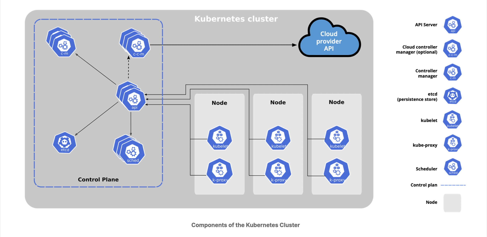

## Control Plane Nodes
### 1. API
1. The cluster gateway
2. Exposes a controlling RESTful API
3. Routes secondary/custom APIs
4. All other components communicate with ETCD via API
5. Authentication gatekeeper
   Endpoint examples   
   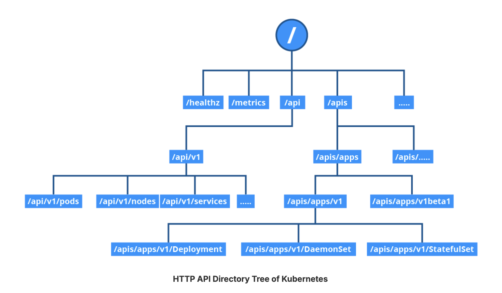    
6. [API Cluster access](Set%20up%20Cluster%20access.md)  
7. API resources  
   `> kubectl api-resources [--sort-by=(name | kind)] [-o wide | name |...]`   
   
8. API Groups - enabled versions   
   `> kubectl api-versions`   
   
	1. Enable/disable the group version  
	   `> ExecStart=/usr/local/bin/kube-apiserver ... --runtime-config api/all=true,api/v1alpha1 ...`  
	   or   
	   `vi /etc/kubernetes/manifests/kube-apiserver.yaml` and edit *--runtime-config*  
	   
	2. Convert versions  
	   Install with curl [kuberctl-convert](https://kubernetes.io/docs/tasks/tools/install-kubectl-linux/#install-kubectl-convert-plugin)  
	   `> kubectl convert -f pod-definition.yaml --output-version=apps/v1 > pod-definition-converted.yaml`    
	   
	3. Preferred (default) version  
	   `> kubectl proxy &`    
	   `> curl http://localhost:8001/apis`    
	   or   
	   `> kubectl get --raw /api/v1 | jq -C . | less -iR`   
	   
9. API [available/enabled/disabled admission controllers](#1333-operations)  


### 2. Controller manager
1. Watches for cluster state changes via API, comparing desired (declared) states and current ones
2. Manages controllers (e.g. ReplicaSet controller) or operators to restore consistent states of pods, endpoints, service accounts and tokens
3. Cloud CM communicates with the cloud infrastructure layer to manage nodes, volumes, load balancers and routes  
  

### 3. Scheduler
1. Decides on a new node’s discovery
2. Distributes pods based on some factors:
	1. pods’ requirements vs node resources
	2. data locality
	3. affinity and anti-affinity spec
	4. taints, tolerations
	5. etc

3. Returns decisions to the API for further workload deployment delegation  


### 4. ETCD
1. Distributed strongly consistent [key-value database](DB%20Types%20and%20Data%20Model.md) for K8s cluster states
2. Data added, not replaced, periodically compacted
3. Only the API communicates with it
4. **etcdctl** utility
5. It can be stacked within the Control Plane or be external storage
6. etcd is based on the [Raft Consensus Algorithm](https://raft.github.io/) which allows a collection of machines to work as a coherent group that can survive the failures of some of its members.
7. etcd is also used to store configuration details such as subnets, ConfigMaps, Secrets, etc  
   
   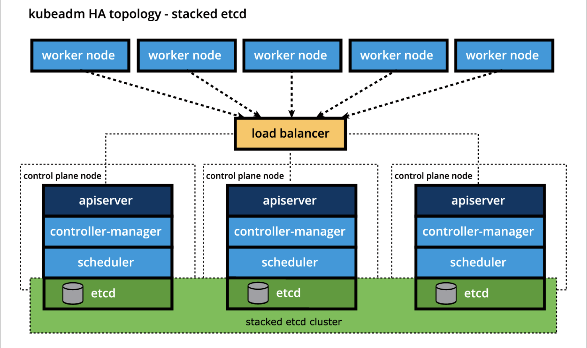  
   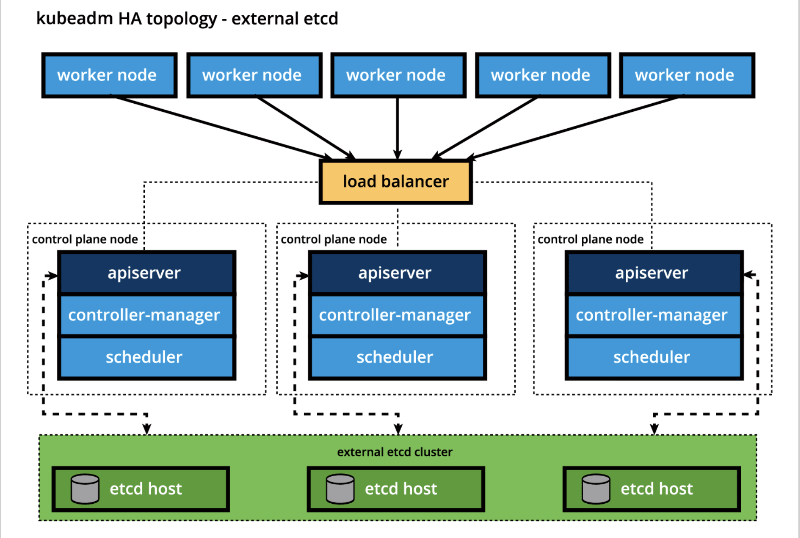  

## Working Nodes
They can be allocated on bare metals, VMs or containers, comprising Pods of the Control Plane as well as “regular” ones.  

### 1. Kubelet
1. Communicate with the *API* and *CRI*
2. Register and serve nodes
3. Manage pods/containers deployed by Kubernetes, checking out and reporting their states to the *API*
4. Serve (without *API*) the special **Static Pod**s
	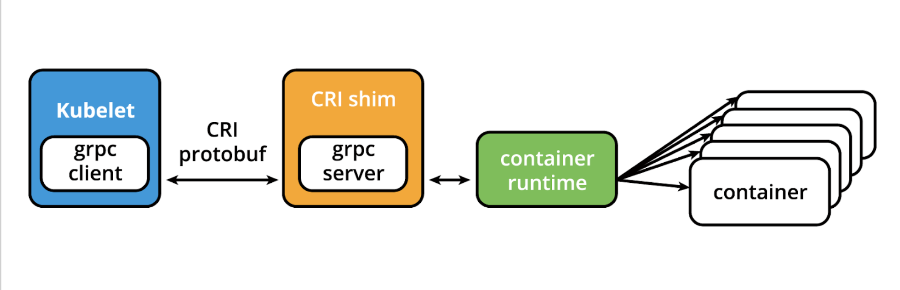
5. **cAdvisor** - Container Advisor retrieves metrics from Nodes and Pods for the API Server   
   `> kubectl apply -f https://github.com/kubernetes-sigs/metrics-server/releases/latest/download/components.yaml`   
   `> kubectl get pod metrics-server -n kube-system`   
6. Get Node's metrics  
   `> kubectl top nodes`   
   Pod's metrics  
   `> kubectl top pods -A`   
   Pod's container metrics  
   `> kubectl top pods --containers`  
   Get Pod's metrics sorted by cpu (memory)  
   `> kubectl top pods --sort-by=cpu`  
   Get raw data for node cr01-worker  
   `> kubectl get --raw /api/v1/nodes/cr01-worker/proxy/metrics/resource`   
   
7. Operations  
   `> systemctl status kubelet`  
   `> journalctl -u kubelet`  
   
### 2. Kube-Proxy
1. Responsible for dynamic updates and maintenance of all networking rules on the node
2. Responsible for TCP, UDP and SCTP stream forwarding
3. It is k8s default CNI and operates in conjunction with iptables/ipvs
4. Alternative CNI examples:
	1. Cilium (eBPF-based)
	2. KPNG (Kubernetes Proxy Next Gen)
	   
### 3. Container Runtime Interface (**CRI and CRI shims**)
1. Serve containers that meet the **OCI** Open Container Initiative
	1. imagespec - build container spec - ImageService
	2. runtimespec - container deployment spec - RuntimeService

2. Examples CRI:

	1. [CRI-O](https://cri-o.io/)
	2. Docker via cri-dockerd (docker-shim till v1.24)
	3. Mirantis Container Runtime (MCR)
	4. Podman
	5. Rocket Rkt

3. Utilities to compare

	1. **ctr** (control containerd, not friendly, debug useful)
	2. **nerdctl** (control containerd, docker-like, friendly)
	3. **Docker** (control Docker)
	4. **crictl** (control Kubernetes CRI compatible containers, debug and inspect)
	   
4. CRI examples:
	1. **containerd** plugin (aka cri-containerd)  
	   
	   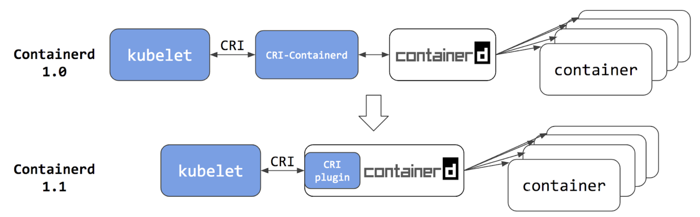
	2. **cri-dockerd**  
	   
	   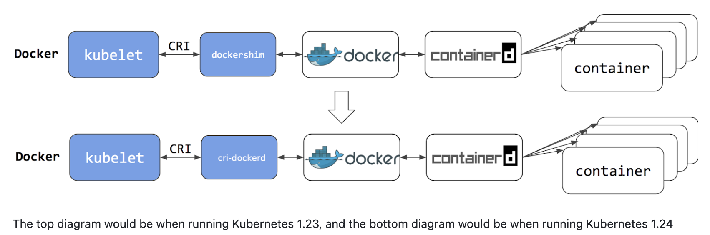
### 4. Addons
1. DNS
2. Dashboard
3. Monitoring
4. Logging
5. Device Plugins: GPU, NIC, etc
   
### 5. Network Communication
1. Container-to-Container  
   Within a pod, containers have the same Linux network namespace and communicate via `loopback` (via Pause service container, non-user container)	   
2. Pod-to-Pod communicate via [CNI](#91-container-network-interfaces--cni)
3. External-to-Pod  
   Communicate via Services declaration and provided by kube-proxy (e.g. iptables)
		   
### 6. Component communication examples
1. One of the nodes crashed
	1. *kubelet* on the crashed node stops sending heartbeats and status updates
	2. *API Server* updates node status to NotReady in *etcd*; Pod status may become Unknown or Failed
	3. *ReplicaSet controller* in *kube-controller-manager* watches the change in actual state (via API Server), see *.status.readyReplicas* < *.spec.replicas*
	4. *ReplicaSet controller* calls API Server to create a new Pod
	5. *Scheduler* picks a healthy node and assigns it
	6. *kubelet* on the new node sees the new Pod assigned to its node, pulls the container image, and starts the Pod
2. ...

---

# Resources

## 1. Namespace
### 1.1. Secure isolation
See [Admission control](#133-admission-control)

### 1.2. Scale space of names
### 1.3. Resource restriction
See [LimitRange](#273-limitrange) and [ResourceQuota](Kubernetes.md#274-resourcequota)  

### Operations
1. Switchover to the specific namespace  
   `> kubectl config set-context --current --namespace=$namespace`  
   view context  
   `> kubectl config view --minify | grep namespace`  
2. More config context operations
	1. Get context names  
	   `> kubectl config get-contexts -o name`  
	2. Get the current context name  
	   `> kubectl config current-context`  
	3. Switch context  
	   `> kubectl config use-context $test-context`  

---

## 2. Pods / Containers
**Pods** are allocated in Nodes and comprise containers. The containers within the same pod communicate with each other via localhost.

1. Pod is a collection of one or more containers and volumes, where they share the same IP addresses  
   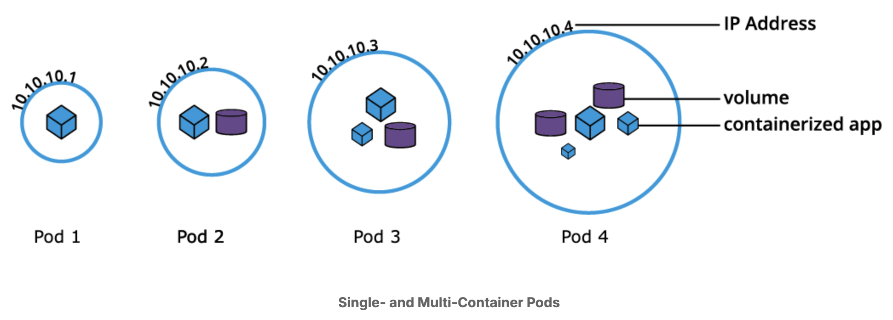  
2. **Static Pods** - Kubernetes serving special pods which manifests are allocated in Nodes, so only local *kubelet* serves them without the *API* and mirrors to the *API*  

### 2.1. Operations
1. Generate a skeleton manifest  
   `> kubectl run $test-pod --image=nginx --dry-run=client -o yaml`  
   
2. Generate a test-pod manifest, override label, provide a container port  
   `> kubectl run $test-pod --image=nginx --label='VAR1=VAL1,VAR2=VAL2' --port=80 --dry-run=client -o yaml`   
   
3. Do [more](https://kubernetes.io/docs/reference/kubectl/generated/kubectl_run/) - run a command in a Pod with args, using env variables, get output from its terminal and clean  
   `> kubectl run $test-pod --image=busybox -it --rm --restart=Never --env='DIR=/root' --command -- ls -la '$(DIR)'`  
   
4. Collect info with *custom-columns*  
   `> kubectl get po -o custom-columns=NAME:.metadata.name,IMAGES:.spec.containers[*].image`  
   
5. Collect info with *jsonpath*  
   `> kubectl get pod/tp -o jsonpath='{.status.phase}{"\n"}'`  
   `> kubectl get pod/tp -o jsonpath='{.status}'| jq .podIPs`  
   
6. Collect info with *json*  
   `> kubectl get pod/tp -o json`  
   
7. Collect Pod by selector with label VAR1=VAL1  
   `> kubectl get po --selector VAR1=VAL1`  
   The *selector*, either in Deployment, ReplicaSet, or Service, selects the appropriate Pods based on their *labels*.  

### 2.2. POD lifecycle  

1. Phases  
   `> kubectl get pod test-pod -o jsonpath='{.status.phase}'`  
   List of pods:  
   `> kubectl get pods -o custom-columns=NAME:.metadata.name,PHASE:.status.phase`  
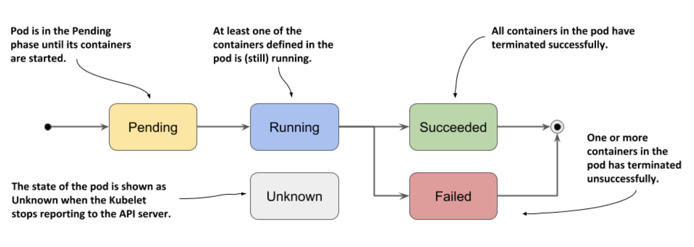

2. Pod statuses (integral)  
   `> kubectl get pods [-o (wide|yaml|..)] [-n namespace]`  
	1. Pending
	2. ContainerCreating
	3. Running  
	   
3. Pod conditions  
	   

### 2.3. POD Affiliation
#### 2.3.1. **Taints** (Node) / **Tolerations** (Pod)

> **CKAD hints**
> 
> 1. [Concepts](https://kubernetes.io/docs/concepts/scheduling-eviction/taint-and-toleration/)
> 2. `> kubectl taint node -h`
> 3. `> kubectl explain pod.spec.tolerations --recursive`
>
> Search pattern: *taint*, *toleration*


**Taint Nodes**  
*Taints* are marked *Nodes* to repel *pods* if they are not tolerated. However, keep in mind that tolerant pods can occupy other nodes without any restricting taints.  

Taint a node:  
`> kubectl taint node test-node KEY1=VAL1:[NoSchedule | PreferNoSchedule | NoExecute]`  

Get the node taints  
`> kubectl get nodes test-node -o jsonpath='{.spec.taints}' | jq .`  
```json
[
  {
    "effect": "NoSchedule",
    "key": "node-role.kubernetes.io/control-plane"
  }
]
```
  
Remove taint  
`> kubectl taint node test-node KEY1=VAL1:NoSchedule-`  
or all entries with the key  
`> kubectl taint node test-node KEY1-`  


Effects:
1. `NoSchedule` - never put new intolerant pods on this node, the existing ones are not evicted
2. `PreferNoSchedule` - perhaps no schedule new intolerant pods
3. `NoExecute` - no schedule new and evict the existing intolerant node. However, tolerant pods that have a tolerationSeconds interval anyway will be evicted !!!
4. No effects means all of them
5. The pods that are intolerant of one of the taints from the list - they are intolerant for the given nodes.
6. If *.spec.nodeName* is specified, then NoSchedule intolerance is ignored, but not NoExecute.

**Tolerate Pods**  
Tolerating a *Pod*  !!! You can add new entries without pod replacement !!!  

```yaml
tolerations:
  - key: KEY1
    value: VAL1
    operator: Equal
    effect: NoSchedule
```  

or  

```yaml
tolerations:
  - key: KEY1
    operator: Exists
    effect: NoSchedule
```  


#### 2.3.2. **Affinity** (Node: label, Pod: affinity)
> **CKAD hints**
> 
> 1. [Concepts](https://kubernetes.io/docs/concepts/scheduling-eviction/assign-pod-node/)
> 2. [Tasks](https://kubernetes.io/docs/tasks/configure-pod-container/assign-pods-nodes-using-node-affinity/)
>
> Search pattern: *affinity*

**Affinity** binds relevant *Pods* to the specific *Nodes*. However, keep in mind that other *Pods* can also occupy these *Nodes*.  

Get the node’s labels:  
`> kubectl get nodes --show-labels`  
   
Assign label:  
`> kubectl label nodes test-node KEY1=VAL1`  
	
Configure *Pod*spec per affinity type:  

1. *requiredDuringSchedulingIgnoredDuringExecution* - schedule if an appropriately labelled node exists or not at all  
```yaml
#.spec
affinity:
  nodeAffinity:
    requiredDuringSchedulingIgnoredDuringExecution:
      nodeSelectorTerms:
        - matchExpressions:
            - key: KEY1
              operator: In
              values:
                - VAL1
```  
2. *preferredDuringSchedulingIgnoredDuringExecution* - schedule preferably to a node with the appropriate label or elsewhere  
```yaml
#.spec
affinity:
  nodeAffinity:
    preferredDuringSchedulingIgnoredDuringExecution:
      - weight: 1
        preference:
          matchExpressions:
            - key: KEY1
              operator: In
              values:
                - VAL1
```  

#### 2.3.3. nodeSelector
*nodeSelector* binds a *Pod* to one of the *Nodes* with a matching label, or it stays unscheduled if there is no given label on any of the Nodes  
1. Configure *Pod* spec:  
```yaml
# .spec
nodeSelector:
  size: Large
```  
2. Label Node:  
`> kubectl label node $TEST-NODE size=Large`  

#### 2.3.4. nodeName
*nodeName* binds to the specific *Node* by its name  
```yaml
# .spec
nodeName: node01
```  

--
### 2.4. Container Probes

#### 2.4.1 Probe Types
> **CKAD hints**
> 
> 1. [Tasks](https://kubernetes.io/docs/tasks/configure-pod-container/configure-liveness-readiness-startup-probes/)
> 2. `kubectl explain pods.spec.containers`  
>   
> Search patterns: *liveness*, *readiness*, *startup*

##### 1. startupProbe
It probes if the container/app *is running and ready on startup*; else the kubelet *kills (and restarts) the container*. 

1. Until *startupProbe* succeeds, the other ones are disabled.
2. Use cases: 
   1. Slow-starting apps  

##### 2. readinessProbe
It probes if the container *is ready responding to requests*, else, the kubelet *removes its Pod's ip-address* from *Service Endpoints* - STOP routing TRAFFIC to the Pod.  

1. Use cases:
	1. To prevent sending requests to the pod/container before it is ready
	2. Self-maintenance period
	3. To check the backend services that the app depends on  
	   
2. *readinessGates*
	1. Specify *.spec.readinessGates* to add an ==application extra signal== to PodStatus
	2. To change a customer condition, [use a library](https://kubernetes.io/docs/reference/using-api/client-libraries/) to PATCH condition statuses from the application  
		```yaml
		kind: Pod
		...
		spec:
		  readinessGates:
		    - conditionType: "www.example.com/feature-1"
		```   
##### 3. livenessProbe
It probes if the container *is running* and its apps are running, else the kubelet *kills (and restarts gracefully with terminationGracePeriodSeconds) the container*
1. Use cases:
	1. To check if the app is healthy. If the app crashes, the kubelet kills the container. If the app is running but is not functioning properly, it needs to be restarted.  

####  2.4.2. Container Probe check mechanism
1. *exec*
```yaml
livenessProbe:
  exec:
    command:
      - cat
      - /tmp/healthy
  initialDelaySeconds: 5
  periodSeconds: 5
```
   
2. *httpGet*
```yaml
ports:
  - name: liveness-port
    containerPort: 8080
livenessProbe:
  httpGet:
    # host: 127.0.0.1
    # scheme: HTTP | HTTPS
    port: liveness-port # or number
    httpHeaders:
      - name: Accept
        value: application/json
```

3. *tcpSocket*
```yaml
readinessProbe:
  tcpSocket:
    port: 8080
  initialDelaySeconds: 15
  periodSeconds: 10
```
4. *grpc*
	   
	
#### 2.4.3. Container Probe configuration
1. *initialDelaySeconds* - (default: 0, min: 0) - begin after Pod's start or startupProbe if defined.  
2. *periodSeconds* - (default: 10, min: 1) - how often to probe. While a container is **not Ready**, the kubelet **may probe more frequently** than periodSeconds.  
3. *timeoutSeconds* - (default: 1, min: 1) - how long to wait for a response to the probe. 
4. *failureThreshold* - (default: 3, min: 1) - number of tries for final failure.
5. *successThreshold* - (default: 1, min: 1) - number of tries for considering it successful after failure - MUST BE 1 for liveness and startup probe.
6. *terminationGracePeriodSeconds* - (default: 30, min: 1) - grace period before the kubelet forces it to stop.
   
--
### 2.5. Container lifecycle/status  
   `> kubectl describe pod test-pod`  
1. Pod's *restartPolicy*: \[Always|OnFailure|Never\], restart with BackOff - 10s, 20s, 40s, ... 300s - policy on Pod's exit - **DOES NOT affect Probes**
2. with *ReduceDefaultCrashLoopBackOffDecay* 1, ..., 60
3. with per node's kubelet config -  *crashLoopBackOff.maxContainerRestartPeriod*\[1-300\]: 10, .., maxContainerRestartPeriod

--

### 2.6. Container command/args  
   *.spec.containers[\*].command* - Docker ENTRYPOINT   
   `> kubectl run $TEST-POD --image=$TEST-IMAGE --command -- $TEST_COMMAND $ARG1 $ARG2`   
   
   *.spec.containers[\*].args* - Docker CMD  
   `> kubectl run $TEST-POD --image=$TEST-IMAGE -- $ARG1 $ARG2`   
  
--

### 2.7. Pod / Container Resources  
With `PodLevelResources` [feature gate](https://kubernetes.io/docs/reference/command-line-tools-reference/feature-gates/) enabled:  
 - Priority: When both pod-level and container-level resources are specified, pod-level resources take precedence.

#### 2.7.1. Per Container / Pod
> **CKAD hints**
> 
> 1. [Concepts](https://kubernetes.io/docs/concepts/configuration/manage-resources-containers/)
> 2. [Tasks CPU](https://kubernetes.io/docs/tasks/configure-pod-container/assign-cpu-resource/)
> 3. [Tasks Memory](https://kubernetes.io/docs/tasks/configure-pod-container/assign-memory-resource/)
> 4. `kubectl explain pod.spec.resources --recursive`
> 
> Search patterns: *resources cpu*

**Resources declaration**
*.spec.containers[\*].resources*
 - *requests* - desired (minimum) amount of resources
 - *limits* - maximum amount of resources - 
	 - memory: Mi - pod is terminated
	 - cpu: m - pod is throttled
	
Overlimit of *limits* - Pod is running, but Containers are restarting, over *limits* of the Node - Pod is pending.  
If resources are defined on both levels - Pod and Containers, the **Pod is preceded**!  

**Resize policy**
*.spec.containers.[\*].resizePolicy*  defines cpu/memory resize with or without restart 

--


#### 2.7.2. QoS Class 
> **CKAD hints**
> 
> 1. [Tasks](https://kubernetes.io/docs/tasks/configure-pod-container/quality-service-pod/)
> 
> Search patterns: *qosclass*

*.status.qosClass* - is computed based on assigned resources  
1. *Guaranteed*  
	1. Pod/Container defined and *requests.cpu* == *limits.cpu*
	2. Pod/Container defined and *requests.memory* == *limits.memory*
2. *Bursted* - no meets all Guaranteed conditions, either some parameters are not defined or not equal
3. *BestEffort* - no restrictions assigned

--  
#### 2.7.3. LimitRange
> **CKAD hints**
> 
> 1. [Concepts](https://kubernetes.io/docs/concepts/policy/limit-range/) and then lots of examples at the bottom
> 
> Search patterns: *limitrange*

*LimitRange* - per Pod and per Container within the given **namespace**.   
Validations occur only at the Pod admission stage and do not impact the existing ones.  
You get `403 Forbidden` if over the limit: cpu, memory, storage

**Description**:
*.spec.limits*: 
- *type*: Container, Pod, PVC
- *default*: defines default *limits* explicitly if it's not specified in Pod/Container resources
- *defaultRequest*: defines default *requests* explicitly if it's not specified in Pod/Container resources
- *max*: checks if the defined *limits* specified in Pod/Container resources are not over the limits
- *min*: checks if the defined *requests* specified in Pod/Container resources are not less than *min* 
  
**Operations**:
1. Get limit ranges  
   `> kubectl get limitranges -A`  
   `> kubectl describe limitranges test-limits -n default`  
2. Generate a LimitRange  
   There is **no skeleton manifest generator**.  

--  
#### 2.7.4. ResourceQuota

> **CKAD hints**
> 
> 1. [Concepts](https://kubernetes.io/docs/concepts/policy/resource-quotas/)
> 2. `> kubectl create quota -h`
> 
> Search patterns: *quotas*

Provides limits across all Pods within the given **namespace** for cpu, memory, storage, external attributes and numerous resources
API server should run with `--enable-admission-plugins=` flag, which has *ResourceQuota*.  
When a *quota* is defined for the given namespace, the resources for Pod/Container **must** be specified individually or with *LimitRange* defaults (an example when *LimitRange* mutation works before *ResourceQuota* validation).

1. **Resource Description**  
   *.spec.hard*  
	- cpu
	- memory, 
	- storage, 
	- pods
	- configmaps
	- secrets
	- replicationcontrollers
	- services
	- services.loadbalancers
	- services.nodeports
	- persistentvolumeclaims
	- resourcequotas
	    
   *.spec.scopeSelector* - scope of definable and predefined entity classes.  
	
1. Generate a skeleton manifest  
   `> kubectl create quota test-quota -n test-ns --hard="requests.cpu=0.5,requests.memory=500Mi,limits.cpu=2,limits.memory=2Gi"`  

	
### 2.8. Pod / Container Security Context
Tools to manage pod and container privileges and access   

> **CKAD hints**
> 
> 1. [Tasks](https://kubernetes.io/docs/tasks/configure-pod-container/security-context/)
> 2. [Concepts](https://kubernetes.io/docs/concepts/security/pod-security-standards/)
> 3. `kubectl explain pods.spec.securityContext --recursive`
> 4. `kubectl explain pods.spec.containers.securityContext --recursive`
>
>Search patterns: *securitycontext*
> Notes:
> - Keep in mind that when we get the existing pod manifest, there is *spec.securityContext* even though empty and **rewrites declared above**.

#### 2.8.1. Per Container / Per Pod
1. *RunAsUser*
2. *RunAsNonRoot*
3. *RunAsGroup*
4. *SupplementalGroups* list
5. *SupplementalGroupsPolicy* 
	1. *Merge* (default) - add/evaluate groups from /etc/group
	2. *Strict* - stricts by the list of *SupplementalGroups* , *RunAsGroup* and *fsGroup*
6. *fsGroup* - controls ownership and permissions of the mounted volumes and changes them recursively as needed.
7. *fsGroupChangePolicy* - how to change ownership and permissions
	1. *Always* - changes after mounting
	2. *OnRootMismatch* - changes if root fs permissions mismatch configured ones
8. [CSI](#1523-container-storage-interface-csi) drivers can provide different criteria  
	   
#### 2.8.2. Per Container
1. *allowPrivilegeEscalation* - false/true
2. *capabilities* - "CAP_" linux properties like *SYS_ADMIN*, *NET_ADMIN*; breaks down root privileges to smaller permissions 
3. *seccompProfile*
4. *appArmorProfile*
5. *seLinuxOptions*

An example in *Deployment*
```yaml
...
kind: Deployment
spec:
  #...
  template:
    #...
    spec:
      securityContext:
        runAsUser: 1000
        runAsGroup: 3000
        fsGroup: 2000
        supplementalGroups: [4000]
      #...
      containers:
        - name: test-container
          #...
          securityContext:
            allowPrivilegeEscalation: false
            privileged: false
            capabilities:
              add: ["NET_ADMIN", "SYS_TIME"]
```

--

### 2.9. Container types and multi-container pods
#### 2.9.1. Application containers *.spec.containers*
1. Co-located within a Pod.
2. Their start order is undefined.
#### 2.9.2 Init Containers *.spec.initContainers*
1. They start and finish their jobs before the main one starts
2. They start according to their appearance in the Pod config
3. Use cases
	1. Service check
	2. Initial config fetch
	3. Certificate validation
	4. Resource wait (volume attached, DNS resolved) 
#### 2.9.3. Sidecar containers *.spec.initContainers*
1. An init container (among initContainers) with *restartPolicy: Always*
2. Start in order of the init container list
3. Start before the application containers and stop after them
4. Use cases
	1. Logs collector
	2. Metrics collector
	3. Proxy (Istio, Linkerd), in the old classification "Ambassador"
	4. Config sync
	5. Caching/preprocessing
	6. Adapter - from the old classification, to transform in/out data and protocols to avoid changing the main application
#### 2.9.4. Ephemeral containers
Temporary containers running for debugging  
`> kubectl debug test-pod -it --image=busybox --container=test-ephemeral-container --target=test-app-container`  
- non-removable
- non-restartable
- non-modifiable
- can be stopped internally - kill 1   
  `> kubectl exec -c test-ephemeral-container test-pod -- kill 1`    

### 2.10. Troubleshooting
#### 2.10.1. Events
1. From events in the description  
   `kubectl describe pod test-pod`  
2. From event listing  
   `kubectl events --namespace test-ns` or all `-A` or `kubectl get events`  
3. Sorting  
   `> kubectl events --sort-by='.metadata.creationTimestamp'`  

#### 2.10.2. Logs
1. Read a Pod logs  
   `> kubectl logs pods/test-pod` or in real-time `-f`   
2. Read the crashed Pod logs  
   `> kubectl logs pods/test-pod -p`  
   

#### 2.10.3. Debug
1. If a given Container *test-app-container* is running and has a shell, it is possible to inspect it  
   `> kubectl exec test-pod -it -c test-app-container -- sh`  
   or attach to its running process  
   `> kubectl attach test-pod -it -c test-app-container`  
   
   
2. To connect to the **running Pod** *test-pod* with the **failing Container** *test-app-container* and share its PID and Storage, it requires creating an ephemeral container within the existing Pod and using the *--target* flag   
   `> kubectl debug test-pod -it --image=busybox --target=test-app-container`   

   So, in this case, ps/top will show *test-app-container* processes. Having the running app APP_PID, it is possible to access its image storage */proc/APP_PID/root* directory   
   `> ls -la proc/1/root/`   
   The containers' states can be discovered as usual  
   `> kubectl describe pod test-pod`    
   As an ephemeral, it stops after exit.  
   
4. If the **Pod **  *test-pod*  **is failing**, it requires copying the Pod to *test-pod-debug* with a supplemental Container *debugger* based on *--image*  
   `> kubectl debug test-pod -it --image=busybox --container=debugger --copy-to=test-pod-debug --share-processes -- sh`   
   Then the debug Pod *test-pod-debug* needs to be removed manually.  
   
5. If you choose *--container* as a given app container *test-app-container*, then it allows you to replace its start command in the Pod copy  
   `> kubectl debug test-pod -it --container=test-app-container --copy-to=test-pod-debug --share-processes  -- sh`  
   
6. Debug Pod on the given node + privileged mode  
   `> kubectl debug nodes/test-node -it --image=busybox --profile=sysadmin`  
   the test-node filesystem  
   `> ls /proc/1/root`  


---

## 3. ReplicaSet (ReplicationController)
1. ReplicaSet controller provides HA control and keeps a specified number of Pod replicas, even if only one replica exists.
2. Horizontal scaling and load balancing.
3. The “selector” declaration allows control of Pods not created under the given ReplicaSet.
4. **Label Selectors**
	1. Equality-based KEY1=VAL1
	2. Set-based - KEY1: Exists; KEY1 in (VAL1,VAL2)
5. ReplicaSet skeleton manifest can be generated via the Deployment creation and editing to replace `kind` with ReplicaSet.  
   `> kubectl create deployment test-rs --image=nginx -o yaml --dry-run=client`  
6. Get objects by selector  
   `> kubectl get all --selector KEY1=VAL1`  
	   


---

## 4. Deployment  
> **CKAD hints**
> 
> 1. `> kubectl create deployment -h`
> 2. [Concepts](https://kubernetes.io/docs/concepts/workloads/controllers/deployment/)
> 3. [Tasks](https://kubernetes.io/docs/tasks/run-application/run-stateless-application-deployment/)

**Concepts**
1. The *Deployment* is a workload resource for stateless apps management.
2. The deployment controller manages rollout and rollback changes. It is an architect/planner, and it does not participate in state restoration.
3. Produce ReplicaSet and Pods
4. Generate a skeleton manifest  
   `> kubectl create deployment test-deployment --image=test-image --replicas=5 -o yaml --dry-run=client`   
5. Scale Deployment on the fly  
   `> kubectl scale deployment test-deployment --replicas=10`   
6. Setting/replacing an image on the fly triggers rollout  
   `> kunectl set image deployment test-deployment test-container=test-image`

--  

### 4.1. Update strategy. 
Any updates to the Pod's section trigger rollout.

#### 4.1.1. Built-in strategies 
Deployment *.spec.strategy*
1. *rollingUpdate*  
```yaml
spec:
  strategy:
    type: rollingUpdate
    rollingUpdate:
      maxSurge: 25%
      maxUnavailable: 25%

```
2. *Recreate*    
   
   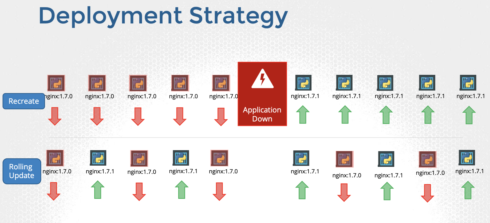  
	   
#### 4.1.2. Blue / Green  
Switchover Service from Deployment v1 to v2 imperatively. The selector picks up **exclusively Pod labels**, not Deployment ones.  
`> kubectl set selector service my-service 'version=v2'`  
   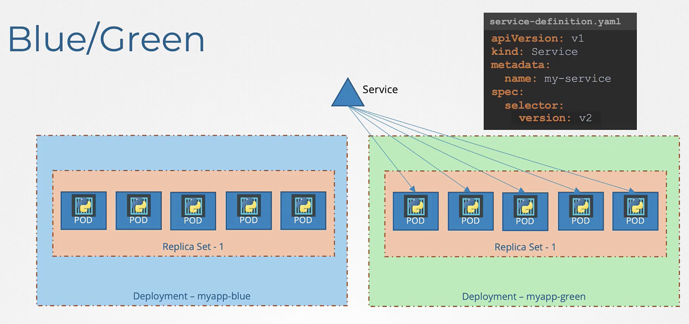  
#### 4.1.3. Canary
Involve the small percentage of v2 in use for testing (e.g. Istio allows routing the number of pods with better granularity)
Imperatively, scale up v2 and scale out v1.  
`> kubectl scale deployment canary replicas=5`  
`> kubectl scale deployment primary replicas=0`  
   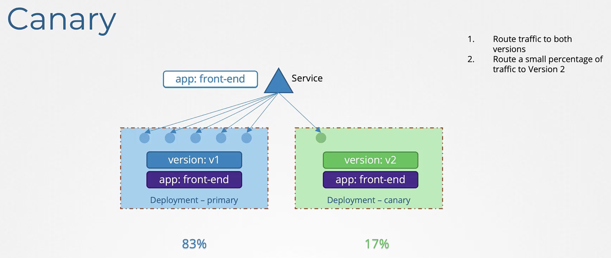  
#### Update global params
1. *.spec.progressDeadlineSeconds*  - (600 sec) deadline for the update procedure to indicate failure state and retry deploying anyway 
2. *.spec.minReadySeconds* - (0 sec) minimum time any Containers in the new Pod should be ready to be considered healthy
3. *.spec.revisionHistoryLimit* - (10) a number of ReplicaSets that can be rolled back

 --
 
### 4.2. The ways to roll out
1. Yaml update + annotation for history *.metadata.annotations.kubernetes.io/change-cause*  
   `> kubectl apply -f deployment_definition.yaml`  
     
2. Imperatively edit and apply + annotation for history *.metadata.annotations.kubernetes.io/change-cause*  
   `> kubectl edit deployment $deployment_name`  
        
3. Imperative CLI command + annotation for history  
   `> kubectl set image deployments $deployment_name $container_name=$image_name`  
   `> kubectl annotate deployments $deployment_name kubernetes.io/change-cause="Update the new revision 3"`  
     
4. Rollout with **pause** - postpones the actual rollout for changes **within** *.spec.template* **only** (other changes applied immediately)!!!  
   `> kubectl rollout pause deployment $deployment_name`    
   `> kubectl set resources deployments $deployment_name -c $container_name --limits=cpu=200m,memory=512Mi`    
   `> kubectl annotate deployments $deployment_name kubernetes.io/change-cause="Update the new revision"`    
   ... set something else  
   !!! *.spec.pause=true*, and any config outputs can show some params that have just been declared and still not applied  
   `> kubectl rollout resume deployment $deployment_name`   
      
5. Check out   
   `> kubectl rollout status deployment $deployment_name -w`   
   `> kubectl rollout history deployment $deployment_name`   
   Look at revision details:  
   `> kubectl rollout history deployment $deployment_name --revision=$revision_from_history`    
	      
### 4.3. Roll back
1. To the previous version   
   `> kubectl rollout undo deployment $deployment_name`  
2. To the specific version  
   `> kubectl rollout undo deployment $deployment_name --to-revision=$revision_from_history`     


---

## 5. StatefulSet
> **CKAD hints**
> 
> 1. `kubectl create deployment --dry-run=client ...`, 
> 	- then replace kind with *kind: StatefulSet*
> 	- remove *spec.strategy* (it uses *spec.updateStrategy* instead)
> 	- add required *spec.serviceName*
> 	- optionally add *spec.volumeClaimTemplates* if you need per-Pod storage
> 2. [Concepts](https://kubernetes.io/docs/concepts/workloads/controllers/statefulset/)
> 3. [Tutorials](https://kubernetes.io/docs/tutorials/stateful-application/basic-stateful-set/)
> 4. `kubectl explain sts`  
> 
> Search patterns: *statefulset*


### Concepts

The _StatefulSet_ is a workload resource for running **stateful applications** that need **stable network identities and persistent storage** for each Pod replica.  
It usually works with a [Headless Service](#^headless-service) to give each Pod its own DNS name (e.g. db-0, db-1, …), which is critical for systems such as databases, queues, and clustered storage engines.  

   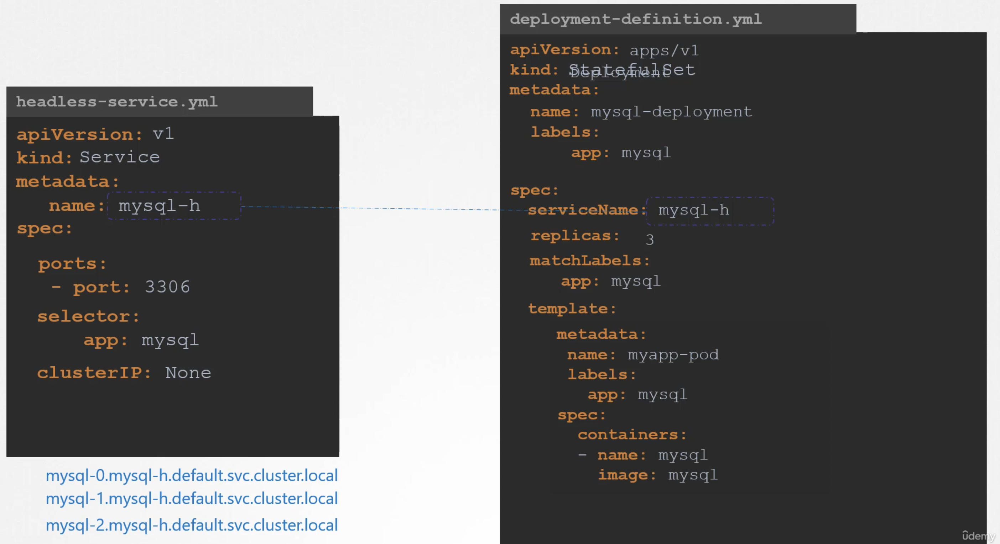  
### Use cases

1. Relational DB clusters (PostgreSQL, MySQL primary–replica)  
    - db-0 = primary, db-1, db-2 = replicas  
    - Each Pod has its own PVC with DB data.  
2. Distributed NoSQL stores (Cassandra, MongoDB, CockroachDB)  
    - Cluster members need fixed hostnames and volumes for data partitions.  
3. Message queues / streaming (Kafka, RabbitMQ cluster)  
    - Brokers keep stable IDs (for partitions/replication) and durable logs on their own PVs.   
4. Consensus systems (etcd, ZooKeeper, Raft-based config stores)
    - Stable member IDs + ordered startup help maintain cluster health and quorum.
5. Sharded / partitioned workers
    - worker-0 handles shard 0, worker-1 shard 1, etc.
    - Identity + volume stay bound to the same shard across restarts.


---

## 6. DaemonSet

> **CKAD hints**
> 
> 1. [Concepts](https://kubernetes.io/docs/concepts/workloads/controllers/daemonset/)
> 2. `kubectl create deployment --dry-run=client ...`
> 	- then replace kind with *kind: DaemonSet*
> 	- remove *spec.replicas* 
> 	- remove *spec.strategy* (it uses *spec.updateStrategy* instead)
> 	- optionally add node targeting rules
> 3. `kubectl explain ds`
>
> Validation:  
> 1. `kubectl get ds test-ds --show-labels`  
> 2. `kubectl get pod -A -l test-ds=test-label -o wide`    
> 
> Search patterns: *daemonset*

### Concepts

The *DaemonSet* is a workload resource for running **exactly one Pod instance on each node** (or on a **selected group of nodes**). It’s typically used for **cluster-level agents** and **node-local services** such as logging, monitoring, networking, and storage daemons. 
The binding mechanism to the Nodes is the same as for the user.  
1. *DaemonSet* controller creates *spec.affinity.nodeAffinity* within the [Pod template](#232-affinity-node-label-pod-affinity) context.
2. *DaemonSet* controller adds a special set of tolerations within the [Pod template](#231-taints-node--tolerations-pod) context to run its Pod on Nodes that are marked unschedulable for application Pods.
3. Scheduler assigns *nodeName* within the [Pod template](#234-nodename) context.
4. The default scheduler can be replaced with an assigned one with *.spec.schedulerName* within the Pod template context.
5. The user can restrict a group of Nodes with *spec.affinity.nodeAffinity* and *spec.nodeSelector* within the [Pod template](#233-nodeselector) context.
6. Update strategy types
	1. *OnDelete* - update if DS Pod has been deleted
	2. *RollingUpdate* - (default) - DS template updated
		1. *.rollingUpdate.maxUnavailable* (default: 1)
		2. *.rollingUpdate.maxSerge* (default: 0)
		3. *spec.minReadySeconds* (default: 0) - Pod will be considered available as soon as it's ready 
7. *spec.restartPolicy* must be *Always*

### Use cases

1. Logging agents
    - e.g. Fluent Bit, Fluentd, Vector
    - Collect container logs from /var/log or container runtime and ship to Elasticsearch/Loki/etc.
2. Metrics / monitoring agents
    - e.g. node-exporter, Prometheus agent, Datadog/Vector agents
    - Scrape node + Pod metrics and send to a central system.
3. CNI / networking components
    - e.g. Cilium/Calico agents, kube-proxy (in some setups)
    - Provide data plane or iptables/ipvs rules on every node.
4. Storage / Volume daemons
    - e.g. Ceph, Rook, OpenEBS, local-PV provisioners
    - Manage node-local disks or storage backends.
5. Node management helpers
    - Security agents, log forwarders, node health checkers, GPU drivers, etc.

---

## 7. Job
> **CKAD hints**
> 
> 1. `kubectl create job -h`
> 2. [Concepts](https://kubernetes.io/docs/concepts/workloads/controllers/job/)
> 3. `kubectl explain jobs.spec --recursive`
>
> Search patterns: *jobs*

### Concepts
1. Like the one-off task Deployment, but it always has *restartPolicy: Never* or *OnFailure*
2. Label Selector is generated automatically
3. Generate a skeleton manifest and then add more parameters  
   `> kubectl create job test-job --image=busybox --dry-run=client --output=yaml -- date`  
   
```yaml
apiVersion: batch/v1
kind: Job
metadata:
  name: test-job
spec:
  backoffLimit: 4
  completions: 3
  parallelism: 2
  template:
    spec:
      containers:
      - name: test-job
        image: busybox
        command:
          - 'date'
      restartPolicy: Never
```
   
4. Get job output  
   `kubectl logs jobs/test-job`    
   
5. States: Complete and Failed  
   
### Parameters: 
1. *.spec.completions* - waits for a number of the successfully completed Pods
2. *.spec.parallelism* - runs a number of the parallel Pods
3. *.spec.activeDeadlineSeconds* - stops the job after deadline seconds
4. *.spec.backoffLimit* - stops the job after the number of failure retries
5. *.spec.ttlSecondsAfterFinished* - removes the job after ttl seconds

---

## 8. CrontabJob

> **CKAD hints**
> 
> 1. `kubectl create cronjobs -h`
> 2. [Concepts](https://kubernetes.io/docs/concepts/workloads/controllers/cron-jobs/)
> 3. `kubectl explain cronjobs.spec --recursive`
>
> Search patterns: *cronjob*

### Concepts
1. Like a Job creates a task on a repeating schedule
2. Creates a Job with *.spec.jobTemplate* and Cron-like schedule *.spec.schedule*  
   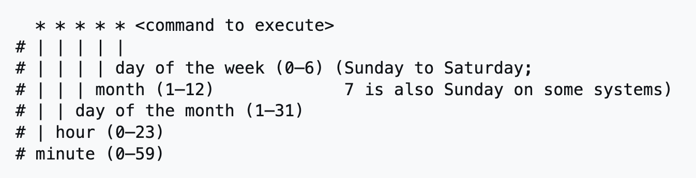
3. Generate a skeleton manifest  
   `> kubectl create cronjob test-cj --image=busybox --schedule="*/5 * * * *" -- date`  

### Parameters
1. *.spec.startingDeadlineSeconds* - optional, interval in seconds during which the job may still run after missing its scheduled time
2. *.spec.concurrencyPolicy* - whether it is possible to run or not the job, or in what manner, when the previous one is still running
	1. *Allow* (default)
	2. *Forbid* - not run at the scheduled moment, but may be run if the previous one finishes within *startingDeadlineSeconds* 
	3. *Replace*
3. *.spec.successfulJobsHistoryLimit* - (default: 3)
4. *.spec.failedJobsHistoryLimit* - (default: 1)
5. *.spec.suspend* - (default: false), if *true*, it suspends the job performance, but not its scheduling. All accumulating jobs will run (if *startingDeadlineSeconds* is not defined) once. *.spec.suspend* becomes *false* !!!

   

---

## 9. Networking

### 9.1. Container Network Interfaces / CNI
1. Built-in
	1. loopback
	2. bridge
	3. host-local
	4. hostNetwork
2. External / Third-party Software Defined Network, **SDN**
	1. MACvlan
	2. IPvlan
	3. Flannel
	4. Weave
	5. Calico
	6. **Cilium**
	7. etc
3. Specialized
	1. Kube-Router
	2. Kube-OVN


### 9.2. Service
> **CKAD hints**
> 
> 1. `kubectl create service -h`
> 2. `kubectl expose -h`
>
> Search patterns: *service*

#### 9.2.1. ClusterIP

 *ClusterIP* - provides a base cluster-wide *stable internal FQDN* to serve a set of Pods. Every pod has its unique cluster-wide ip-address, but they are ephemeral as well as their Pods.  All types inherit *ClusterIP*, excluding *ExternalName*.  
 
 1. **Base Service** *.spec.ClusterIP* = "ip-address" - it provides FQDN and a stable internal ip-address that is routed within the cluster *service*.*namespace*.svc.cluster.local .   
    Cluster pod intercommunication is a use case.  
    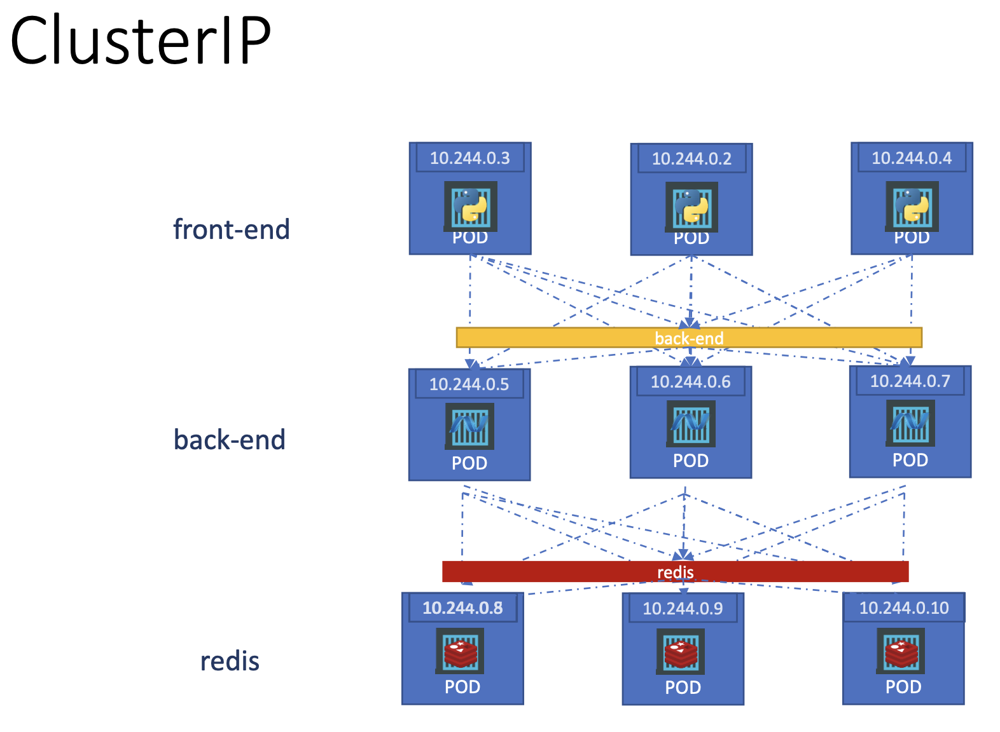    
    
    <a id="headless-service"></a>
 2. **Headless Service**  *.spec.ClusterIP* = **None** - instead of providing a virtual ClusterIP, it exposes DNS records that resolve directly to Pod ip-addresses via A/AAAA records ^headless-service
    - it enables per-Pod FQDNs (e.g., *pod-0*.*service*.*namespace*.svc.cluster.local) 
    - and, for the service name itself, returns multiple Pod ip-addresses via round-robin DNS (A/AAAA records)  
	[StatefulSet](#5-statefulset) is a use case.    
	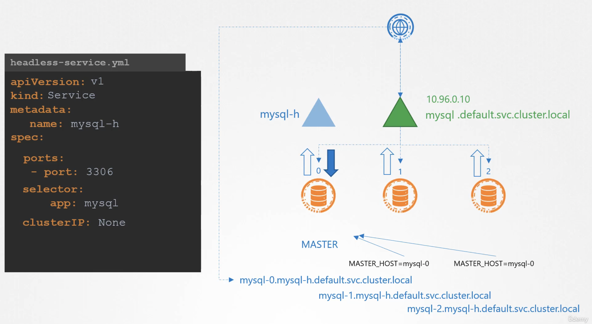  
    
 3. Generate a skeleton manifest:  
    `> kubectl create service clusterip test-service --dry-run=client -o yaml --tcp=$port:$targetPort`   
    or   
    `> kubectl expose pod test-pod --port=$port --target-port=$tport --name test-service --dry-run=client -o yaml`  
	   
	   
#### 9.2.2. NodePort
*NodePort* - exposes Pod's ports to the Node's ip-address   

Generate a skeleton manifest:  
   `> kubectl create service nodeport test-service --dry-run=client -o yaml --tcp=8080:80 --node-port=30080`   
   or   
   `> kubectl expose pod test-pod --port=80 --targetPort=80 --name test-service --type=NodePort --dry-run=server -o yaml`   
   
   The `expose` command does not have the *nodePort* parameter and generates a random NodePort from the allowed range. So, if the specific *nodePort* is required, use `kubectl edit svc` or edit its manifest.  
   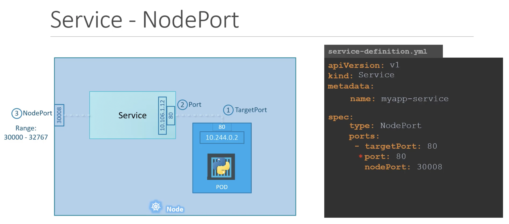  
   The Service Selector binds it to the appropriate Pods based on their *labels*.  
   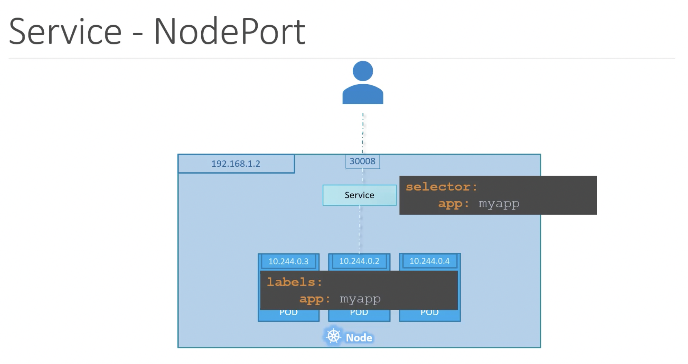  
In the multi-node case, NodePort is created on each of them.  
   
   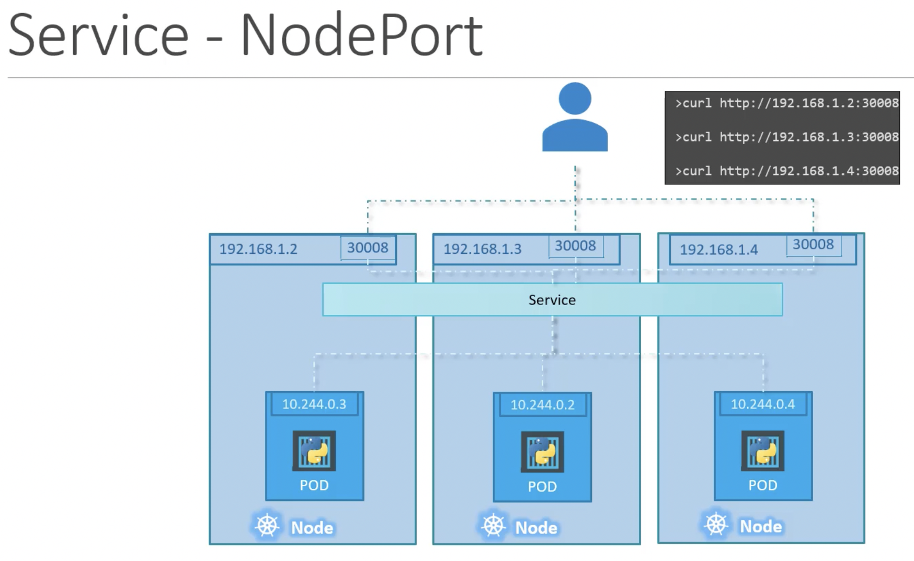    

#### 9.2.3. LoadBalancer  
 *LoadBalancer* - Cloud-Control-Manager provides an external load balancer configuration   
`> kubectl create service loadbalancer test-service --dry-run=client -o yaml --tcp=8080:80 --node-port=30080`   
   or  
`> kubectl expose pod test-pod --port=80 --targetPort=80 --name test-service --type=LoadBalancer --dry-run=server -o yaml`  
 specific *.spec.loadBalancerIP* permanent external ip-address if it needs  
#### 9.2.4. External Name
*ExternalName* - provide access to an external service by its FQDN  
TODO
#### 9.2.5. External IPs
*.spec.externalIPs* - to access the Service/Pods via the external ip-address and ports. It needs to route these IPs with external tools because Kubernetes does not manage these IPs and their routing. 
TODO


### 9.3. Ingress
> **CKAD hints**
> 
> 1. `kubectl create ingress -h`
> 2. [Concepts](https://kubernetes.io/docs/concepts/services-networking/ingress/)
>
> Search patterns: *ingress*

1. Ingress Controller processes and routes HTTP/HTTPS (Layer 7) requests according to rules to Services and Resources. This is an alternative to *NodePort* and LoadBalancer.  
   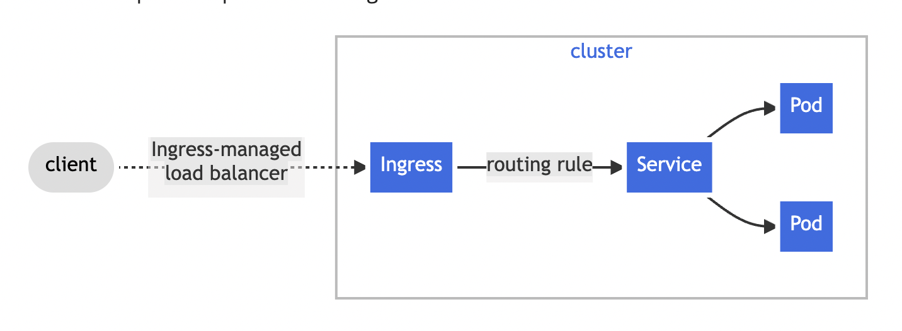  
2. Create an ingress with the prepared Service `test-service`:   
   `> kubectl create ingress test-ingress --rule=/test=test-service:8080 --dry-run=client -o yaml`  
   
3. *.spec.ingressClassName* implements if it's specified, else default.  
4. Rules. *.spec.rules* route requests by URL to the backend.  
	1. *host*
	2. *http* -> *paths* -> *path*
5. Path types *.spec.rules[\*].paths[\*].pathType
	1. *Prefix* - /aaa matches /aaa, /aaa/, /aaa/bbb (subpath), but not /aaabbb
	2. *Exec* - /aaa mathes /aaa, but not /aaa/
	3. *ImplementationSpecific*  - matching is up to the *IngressClass*
	   
6. Backend *.spec.rules[\*].paths[\*].path.backend
	1. Service *..backend.service*
	2. CRD - Customer Resource Backend *..backend.resource* - assets provider (e.g. files)
	3. *.spec.defaultBackend* - usually it is provided by the ingress controller - processes all unmatched requests
7. TLS *.spec.tls*  
8. [Ingress Controllers Plugins](https://kubernetes.io/docs/concepts/services-networking/ingress-controllers/) (some of):
	1. [Cilium](https://cilium.io/) 
	2. [HAProxy](https://www.haproxy.org/)
	3. [Istio](https://istio.io/)
	4. [Nginx](https://www.f5.com/products/nginx/nginx-ingress-controller)
	5. [Traefik](https://doc.traefik.io/traefik/providers/kubernetes-ingress/)
	6. etc  
	   
### Types of Ingress
1. Single service (default backend)  
   `kubectl create ingress test-ingress --class=default --default-backend=default-service:80`		   
	```yaml
	apiVersion: networking.k8s.io/v1
	kind: Ingress
	metadata:
	  name: test-ingress
	spec:
	  ingressClassName: default
	  defaultBackend:
	    service:
	      name: default-service
	      port:
	        number: 80
	```  
	
2. Simple fanout  - ingress -> URI paths (*.spec.rules[\*].http.paths[\*].path*) -> service  
   `> kubectl create ingress test-ingress --class=nginx --rule=/foo*=service1:4200 --rule=/bar*=service2:8080`  
   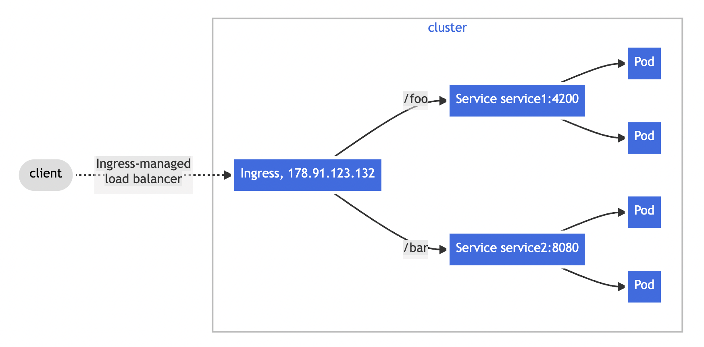  
   
3. Name-based virtual hosting - ingress -> FQDN (*.spec.rules[\*].host*) -> services  
   `> kubectl create ingress test-ingress --class=nginx --rule=foo.bar.com/*=service1:80 --rule=bar.foo.com/*=service2:80`  
   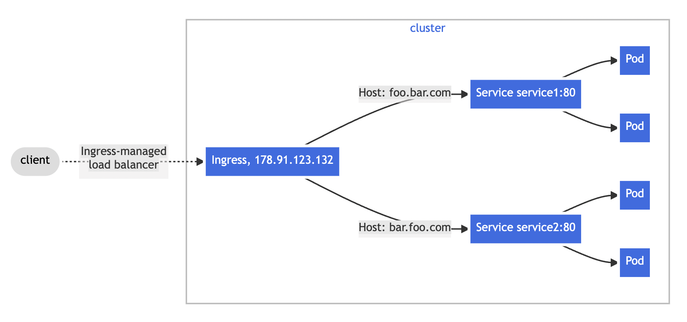  
4. TLS + [TLS Secret](#114-secret-tls)  
   `> kubectl create ingress test-ingress --class=nginx --rule=foo.bar.com/*=service1:80,tls=secret1`  
5. LoadBalancer  
   

---

### 9.4. EndpointSlices
> **CKAD hints**
> 
> 1. [Concepts](https://kubernetes.io/docs/concepts/services-networking/endpoint-slices/)
>
> Search patterns: *entrypointslices*

A set of network endpoints (ip-addresses) and ports
1. Mapped to the Service name if generated by it.
2. Type: IPv4 and IPv6  
3. Get the information about Endpoints associated with the Service  
   `> kubectl get endpointslices`  
   or  
   `> kubectl describe service test-service`  
   

---

### 9.5. NetworkPolicy
> **CKAD hints**
> 
> 1. [Conception](https://kubernetes.io/docs/concepts/services-networking/network-policies/)
> 2. [Tasks](https://kubernetes.io/docs/tasks/administer-cluster/declare-network-policy/)
> 3. `kubectl explain networkpolicy.spec --recursive`
>
> Search patterns: *netpol*, *network policy*

### Concepts

1. Isolation Types (allowed by default if not specified) *.spec.policyTypes*:
	1. Ingress *.spec.ingress*
	2. Egress *.spec.egress*
2. Entity isolation
	1. Pod - label identification with *podSelector*
	2. Namespace - label identification with *namespaceSelector*
	   The namespace can be specified by its specific-assigned label or by its name using its immutable label:  
	    *kubernetes.io/metadata.name: NS-NAME*
	3. IP Block - description with  *ipBlock* 
	4. Ports - *port*, *protocol*
3. Selectors *from* and *to* 
4. [The AND or OR logic of rules](https://kubernetes.io/docs/concepts/services-networking/network-policies/#behavior-of-to-and-from-selectors)
	1. AND works within the same member of the selector list
	2. OR works among a member of the list
	
	  OR logic works within the *from* section, between the list members *podSelector* and *ipBlock*.  
	  Whereas, AND logic works between the dict members *podSelector* and *namespaceSelector*.  
	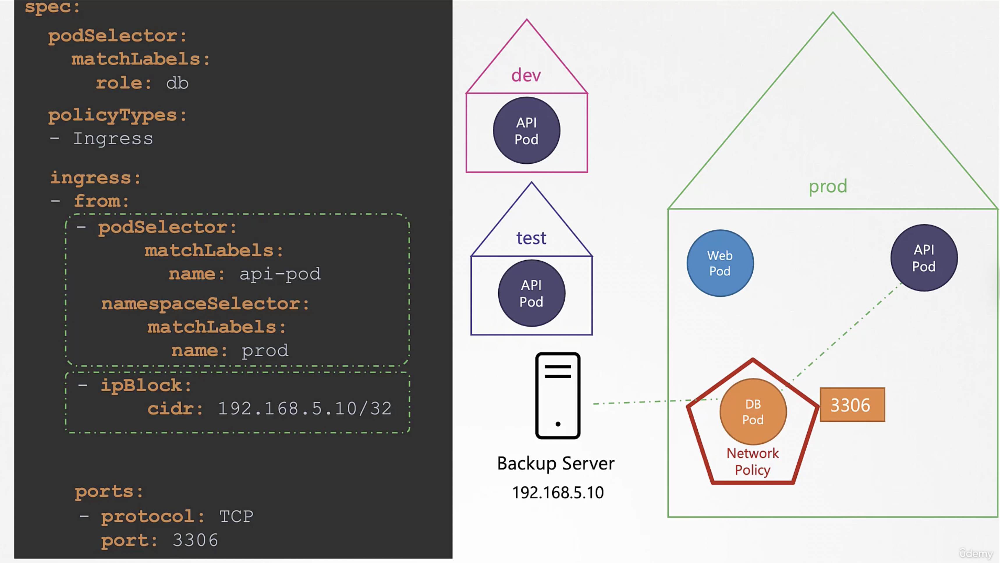  
		Once *Egress* is mentioned within *policyTypes*, all egress traffic is blocked from the DB Pod, excluding the stateful ingress rule *from* and the egress rule *to*.  
   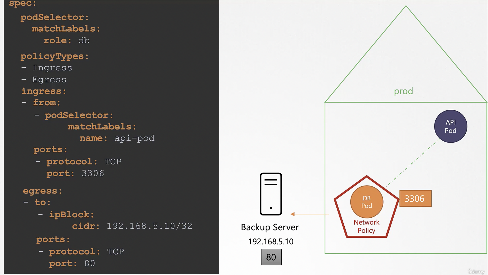  
Working with Egress policy, **DO NOT FORGET** about requests to **DNS anywhere**  
  ```yaml
  egress:
  - to:
      ...
  - ports:
      - port: 53
        protocol: TCP
      - port: 53
        protocol: UDP
  ```  


---

### 9.6. Network Tools
#### 9.6.1. Port Forwarding
Serves for debugging only, to forward a port from a Pod to the local machine that has access to the cluster  
`> kubectl port-forward pods/test-pod 8030:80`   
`> curl http://localhost:8030`   
 
or its Deployment, Service, ReplicaSet  
`> kubectl port-forward deployment/test-nginx 8030:80`   
`> kubectl port-forward service/test-nginx 8030:80`   
`> kubectl port-forward replicaset/test-nginx 8030:80`   

#### 9.6.2. Test pod
Run test utilities on the given source *Pod* with the given properties (label, namespace, etc)  against the testing *Service*  
`> kubectl exec source-pod -it -- wget -O- -T 10 test-service:80`  

Run debug *Container* in the given *Pod* if the given *Container* does not comprise the required utilities  
`> kubectl debug source-pod --image=busybox -it -- wget -O- -T 10 test-service:80`  
`> kubectl debug source-pod --image=busybox -it -- nc -zv -w 10 test-service 80`  
`> kubectl debug source-pod --image=nginx:alpine -it -- curl -m 10 test-service:80`  

Do not use temporary or fast-executing pods **against NetworkPolicy**. They might not have NetworkPolicy rules applied before they complete.
**BAD choice**:  
~~`> kubectl run tmp --image=nginx:alpine --rm --restart=Never --labels=app=test-label -it --command -- curl -m 5 nginx-api-svc:8080`~~  

**Right choice:** 
`> kubectl run tmp --image=nginx:alpine --rm --restart=Never --labels=app=test-label -it --command -- sh'  
`> curl -m 5 nginx-api-svc:8080`  
Or the debug container    

---

## 10. ConfigMap
> **CKAD hints**
> 
> 1. `kubectl create configmap -h`
> 2. [Tasks](https://kubernetes.io/docs/tasks/configure-pod-container/configure-pod-configmap/) (lots of examples)
> 3. [Concepts](https://kubernetes.io/docs/concepts/configuration/configmap/) (enough examples)
>
> Search patterns: *configmapref* (envfrom), *configmapkeyref*(env), *configmap*

### 10.1. Literal config  
`> kubectl create configmap test-config-map --from-literal=APP_VAR1=VAL1 --from-literal=APP_VAR2=VAR2 --dry-run=client -o yaml`   

Generated ConfigMap manifest:  
```yaml
apiVersion: v1 
kind: ConfigMap  
metadata:  
  name: test-config-map 
data:  
  APP_VAR1: "VAL1"
  APP_VAR2: "VAL2"
```

Usage as env vars per variable *configMapKeyRef* with renaming ability  
```yaml
#.spec.template.spec.containers.[*]
env:
  - name: NEW_NAME_APP_VAR1
    valueFrom:
      configMapKeyRef:
        name: test-config-map
        key: APP_VAR1
```

Usage of the whole configMap *configMapRef*  
```yaml
#.spec.template.spec.containers.[*]
envFrom:
  - configMapRef:
      name: test-config-map
```

This *ConfigMap* can be mounted [as a volume](#103-config-filedirectory) - each key will be a filename that comprises its value.  

### 10.2. Env config file
`> kubectl create configmap test-config-map --from-env-file=test-config.properties`  
And use [as env vars](#101-literal-config) or mount [as a volume](#103-config-filedirectory) - each key will be a filename that comprises its value.  

### 10.3. Config file/directory  
`> kubectl create configmap test-config-map --from-file=test-config.properties`   

To rename the key filename in *data:* specify the new key name, e.g. *new-test-name* *:  
`> kubectl create configmap test-config-map --from-file=new-test-name=test-config.properties`  


File test-config.properties:  
```txt
permission=read-only
allowed="true"
resetCount=3
```
Generated a skeleton manifest:  
```yaml
apiVersion: v1 
kind: ConfigMap  
metadata:  
  name: test-config-map 
data:
  # or new-test-name: |
  test-config.properties: |
    permission=read-only
    allowed="true"
    resetCount=3 
```
Usage as a mounted file:  
```yaml
#.spec.template.spec
volumes:
  - name: test-config-volume
    configMap:
      name: test-config-map
      # optionally to rename the key filename in the mounted directory
      items:
        - key: test-config.properties
          path: app-properties
#.spec.template.spec.containers.[*]
volumeMounts:
  - name: test-config-volume
    mountPath: "/config"
    readOnly: true
```

From a directory that comprises several config files  
`> kubectl create configmap test-config-map --from-file=config-dir/`  

---

## 11. Secret
> **CKAD hints**
> 
>1. `kubectl create secret -h`
>2. [Tasks](https://kubernetes.io/docs/tasks/inject-data-application/distribute-credentials-secure/)
>3. [Concepts](https://kubernetes.io/docs/concepts/configuration/secret/)
>
> Search patterns: *secretref* (envfrom), *secretkeyref*(env), *secretname*(volume), *secrets*

### Concepts
The secret data is encoded but not encrypted in ETCD by default. It requires additional efforts
1. Encrypt/decrypt data in an application
2. Rest encryption usage [https://kubernetes.io/docs/tasks/administer-cluster/encrypt-data/](https://kubernetes.io/docs/tasks/administer-cluster/encrypt-data/)
3. Secret Store CSI Driver
4. Helm Secrets, [HashiCorp Vault](https://www.vaultproject.io/).
5. Some tools [https://www.youtube.com/watch?v=EonWeoFPpvM](https://www.youtube.com/watch?v=EonWeoFPpvM)     

### 11.1. Literal secret
 `> kubectl create secret generic test-secret --type=Opaque --from-literal=APP_VAR1=VAL1 --from-literal=APP_VAR2=VAR2`   
Generated a skeleton manifest  
```yaml
apiVersion: v1
data:
  APP_VAR1: VkFMMQ==
  APP_VAR2: VkFSMg==
kind: Secret
metadata:
  name: test-secret
type: Opaque
```

 Usage as env vars per variable *secretKeyRef*  
 ```yaml
env:
  - name: APP_VAR1
    valueFrom:
      secretKeyRef:
        name: test-secret
        key: APP_VAR1
```

Usage of the whole secret - *secretRef*  
```yaml
envFrom:
  - secretRef:
      name: test-secret
``` 

Check  
`> kubectl exec -i -t test-pod -- /bin/sh -c 'echo $APP_VAR1'`   

This *Secret* can be mounted [as a volume](#113-secret-file) - each key will be a filename that comprises its value.  

### 11.2. Env secret file
 `> kubectl create secret generic test-secret --type=Opaque --from-env-file=secret.env`  
 And use [as env vars](#111-literal-secret) or mount [as a volume](#113-secret-file) - each key will be a filename that comprises its value.  

### 11.3. Secret file
   `> kubectl create secret generic test-secret --type=Opaque --from-file=secret.txt`  
Usage as a mounted file  
```yaml
# .spec.template.spec
volumes:
  - name: secret-volume
    secret:
      secretName: test-secret

# .spec.template.spec.containers[]

volumeMounts:
  - name: secret-volume
    readOnly: true
    mountPath: "/etc/secret-volume"
```

### 11.4. Secret TLS
   `> kubectl create secret tls test-tls-secret --cert=tls.crt --key=tls.key`  

### 11.5. Declarative-way Secret
If it's required to enter values declaratively in .yaml, they should be encoded  
- Encode:`> echo -n 'VAL1' | base64`
- Decode:`> echo -n ‘VAL1‘ | base64 —decode`  
  or  
- Instead of *data:* use *stringData*  
```yaml
kind: Secret
...
stringData:
  APP_VAR1: VAL1
  APP_VAR2: VAL2 
```

Extract data  
   `> kubectl get secret test-secret -o jsonpath='{.data}'`  
    

---

## 12. ServiceAccount
> **CKAD hints**
> 
> 1. `kubectl create sa -h`
> 2. [Tasks](https://kubernetes.io/docs/tasks/configure-pod-container/configure-service-account/)
> 3. [Concepts](https://kubernetes.io/docs/concepts/security/service-accounts/)
> 
> Search patterns: *serviceaccount*

### Concepts
1. Identity for a Pod and its application access to the Kubernetes API.
2. Every namespace has a *default* SA, and it is mounted to all pods automatically, unless either 
	- *spec.automountServiceAccountToken: false* within Pod context, or
	- *automountServiceAccountToken: false* within SA context
3. To read/decode the token:  
   
   `> jq -R 'split(".") | select(length > 0) | .[0],.[1] | @base64d| fromjson' <<<  TOKEN`  
	   or    
   `> TOKEN=$(kubectl create token test-sa)`   
   `> echo "$TOKEN" | cut -d "." -f2 | base64 -d | jq`  
	
### Typical workflow
1. Create SA
   `> kubectl create serviceaccount test-sa`   
   
2. Create a **short-lived token** for the given SA  
   `> kubectl create token test-sa`  
   
3. Create a pod config against the server, and edit the *.spec.serviceAccountName*, then create a token entry. It is bound to SA.
	`> kubectl run test-pod --image=test-image test --dry-run=server -o yaml`  
	Extract *.spec.serviceAccountName* from a Pod configuration  
	`> kubectl get pod test-pod -o jsonpath='{.spec.serviceAccountName}' | -o custom-columns=SA:.spec.serviceAccountName`  

4. Create *Role* and *RoleBinding* to bind resource permissions and SA (see [Authorization](#132-authorization))  
	

**Long-lived token** workflow (not recommended) using the Secrets bound to the ServiceAccount test-sa via annotation  
```yaml
apiVersion: v1
kind: Secret
metadata:
  name: test-sa-secret
  annotations:
    kubernetes.io/service-account.name: test-sa
type: kubernetes.io/service-account-token
data:
  token: ENCODED-TOKEN
```  
Identify the bound token to SA:  
`> kubectl describe serviceaccount test-sa`  

Extract the token from the given secret:  
`> kubectl get secret test-sa-secret -o jsonpath='{.data.token}' | base64 -d`  


---

## 13. AAA Security
### 13.1. Authentication
1. Kind of users
	1. Normal users
	2. Service account
2. Authentication modules
	1. X509 Client Certificates
	2. Static Token - infinite token
	3. Bootstrap Tokens
	4. ServiceAccount Tokens  
	   `kubectl create serviceaccount jenkins`   
	   `kubectl create token jenkins`  
	5. OpenID Token
	6. Authenticating proxy and Webhook provide LDAP, SAML, and Kerberos external authenticators
   
### 13.2. Authorization
1. Node - for kubelet
2. ABAC - attribute-based
3. RBAC - role-based
	1. Generate a skeleton manifest for a role or a cluster role  
	   `> kubectl create (role|clusterrole) test-role --resorce=pod,replicaset,deployment --verb=get,list,watch,create,update --dry-run=client -o yaml`  
	2. Generate a skeleton manifest for a cluster non-resourceful role  
	   `> kubectl create clusterrole test-role --non-resorce-url=/metrics --verb=get --dry-run=client -o yaml`  
	3. Generate a skeleton manifest for role binding to users and groups  
	   `> kubectl rolebinding test-rolebinding (--role|--clusterrole)=test-role --user=test1,tes2 --group=testgroup1 --dri-run=client -o yaml`  
	4. Generate a skeleton manifest for role binding to a service account in a non-default namespace  
	   `> kubectl create rolebinding test-rb -n test-ns --role=test-role --serviceaccount=test-ns:test-sa --dry-run=client -o yaml > rolebinding.yaml`  
	   Validate if *test-sa* from *test-ns* namespace can 'get pods' within *test-ns* namespace  
	   `> kubectl auth can-i get pods --as=system:serviceaccount:test-ns:test-sa -n test-ns`  
	   
4. Webhook - by third-party decisions
   
### 13.3. Admission control
#### 13.3.1. Types of Admission Controllers:
1. Mutating - transforms/changes a request before applying
2. Validating - validates a request
3. Both
4. Webhooks - sending a request to an external Admission Webhook Server
	1. MutatingAdmission ([WebhookAdmission Example](WebhookAdmission%20Example.md))
	2. ValidatingAdmission  
		   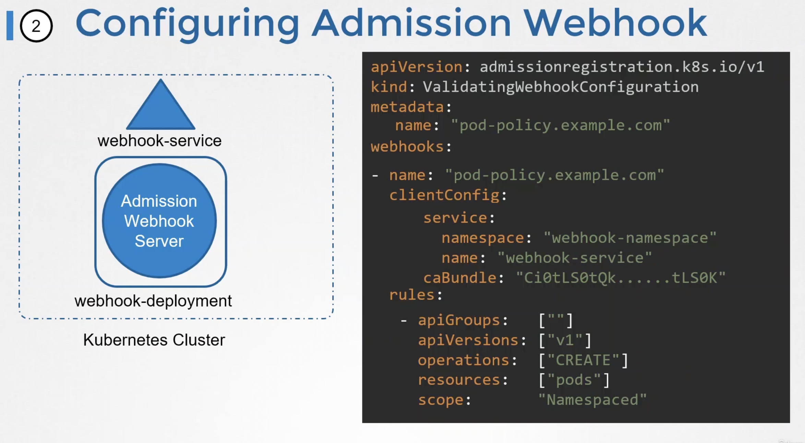  

#### 13.3.2. Built-in PodSecurity Admission controller
Controls Pod security **level** and **mode** restrictions within the given **namespace**. By default, no restrictions are applied (though they can exist on the lower layer - CRI).  
Namespace label: *pod-security.kubernetes.io/* Mode: Level  

1. Level
	1. *privileged* - unrestricted, suitable for a test env
	2. *baseline* - minimally restrictive, well-known restrictions
	3. *restricted* - hard restricted, production best practice
2. Mode
	1. *enforce* - rejects Pod deployment
	2. *audit* - triggers defined audit logging, allowing the deployment
	3. *warn* - triggers a warning, allowing the deployment
	
Assign label:  
`> kubectl label namespace pod-security.kubernetes.io/warn=baseline`  

Get label:  
`> kubectl get namespace test-ns --show-label`  

#### 13.3.3. Operations
1. Get enabled/disabled admission controllers on the control plane from the API-server static pod manifest  
   `> cat /etc/kubernetes/manifests/kube-apiserver.yaml | grep admission-plugins`  
   Get with kubectl  
   `> kubectl get -n kube-system pod kube-apiserver-<control-plane-node-name> -o yaml| grep admission-plugins`   
   
2. Get available/enabled by default admission controllers  
   `> kubectl exec -n kube-system kube-apiserver-<control-plane-node-name> -it -- kube-apiserver -h | grep admission-plugins`  
   
3. Enable/Disable admission controller plugins - add to the manifest /etc/kubernetes/manifests/kube-apiserver.yaml  
   `--enable-admission-plugins/--disable-admission-plugins`  
   
4. Enable/Disable specific API versions, API groups and API resources at runtime in the API-server manifest, e.g.  
   `--runtime-config=batch/v1=false,batch/v2alpha1=true,apps/v1beta1=false`  
   

---

## 14. Monitoring
1. Tools
	1. Heapster (deprecated)
	2. Metrics Server
	3. Prometheus
	4. ELK
	5. Datalog
	6. Dynatrace  

---

## 15. Volumes

### 15.1. Volume definition and usage
1. Pod's definition *.spec.volumes*
2. Pod's usage *.spec.containers[\*].volumeMounts*
	1. *.mountPath*
		1. *.subPath* or
		2. *.subPathExpr*  
### 15.2. Volume Types and Drivers	   
#### 15.2.1. Volume Types
1. Persistent (PV)
2. Ephemeral (EV)
3. Projective
	   
#### 15.2.2. In-Tree Volume drivers
1. *emptyDir* - (EV), it is removed with its Pod's removal, but is safe with its Pod's crash.
2. *hostPath* - does not work in a multinode env, use *local
3. *local* - multinode local storage
4. *configMap* - (EV) ([usage](#103-config-file))
5. *secret* - (EV) ([usage](#113-secret-file))
6. downwardAPI - (EV), to inject Pod and Container fields into Container - metadata, spec, status, resource  
	   
#### 15.2.3. Container Storage Interface (CSI)
[Out-of-Tree Volume drivers](https://github.com/kubernetes-csi/external-provisioner)  

1. nfs - NFS storage ([NFS Volume Example](NFS%20Volume%20Example.md))
2. fc - Fibre Channel storage, vendor-specific
3. iscsi - SCSI over IP, vendor-specific
4. Ceph RBD 
5. CephFS
6. Longhorn  
7. Amazon EBS
8. AzureDisc
9. AzureFile
10. Google Compute Engine Persistent Disk (GCE PD)
11. OpenStack Cinder
12. vSphere
13. VMware Cloud Provider (vCP)
14. Image (container image) - (EV)


### 15.3. PersistentVolume / PersistentVolumeClaim Lifecycle
*PersistentVolume* PV [cluster-scoped] and  *PersistentVolumeClaim* PVC [namespaced] lifecycle  
*PVC* serves to decouple a Pod from *PV*  

> **CKAD hints**
> 
> 1. [Tasks](https://kubernetes.io/docs/tasks/configure-pod-container/configure-persistent-volume-storage/)
> 2. [Concepts](https://kubernetes.io/docs/concepts/storage/persistent-volumes/)
> 
> Search patterns: *persistentvolume*

#### 15.3.1. Provisioning Types.  

##### 1. Static: **PVC -> PV**  
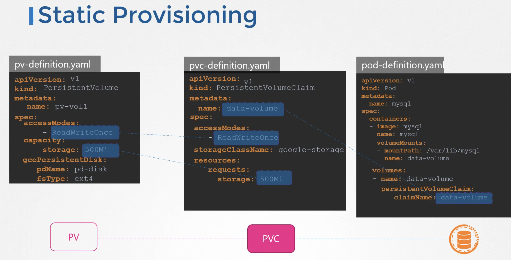    
   
   
##### 2. Dynamic: **PVC -> PV StorageClasses**  
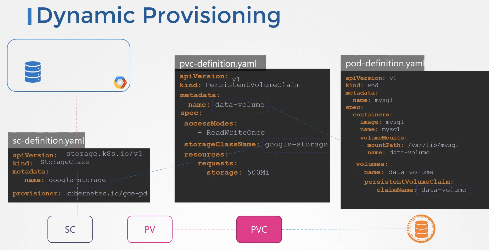  


#### 15.3.2. Binding criteria.  
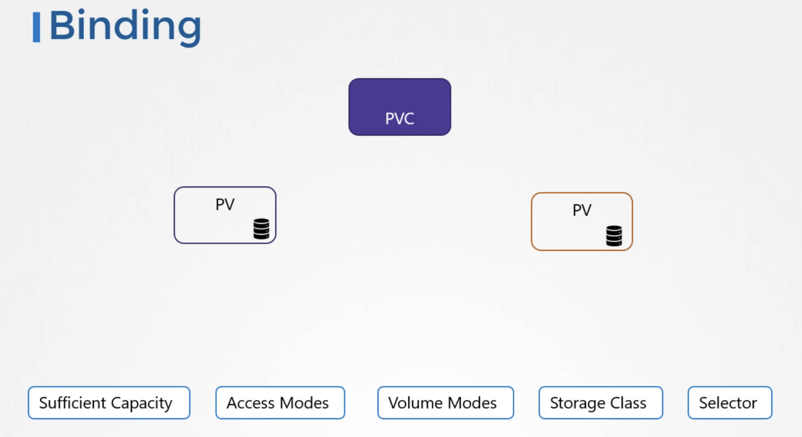  


1. Permanently PV -> PVC with PV *.spec.claimRef* referencing the PVC name (reservation PV for PVC)  
```yaml
...
kind: PersistentVolume
spec:
  storageClassName: ""
  claimRef:
    name: test-pvc
    namespace: ns-test
  persistentVolumeReclaimPolicy: Retain  

```
  
2. Permanently PV -> Node with *spec.nodeAffinity* in PV declaration  
```yaml
nodeAffinity:
  required:
    nodeSelectorTerms:
      - matchExpressions:
          - key: kubernetes.io/hostname
            operator: In
            values:
              - cr01-worker4
```
   
3. Permanently PVC -> PV with *spec.volumeName* referencing PV's name  
```yaml
apiVersion: v1
kind: PersistentVolumeClaim
metadata:
  name: foo-pvc
  namespace: foo
spec:
  storageClassName: "" # Empty string must be explicitly set otherwise default StorageClass will be set
  volumeName: foo-pv
```

4. Permanently PVC -> PV with Label *selector* referencing PV's *labels*    
   *matchLabels* and *matchExpressions* have AND logic  
```yaml
apiVersion: v1
kind: PersistentVolumeClaim
metadata:
  name: test-pvc
spec:
  #...
  selector:
    matchLabels:
      release: "stable"
    matchExpressions:
      - key: environment
        operator: In
        values:
          - dev
```  
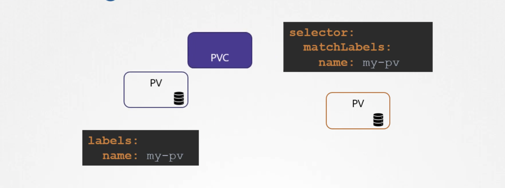  

5. Dynamically PVC -> PV with *storageClassName*  
   PVC defined with *storageClassName* or *DefaultStorageClass* initializes to create a PV with the StorageClass *provisioner*  
	1. If PVC's *storageClassName* = "" - it's bound to PV with no annotation, or *storageClassName* = "" - no dynamic provisioning
	2. If PVC's *storageClassName* is not mentioned
		1. *DefaultStorageClass* is ON, but is not defined -> means OFF
		2. *DefaultStorageClass* is ON and defined -> PVC -> DefaultStorageClass PV
			1. If there are several *DefaultStorageClass* defined, a new PVC -> newest
		3. *DefaultStorageClass* is OFF - no dynamic provisioning
	   
#### 15.3.3. Usage  
   PV can be used via PVC, meanwhile EV can be used directly via their driver  
```yaml
# Pod .spec
volumes:
  - name: data
    persistentVolumeClaim:
      claimName: block-pvc
# Pod .spec.containers[]

volumeDevices:
  - name: data
    devicePath: /dev/xvda
# or
volumeMounts:
  - name: data
    mountPath: /mnt
```

#### 15.3.4. Parameters.
1. *PersistentVolume* and *PersistentVolumeClaim* parameters
	1. *capacity.storage*
	2. *volumeMode*
		1. Filesystem (default)
		2. Block
	3. *accessModes*
		1. ReadWriteOnce - RW from one node (but handle multipod node)
		2. ReadOnlyMany - RO from multiple nodes
		3. ReadWriteMany - RW from multiple nodes (nfs, CephFS, AzureFile)
		4. ReadWriteOncePod - RW from one pod only  
		   
	4. *persistentVolumeReclaimPolicy* and PV workflow
		1. Retain - retain data - 
		2. Recycle - remove data only (only nfs and hostPath support)
		3. Delete - delete volume  
		   
	5. *storageClassName* - the name of *StorageClass*  ANDed with PVC's *selector*
	6. *selector* - in PVC to identify PV by *matchLabels* and/or *matchExpressions* with AND logic  
	   
2. *ProjectedVolume* - maps several existing volume sources into the same directory  
   
3. *StorageClass* [cluster-scoped]
	1. Parameters
		1. *provisioner* - a vendor, internal or external CSI
		2. *parameters* - usually vendor-specific
		3. *reclaimPolicy* - volume data reclamation
			1. Retain
			2. Delete
			3. Recycle
		4. *volumeBindingMode* - defines when binding should happen - it matters what type to avoid getting stuck PV in the Pod-specific wrong location
			1. *Intermediate* (default) - bind to PV once PVC is created - best for **global-access storage** - NFS, CephFS, iSCSI
			2. *WaitForFirstConsumer* - bind PV to PVC once a Pod is scheduled - best for **topology-constrained**, **zoned** storage - Cloud-based, local, node-based ZFS/Longhorn  
		5. *allowedTopologies.matchLabelExpressions* - restricts binding within labelled zones  
			   

### 15.4. VolumeClaimTemplate
Defines how PersistentVolumes are [dynamically provisioned](#2-dynamic-pvc---pv-storageclasses) for each Pod in a [StatefulSet](#5-statefulset). In other words, each Pod in the StatefulSet gets its own PersistentVolumeClaim based on this template.   


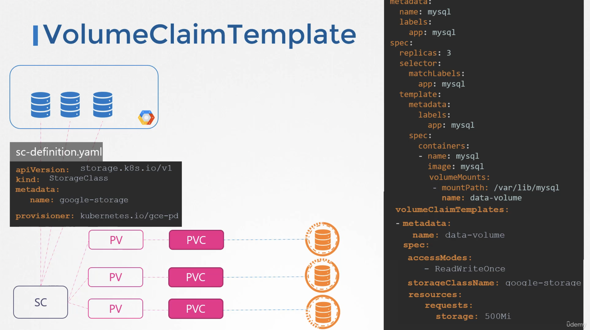   


---

## 16. Kubernetes Extensions
1. Client - controllers request kube-apiserver
2. Webhook - Kubernetes as a client requests backend
3. Points of
	1. Client - kubectl plugins   
	   `> kubectl plugin list`  
	2. API
		1. CustomResourceDefinition (CRD) - define a custom resource and its schema to use as a built-in one
		2. API Aggregation (AA) - allows integrate a custom API behind the K8s API to use as a built-in one
	3. API access
		1. [Authentication (webhook backend)](#131-authentication)
		2. [Authorization (webhook backend)](#132-authorization)
		3. [Dynamic Admission Control](#133-admission-control)
	4. Infrastructure
		1. [CSI](#1523-container-storage-interface-csi)
		2. [CNI](#91-container-network-interfaces--cni)
	5. Scheduling  
		   

---

## 17. Custom Resource Definition (**CRD**)

### 17.1. Operation
1. Get installed CRD  
   `> kubectl get crd`  
2. Get CRD info   
   `> kubectl explain <crd_name>`  
3. Get description  
   `> kubectl describe crd <crd_name>`  
4. Create CRD  
   no skeleton builder (see kubebuilder)  

### 17.2. Operator
1. [History](https://web.archive.org/web/20170129131616/https://coreos.com/blog/introducing-operators.html)  
2. Operators' repository https://operatorhub.io/


---

## 18. HELM
> **CKAD hints**
> 
> 1. [Docs](https://helm.sh/docs/)
> 2. [Cheat Sheet](https://helm.sh/docs/intro/cheatsheet/)
   
### 18.1. Repository / Hub
1. Add a repository  
   `> helm repo list`  
   `> helm repo add bitnami https://charts.bitnami.com/bitnami`  #  [Bitnami repository](https://charts.bitnami.com/)  
2. Update a repository  
   `> helm repo update bitnami`   
   
3. Search a chart in the repo by name   
   `> helm search repo bitnami/nginx`  
   
   All existing versions   
   `> helm search repo bitnami/nginx -l`   
   
   Search charts  
   `> helm search hub fastapi` # search within default repository [ArtifactHub](https://artifacthub.io/)   

### 18.2. Install 
1. Install overriding values  
	- Get available values in the given chart  
	  `> helm show values REPO/CHART-NAME`  
	 
	- Install a chart customizing a required value  
	  `> helm install RELEASE-NAME REPO/CHART-NAME --set VALUE-NAME=REQUIRED-VALUE`  
	  Example:  
	  `> helm install app-nginx bitnami/nginx --version 12.0.6 --namespace ns-helm --set replicaCount=2`  
	  
	- Install a chart using a customized value file  
	  `> helm install RELEASE-NAME REPO/CHART-NAME --velues CUSTOMIZED-VALUES.yaml`  
     
1. Retrieve info from the installed chart  
	- Get the list of all installed releases in different statuses and all namespaces  
	  `> helm list -a -A`  
	- Get user-supplied values from the installed chart  
	  `> helm get values RELEASE-NAME`   
	- Get all values merged with user-supplied ones  
	  `> helm get values RELEASE-NAME --all`   
	- Get all manifests of the given release  
	  `> helm get manifest RELEASE-NAME`  
	- Get all the info from the installed chart, e.g. including the readme examples for nginx-ingress-controller  
	  `> helm get all RELEASE-NAME`  
  

### 18.3. LifeCycle/Upgrade
1. Upgrade by reusing previously set values and the given **chart version**  
   `> helm upgrade RELEASE-NAME REPO/CHART-NAME --version CHART-VERSION --reuse-values`  
   Example:  
   `> helm upgrade app-nginx bitnami/nginx --version 13.2.34 --namespace ns-helm --reuse-values`   
2. Get the release history  
   `> helm history RELEASE-NAME`  

---

## 19. Kustomize
> **CKAD hints**
> 
> 1. [Tasks](https://kubernetes.io/docs/tasks/manage-kubernetes-objects/kustomization/)
>    
>Search patterns: *kustomize*

> External Links (out of CKAD):
> 2. [Docs](https://kubectl.docs.kubernetes.io/references/kustomize/kustomization/)
> 3. [GitHub](https://github.com/kubernetes-sigs/kustomize)

### Concepts
1. Config stages and params
	1. *resources*
	2. generators
		1. *configMapGenerator*
		2. *secretGenerator*
		3. *generatorOptions*
	   3. transformers
		   1. *commonAnnotations*
		   2. *commonLabels* - adds common labels and selectors (deprecated)
		   3. *labels* - adds common labels and optionally selectors
			   - *pairs*:
				  - labels pairs
			  - *includeSelectors*: true|false(default) - adds *.metadata.labels*, *.spec.selector.matchLabels* and *.spec.templates.metadata.labels* like *commonLabels*
			  - *includeTemplates*: true|false(default) - adds *.metadata.labels* and *.spec.templates.metadata.labels
				```yaml
				# Before (deprecated)
				commonLabels:
				  env: qa
				  app: myapp
				# After (Kustomize v5+)
				labels:
				  - pairs:
				      env: qa
				      app: myapp
				    includeSelectors: true  
				  ```
			  
		   4. *images*
			   1. *name* (*image*: name) -> 
				   1. *newName*
				   2. *newTag*
		   5. *namespace*
		   6. *namePrefix* (custom-prefix-, net-api-)
		   7. *nameSuffix* (-custom-suffix, -dev)
		   8. *patches* ([Kustomize patch examples](Kustomize%20patch%20examples.md))
			   1. [Strategic merge patch](https://kubectl.docs.kubernetes.io/references/kustomize/kustomization/)
				   1. *patch* (inline) or *path* (file)
			   2. [Json6902 patch](https://kubectl.docs.kubernetes.io/references/kustomize/kustomization/patchesjson6902/)
				   1. *target*
					   - *group*
					   - *version*
					   - *kind*
					   - *name*
					   - *namespace*
					   - *labelSelector*
					   - *annotationSelector*
				   2. *patch* (inline) or *path* (file)
					   - *op* - operator
						   - *add* - path - value
						   - *remove* - path
						   - *replace* - path - value
						   - *copy* - from - path
						   - *move* - from - path
						   - *test* - path - value
				   3. *options*
					   - *allowNameChange*: true|false (default)
					   - *allowKindChange*: true|false (default)
	4. validators  
	   
2. Overlays approach
3. Components approach [docs](https://kubectl.docs.kubernetes.io/guides/config_management/components/)
   
### Operations
1. Build/generate result
	1. kubectl  
	   `> kubectl kustomize ./`   
	   or a general approach  (use `--dry-run=server` to verify against the existing cluster)  
	   `> kubectl apply --dry-run=server -o yaml -k ./`  
	2. kustomize  
	   `> kustomize build ./`  
2. Apply  
	1. kubectl  
	   `> kubectl apply -k ./`  
	2. kustomize  
	   `> kustomize build ./ | kubectl apply -f -`  
3. Delete  
	1. kubectl  
	   `> kubectl delete -k ./`  
	2. kustomize  
	   `> kustomize build ./ | kubectl delete -f -`  


---

## 20. Service MESH

1. [Consul](https://www.consul.io/)
2. [Istio](https://istio.io/)
3. [Kuma](https://kuma.io/)
4. [Linkerd](https://linkerd.io/)
5. [Cilium](https://cilium.io/)
6. [Traefik Mesh](https://traefik.io/traefik-mesh/)
7. [Tanzu Service Mesh](https://tanzu.vmware.com/service-mesh)

---

# CKAD Study Resources
1. [Kubernetes Docs](https://kubernetes.io/docs/home/) (Primary source of Truth)
   The official documentation is the main reference for both the exam and real-world work. You should know how to quickly navigate the key sections:
   - [Concepts](https://kubernetes.io/docs/concepts/)
   - [Tasks](https://kubernetes.io/docs/tasks/)
   - In the exam environment, prioritize (this doc resources have a priority section "CKAD hints"):  
	   - `kubectl <subcommand> -h` is the fastest way  
	   - `kubectl explain <resources>` for details. Although some resource manifests cannot be generated imperatively (e.g. PV, PVC)  
2. Udemy - [Kubernetes Certified Application Developer (CKAD) with Tests](https://www.udemy.com/course/certified-kubernetes-application-developer)  
   The famous course from [Mumshad Mannambeth](https://www.udemy.com/user/mumshad-mannambeth/), [KodeKloud Training](https://www.udemy.com/user/kodekloud/), [Vijin Palazhi](https://www.udemy.com/user/vijin-palazhi-2/)  
	- provides structured video lessons that follow the CKAD curriculum
	- includes hands-on practice with numerous training labs, lightning labs, mock exams, and challenge labs hosted by [KodeKloud Training](https://kodekloud.com/).
3. The high-quality [KodeKloud Training](https://kodekloud.com/) mock exam labs [Ultimate Certified Kubernetes Application Developer (CKAD) Mock Exam Series](https://learn.kodekloud.com/courses/ultimate-certified-kubernetes-application-developer-ckad-mock-exam-series)
4. Browser-based interactive [KillerCoda CKAD Scenarios ](https://killercoda.com/ckad)
5. Mock exam environment simulator [KillerShell](https://killer.sh/ckad), for timing and muscle-memory training with the real exam setup (terminal, navigation, pressure)
6. Additionally, [PluralSight Course](https://app.pluralsight.com/paths/certificate/certified-kubernetes-application-developer-ckad-2023)
7. Some helpful experience and advice:
   - https://kavinduchamiran.medium.com/my-two-cents-on-passing-ckad-in-2022-ffbb7f1c65be
   - https://medium.com/@codebob75/passing-ckad-cheatsheet-notes-and-tips-1aa285e6a473
   


---
